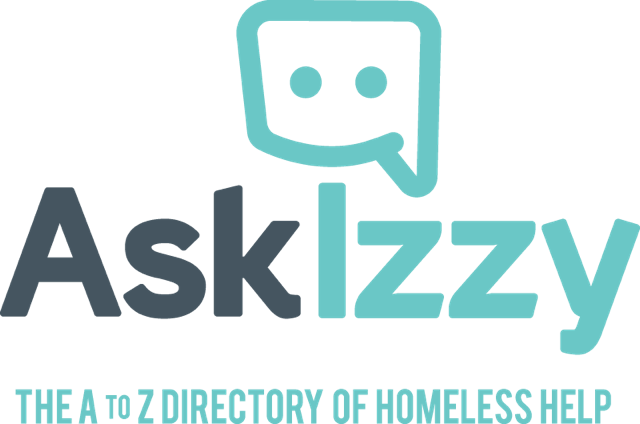

## Today we launched a mobile website for homeless people

<a href="https://askizzy.org.au">

... and it was launched by [one of Australia's many recent Prime Ministers](http://www.heraldsun.com.au/news/victoria/askizzy-app-connects-the-homeless-to-food-shelter-and-health-services/news-story/bfae67275552be421af4dd54bfd575a6?nk=ebd042d1d2789514c4e8553cb5633711-1454053888)

### Today alone we served up over 87,000 requests

As many of you know, I work with [Infoxchange](https://infoxchange.org) as the operations lead.

When I first heard the idea of a website or app for people that have found or are worried about finding themselves homeless in Australia I really didn't think it made sense - until I saw the stats showing how many homeless people in Australia have regular access to a smart phone and data either via a cellular provider or free WiFi.

We did a lot of research, working with homeless and at-risk people throughout Australia, it's really been quite an eye opener especially for my team who are largely technically focused.

AskIzzy is the result of Infoxchange winning the Google Impact Challenge in 2015. For me the most interesting things about the site other than it's value to those in need is that it didn't cost tax payers a cent to develop or host and it has no model for making profit of any kind, this resulted in the site being designed truly for the end consumer - the person in need.
