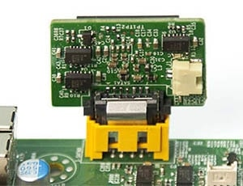
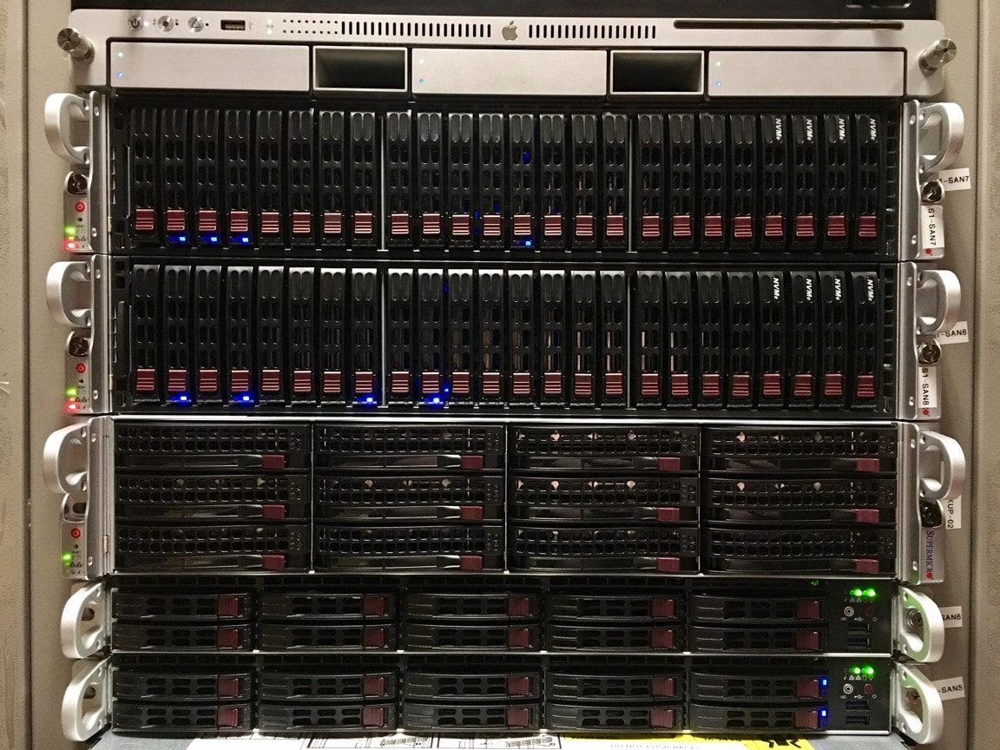

It was almost 3 years ago that my open source storage project went into production. In that time it's been running 24/7 serving as highly available solid state storage for hundreds of VMs and several virtualisation clusters across our two main sites.

I'm happy to report that the clusters have been operating very successfully since their conception.

Since moving away from proprietary 'black box' vendor SANs, we haven't had a single SAN issue, storage outage.

We've also been so please with the success of the design that we've grown from a single cluster at each site to a total of 6 clusters (12 nodes).

## Drive Failure Rates

TLDR; Mid-range SSDs from reputable brands (SanDisk, Crucial / Micron and Intel) are *very* reliable, far more so that the highly overpriced 'enterprise' rotational drives from HP and friends.

### Supermicro DOMs (OS Mirror)

We found that the [Supermicro DOM](https://www.supermicro.com/products/nfo/SATADOM.cfm) disks have been quite unreliable, Supermicro acknowledged the problem and issued an updated hardware revision.

We haven't yet had a single updated v1.1 revision DOM fail on us, but they do have one downside: they're slightly smaller in size, likely due to additional under provisioning on the NAND flash.

This means that you can't simply swap like-for-like and expect your local drive mirrors to rebuild as there isn't enough space on the newly installed v1.1 DOM, an easy workaround for this which we've applied across the board is to increase to the next size units - our 16GB DOMs have been replaced with 32GB.

### SATA SSDs

We haven't had many SATA SSDs fail at all to date out of the total 208 SATA SSDs we have installed I count that we've only had 5 failures, 1 of which was DOA.

#### Failed SATA SSDs

* 1x SanDisk Extreme Pro 480GB
* 2x SanDisk Extreme Pro 960GB
* 1x Micron M600 1TB
* 1x Crucial MX500 1TB (DOA)

### NVMe SSDs

We've had no NVMe SSDs fail out of the 8x Intel DC3600 series we have deployed.

