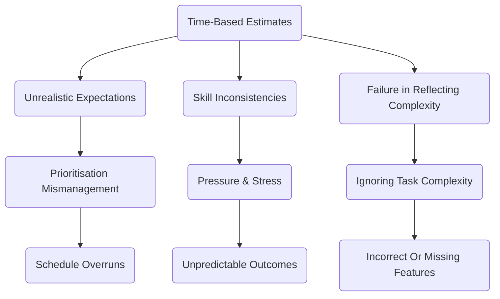
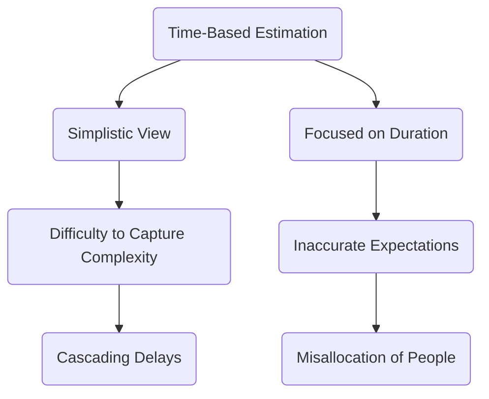
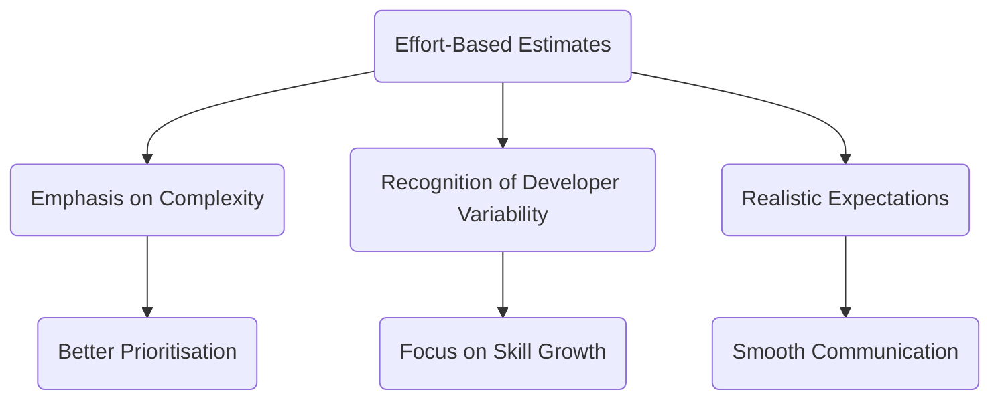
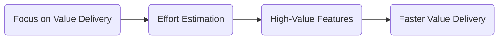
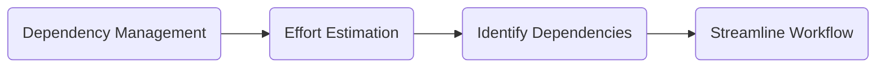
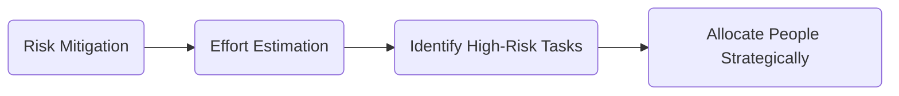
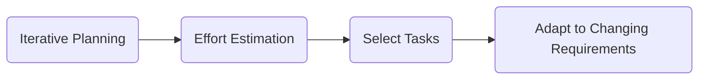
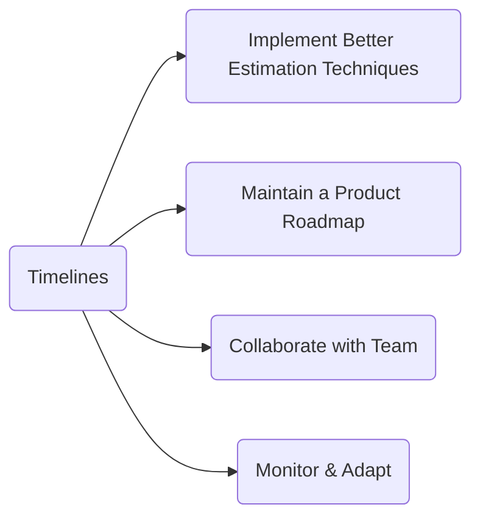
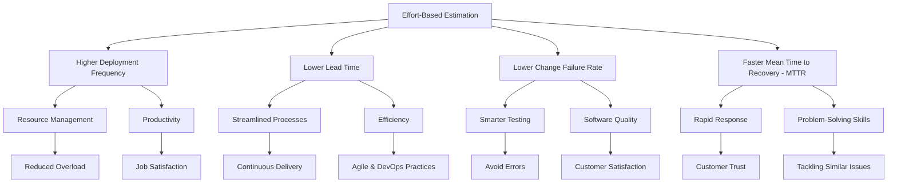

Many organisations - while branding themselves as "Agile" - continue to make the mistake of estimating project velocity based on _time_ than _effort_.

<!--more-->

This flawed approach equates to measuring the team's ability to estimate time, rather than focusing on the actual effort needed to complete tasks.

This isn't to say that time isn't important - quite the opposite. Time is often a critical factor in delivery. However, it's important to understand that time is a _constraint_ and a _metric_ - not a _unit of work_.

---

Managers want to know how much time a project or deliverable will take - but often aren't interested in the complexity of the work. Engineers also want to know how long a piece of work may take - however solving complex problems requires _effort_ - not simply _time_ and the two should not be conflated through the estimation process.

> Effort is non-linear and multi-dimensional. Time (with relation to delivery) is linear and one-dimensional.

As humans we simplify the world around us. This helps us to make (hopefully sensible) decisions in a reasonable time and to communicate with others. However, as complexity grows our reductionist approach often breaks down. We encounter flawed assumptions, external influences and unknown unknowns and as our understanding of each element grows our simple models start to again resemble the complex systems of which we're trying to simplify.

The age old mistake reductionist assumption that the time it takes to complete something is simply amount of work / capacity is alive and well in software delivery.

> How many engineers does it take to deliver a feature? One engineer can deliver a feature in 10 days, so 10 engineers can deliver it in 1 day, right?...

In reality the time a piece of work takes involves complexity of the task, how well practised we are the the kinds of work involved, the skills and experience of the people involved, distractions, outside influences and dependencies.

## The Problem with Estimating in Time

### Time Cannot Represent Complexity

Possibly the most important reason to avoid estimating in time is that time cannot represent complexity.

When estimating in hours/days, we're assuming a direct relationship between effort and time. This can blur the line between the effort required to execute a task and the time it takes to complete it. Complex tasks may require more time than expected, introducing unanticipated delays.

Imagine two tasks. The first: fixing a simple bug. The second: solving a rare edge-case concurrency problem. Clearly, the effort needed for each task differs. Estimating in time means the team will spend hours trying to figure out how long it could take, rather than focusing on the actual effort involved.

### Developer Inconsistencies

Different developers work at different speeds, which makes estimating in time unfair and unreliable. The experience or familiarity a developer has with a specific technology or domain can greatly influence their ability to complete a task.

Developer A might complete a task in two hours, while Developer B might need six hours for the same task. Estimating in time can lead to incorrect assumptions about progress.

### Time Estimates Create Artificial Deadlines and Unnecessary Pressure

When estimating in hours or days, artificial deadlines are often introduced, which may not account for unforeseen challenges, external dependencies, or varying developer skills.

This can lead to unnecessary pressure on team members to meet these deadlines, adversely affecting team morale and the quality of work. With effort estimation, teams can prioritise tasks more effectively, anticipating the necessary adjustments as they encounter new information, without compromising team dynamics or work quality.

---

## Estimating Effort Points - The Better Approach

### Accounting for Complexity

Effort points help teams understand the complexity of tasks and the relative effort needed to complete them. Comparing different tasks based on their complexities allows for logical resource allocation, ensuring smooth project execution.

### Flexibility for Diversity in Skills

Effort points aren't based on how long a task takes, but on how difficult it may be. This allows for better adaptability to the varying skill levels of developers. Teams can assign tasks without time pressure, enabling developers to grow and to deliver quality products.

### Smooth Communication

Effort points support transparency in communication. Rather than assuming how long a task will take, project managers can better account for the effort involved, promoting realistic expectations and allowing for better planning.

### Continuous Improvement Through Data

Effort points offer data-driven insights on team performance, aiding in continuous improvement. The team can identify bottlenecks and find ways to streamline processes, leading to increased efficiency and fewer obstacles.

Here are some resources to help guide your team in switching to effort point estimation:

- [Effort Estimation in Agile: A Beginner's Guide](https://www.smartsheet.com/content-center/best-practices/agile/project-tips/effort-estimation-agile-beginners-guide)
- [Agile Estimating and Planning: Planning Poker](https://www.planningpoker.com/)

---

## Effective Prioritisation

With effort estimation, teams gain a better understanding of the inherent complexity and relative effort required for different tasks. This understanding enables them to prioritise tasks more effectively in several ways:

### Focus on Value Delivery

By identifying the effort involved in each task, teams can strategically prioritise and deliver high-value features first. This ensures that the most crucial aspects of the project are addressed early, resulting in faster value delivery to stakeholders and end-users.

### Balanced Workload Distribution

Effort estimation allows teams to evaluate the complexity of tasks on a case-by-case basis. With this knowledge, they can distribute the workload among team members more fairly, considering individual expertise levels and balancing the work according to each person's capacity.

### Dependency Management

Teams can analyse complex tasks in the context of their dependencies and grouped efforts. By prioritising tasks based on their dependencies, teams can streamline workflow, minimise bottlenecks, and ensure that tasks that are a prerequisite to other tasks are addressed more efficiently.

### Risk Mitigation

Effort-based estimation makes it easier to identify high-risk tasks that require significant effort or have a high degree of uncertainty. By prioritising these tasks, teams can better allocate people to mitigate potential risks and address issues proactively.

### Iterative Planning

Agile methodologies emphasise working in iterations or sprints. Effort estimation aids in this process as teams can select and prioritise tasks to complete during each iteration, allowing them to adapt to changing project requirements and maintain progress.

By prioritising tasks more effectively using effort estimation, teams can enhance productivity, ensure balanced workloads, manage dependencies, minimise risk, and promote iterative planning, all of which contribute to more successful project outcomes.

---

## Strategies for Product Owners/Project Managers to Better Understand Timelines

### Implement Better Estimation Techniques

Using effort estimation methods like Planning Poker or T-shirt sizing will provide a more accurate picture of project progress. Whenever possible, combine these techniques to continuously refine your understanding.

### Maintain a Product Roadmap

Prioritise features and plan your project incrementally. A high-level product roadmap helps monitor progress and highlight dependencies or potential roadblocks

### Collaborate with Your Team

Encourage open communication and involve team members in planning and estimation. Active collaboration ensures shared understanding, lowers the risk of unexpected delays, and promotes proactive problem-solving

### Link Effort-Based Estimation to DORA Metrics

Effort-based estimation plays an essential role in enhancing the overall performance of software delivery teams. When aligned with the DORA (DevOps Research and Assessment) metrics - as recommended in the [Accelerate book](https://itrevolution.com/book/accelerate/) - the benefits of effort estimation can be even more profound.

DORA metrics focus on organisational performance in terms of lead time, deployment frequency, mean time to recovery, and change failure rate. By linking effort-based estimation to these metrics, teams can evaluate the efficiency and effectiveness of their processes, and continuously improve their software development and delivery practices.

### Monitor and Adapt

Stay open to revisiting your initial estimates, adjusting your plans to accommodate any changes or setbacks. Agile methodologies emphasise continuous improvement, so adapt your timeline as needed

By embracing Agile/Kanban methodologies and focusing on effort points instead of time, your team can increase productivity and achieve better results. Adopt these modern practices to provide realistic timelines, improve communication, and foster a more flexible and efficient working environment.

## Summary

In summary, adopting effort-based estimation in Agile and Kanban methodologies and avoiding reverting to dated waterfall style time-based estimation offers numerous advantages, such as better task prioritisation, enhanced communication, and a deeper understanding of task complexity.

By steering away from time-based estimation and embracing an effort-first mindset, you're optimising your delivery process and resource allocation while operating in a more human-centric way. You can take this a step further by connecting this approach to DORA metrics further highlights the impact of effort estimation on an organisation's performance.
