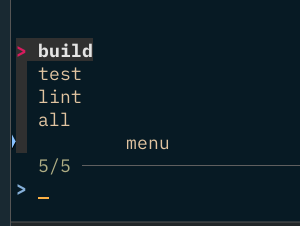

Part one of a series of posts about Makefiles.

<!--more-->

## Dynamic Menu Generation

This reusable snippet will generate a menu of targets from the Makefile. It will use `fzf` if it is installed, otherwise it will use a numbered menu.

```Makefile
#### Dynamically Generated Interactive Menu ####

# Error Handling
SHELL := /bin/bash
.SHELLFLAGS := -o pipefail -c

# Name of this Makefile
MAKEFILE_NAME := $(lastword $(MAKEFILE_LIST))

# Special targets that should not be listed
EXCLUDE_LIST := menu all .PHONY

# Function to extract targets from the Makefile
define extract_targets
	$(shell awk -F: '/^[a-zA-Z0-9_-]+:/ {print $$1}' $(MAKEFILE_NAME) | grep -v -E '^($(EXCLUDE_LIST))$$')
endef

TARGETS := $(call extract_targets)

.PHONY: $(TARGETS) menu all

menu: ## Makefile Interactive Menu
	@# Check if fzf is installed
	@if command -v fzf >/dev/null 2>&1; then \
		echo "Using fzf for selection..."; \
		echo "$(TARGETS)" | tr ' ' '\n' | fzf > .selected_target; \
		target_choice=$$(cat .selected_target); \
	else \
		echo "fzf not found, using numbered menu:"; \
		echo "$(TARGETS)" | tr ' ' '\n' > .targets; \
		awk '{print NR " - " $$0}' .targets; \
		read -p "Enter choice: " choice; \
		target_choice=$$(awk 'NR == '$$choice' {print}' .targets); \
	fi; \
	if [ -n "$$target_choice" ]; then \
		$(MAKE) $$target_choice; \
	else \
		echo "Invalid choice"; \
	fi

# Default target
all: menu

help: ## This help function
	@egrep '^[a-zA-Z_-]+:.*?## .*$$' $(MAKEFILE_LIST) | sort | awk 'BEGIN {FS = ":.*?## "}; {printf "\033[36m%-20s\033[0m %s\n", $$1, $$2}'

# Targets (example targets listed below)
lint: ## Run lint
	@echo "Running lint..."

test: ## Run test
	@echo "Running test..."

build: ## Run build
	@echo "Running build..."
```


