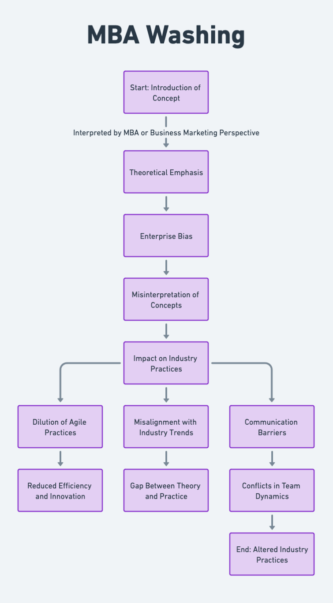
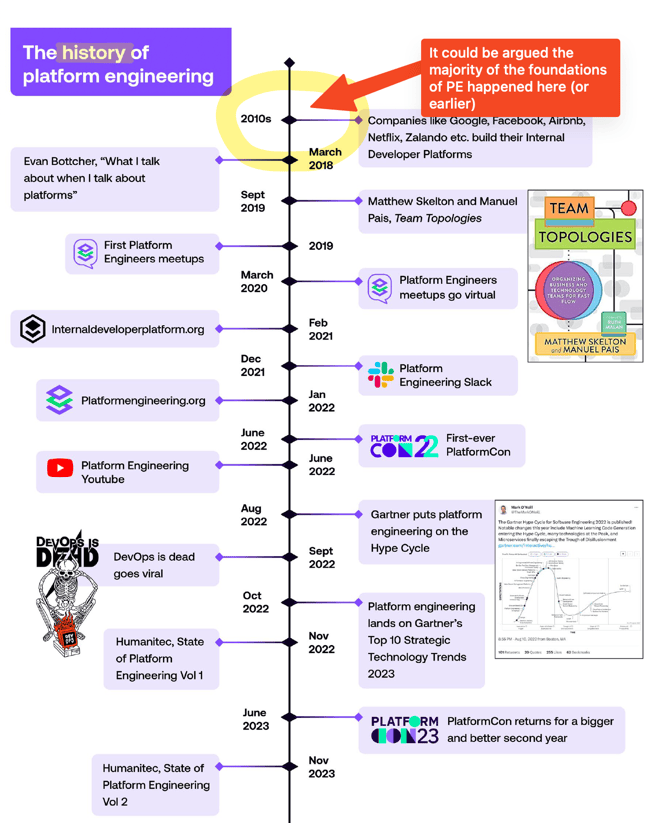

"**MBA Washing**" refers to the phenomenon where individuals, often with a strong theoretical or academic background but limited recent practical experience, adopt and reinterpret industry-specific terminology and cultural movements.

--

This reinterpretation is typically influenced by their academic learning, recent literature, and biases towards larger enterprise perspectives. As a result, the original intent and practical effectiveness of these concepts, such as DevOps or Platform Engineering for example, may be diluted or misrepresented.

<!--more-->


It should be noted that the term "MBA Washing" is somewhat of a joke and not intended to be derogatory towards those with an MBA or similar business-focused education. Instead, it is meant to highlight the impact of theoretical perspectives on cultural movements and industry practices by itself being a co-optable, theoretical term.


### Expanded Definition

Coined to describe the influence of academic or theoretical perspectives, particularly from those with an MBA or similar theory heavy, business or marketing focused education, on practical industry practices.

#### Key Characteristics

- **Theoretical Over Practical**: Emphasis on book knowledge over recent, hands-on experience in the field.
- **Enterprise Bias**: A tendency to view concepts through the lens of large-scale enterprise operations, which may not always be agile or efficient.
- **Misinterpretation of Concepts**: Terms and practices like DevOps, Agile or Platform Engineer are often co-opted, redefined, losing their original effectiveness and intent.

### Impact

- **Dilution of Practices**: Core principles of agile, efficient methodologies may be overshadowed by bureaucratic or theoretical approaches.
- **Misalignment with Industry Trends**: A gap emerges between what is taught or advocated and what is practised in cutting-edge or smaller-scale environments.
- **Communication Barriers**: Creates a disconnect between those trained in these 'washed' concepts and practitioners on the ground.


This flowchart outlines how a concept, when interpreted through an MBA perspective, can lead to a theoretical emphasis, enterprise bias, and misinterpretation of concepts. These factors collectively impact industry practices, leading to the dilution of agile practices, misalignment with industry trends, and communication barriers. These outcomes can further result in reduced efficiency and innovation, a gap between theory and practice, and conflicts in team dynamics, ultimately altering industry practices.


---

### Examples

**DevOps in Theory vs. Practice**: An MBA graduate might focus on the strategic alignment and process optimization aspects of DevOps, overlooking the importance of continuous integration and deployment practices essential in real-world scenarios.

**Agile Methodology**: The agile methodology might be reinterpreted to fit rigid, hierarchical corporate structures, contrary to its original intent of fostering flexibility and cross-functional collaboration.

**Platform Engineering**: As seen in "Humanitec"s [State of Platform Engineering (Vol 2)](https://humanitec.com/whitepapers/state-of-platform-engineering-report-volume-2) report - with their "_history_" of Platform Engineering (pictured below) - there is a string recency bias and a lack of understanding or value placed in the history of such a movement. This is a common theme in many "industry reports" as often published by large, privately owned companies.

This isn't to say that we should discredit any of the individuals, events or communities such a timeline (Team Typologies is a great resource for example) - but instead to highlight the biases of reports such as this. They only paint a narrow, often enterprise-focused, view of the field.

---

In summary, we should be mindful of the impact of theoretical doctrine and perspectives on cultural movements and industry practices, along with the potential for dilution or misrepresentation of these concepts.
