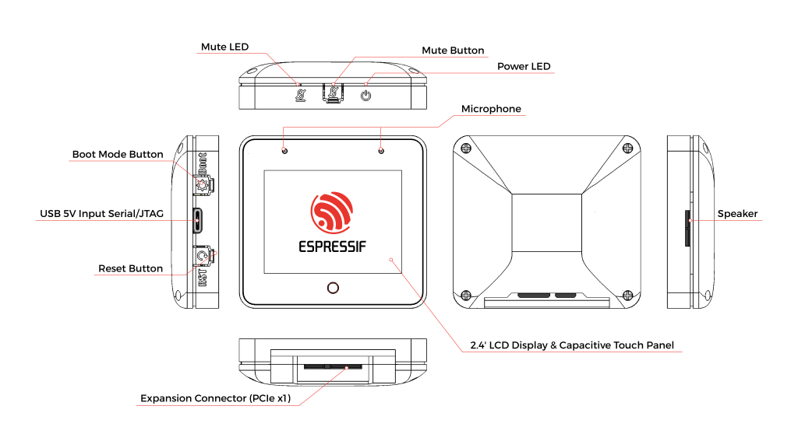

Offline AI / LLM Assistant



More info on this soon but the basic idea was to use Willow, Home Assistant and local LLM models to create a locally hosted, offline, AI powered Siri replacement and interface it with ESP32 S3 Box 3 devices.

<!--more-->

## ESP32 S3 Box 3

The [ESP32 S3 Box 3](https://www.espressif.com/en/news/ESP32-S3-BOX-3) is a small, low cost, ESP32 based board with a microphone, speaker, small touch display, 18650 battery, and a few other nice features.

## Willow

[Willow](https://heywillow.io/) is an open source, locally hosted AI powered voice assistant. It is built with Python and runs on Linux, macOS, and Windows. Willow is designed to be extensible and highly configurable.

## Home Assistant

[Home Assistant](https://www.home-assistant.io/) is an open source home automation platform. It is able to track and control all devices at home and offer a platform for automating control. Home Assistant allows you to control all your devices without storing any of your data in the cloud. We like to keep your privacy private.

## Docker-Compose

Bellow are the various docker-compose and config files relating to the project. As they are - **they will not work**, but may prove useful as a reference / guide.


