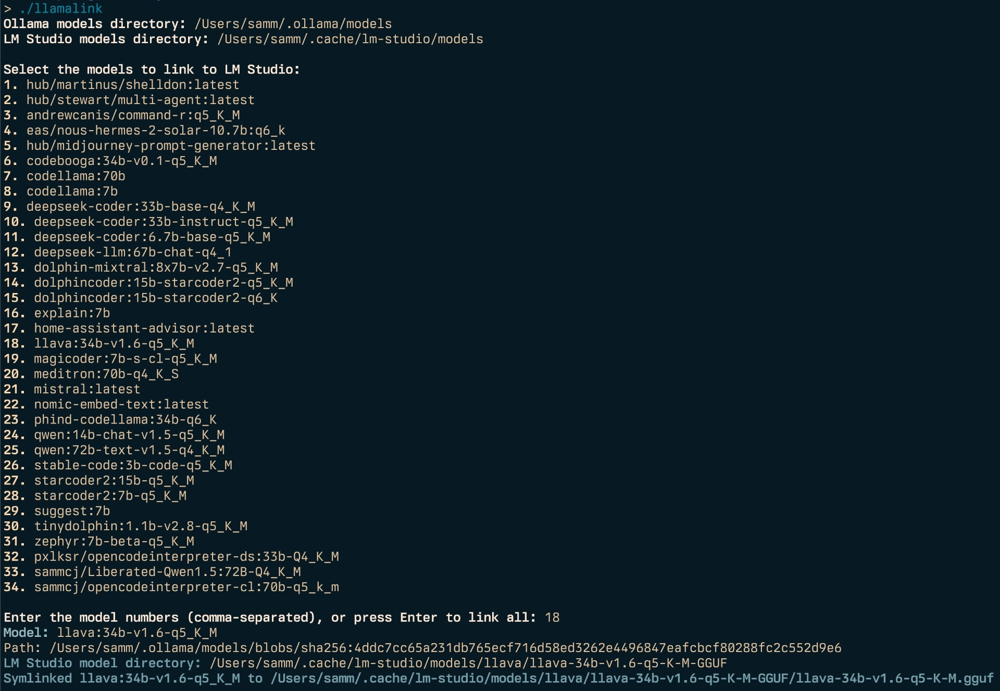

Two of my most commonly used LLM tools are [Ollama](https://ollama.com/) and [LM Studio](https://lmstudio.ai/). Unfortunately they store their models in different locations and filenames. Manually copying or linking files was a pain, so I wrote a simple command-line tool to automate the process.

This is why I created [Llamalink](https://github.com/sammcj/llamalink).



Ollama is a cross-platform model server that allows you to run LLMs and manage their models in a similar way to Docker containers and images, while LM Studio is a macOS app that provides a user-friendly interface for running LLMs.

I often use both applications to generate text, and I wanted a way to easily link Ollama models to LM Studio's directory structure. This would make it convenient to use the models in both applications.

<!-- more -->

## Features

- Retrieves the list of available Ollama models using the ollama list command.
- Displays the list of models and allows the user to select specific models to link or link all models at once.
- Retrieves the model path for each selected model using the ollama show --modelfile command.
- Creates the necessary directories in the LM Studio directory structure.
- Creates symlinks from the Ollama model paths to the corresponding LM Studio model paths.
- Removes any existing symlinks before creating new ones to avoid conflicts.
- Cleans up any broken symlinks in the LM Studio models directory.
- Can be run interactively or non-interactively.

## Usage

At the time of writing this, the `llamalink` command provides the following options:

- `-a` Link all models without prompting for selection.
- `-ollama-dir` Specify a custom Ollama models directory.
- `-lm-dir` Specify a custom LM Studio models directory.
- `-min-size` Include only models over the given size (in GB or MB).
- `-max-size` Include only models under the given size (in GB or MB).
- `-q` Quiet operation, only output an exit code at the end.
- `-no-cleanup` Don't cleanup broken symlinks.
- `-cleanup` Remove all symlinked models and empty directories and exit.
- `-h` Print the help message.

If no flags are provided, the program will run interactively.

---

## Installation

```plaintext
go install github.com/sammcj/llamalink@latest
```

## Example

```plaintext
llamalink

Ollama models directory: /Users/samm/.ollama/models
LM Studio models directory: /Users/samm/.cache/lm-studio/models

Select the models to link to LM Studio:
1. knoopx/hermes-2-pro-mistral:7b-q8_0
2. dolphincoder:15b-starcoder2-q4_K_M
3. llava:13b
4. nomic-embed-text:latest
5. qwen:14b
6. qwen:7b-chat-q5_K_M
7. stable-code:3b-code-q5_K_M
8. tinydolphin:1.1b-v2.8-q5_K_M

Enter the model numbers (comma-separated), or press Enter to link all: 3
Model: llava:34b-v1.6-q5_K_M
Path: /Users/samm/.ollama/models/blobs/sha256:4ddc7cc65a231db765ecf716d58ed3262e4496847eafcbcf80288fc2c552d9e6
LM Studio model directory: /Users/samm/.cache/lm-studio/models/llava/llava-34b-v1.6-q5-K-M-GGUF
Symlinked llava:34b-v1.6-q5_K_M to /Users/samm/.cache/lm-studio/models/llava/llava-34b-v1.6-q5-K-M-GGUF/llava-34b-v1.6-q5-K-M.gguf
```

## License

I have open sourced the codebase under the MIT License and it is freely available for download both on GitHub and via the Go package manager.

## Links

- https://github.com/sammcj/llamalink/
- https://ollama.com/
- https://lmstudio.ai/ (_note: LM Studio is not open source_)
