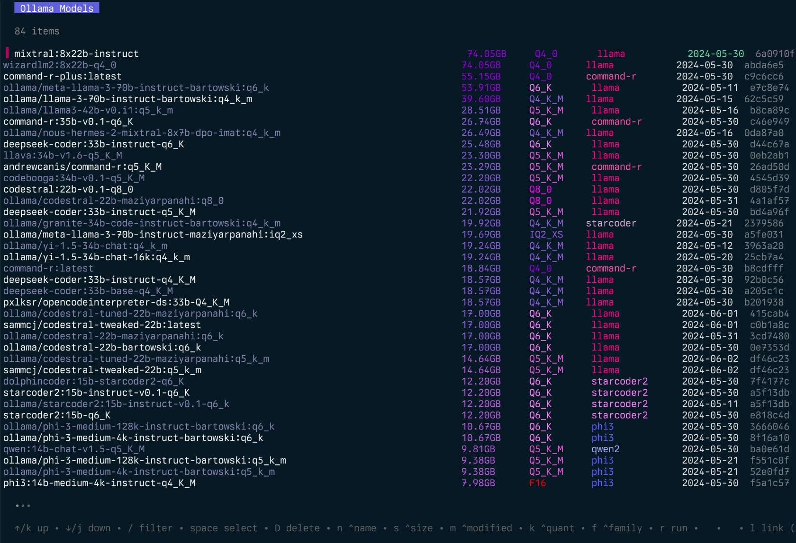

- [Gollama on Github](https://github.com/sammcj/gollama)


Gollama is a client for Ollama for managing models.
It provides a TUI for listing, filtering, sorting, selecting, inspecting (coming soon!) and deleting models and can link Ollama models to LM-Studio.

The project started off as a rewrite of my [llamalink](https://smcleod.net/2024/03/llamalink-ollama-to-lm-studio-llm-model-linker/) project, but I decided to expand it to include more features and make it more user-friendly.



<!--more-->

## Features

- List available models
- Display metadata such as size, quantisation level, model family, and modified date
- Edit / update a model's Modelfile
- Sort models by name, size, modification date, quantisation level, family etc
- Select and delete models
- Run and unload models
- Inspect model for additional details
- Link models to LM Studio
- Copy / rename models
- Push models to a registry
- Show running models
- Has some cool bugs

From go:

```shell
go install github.com/sammcj/gollama@HEAD
```

From Github:

Download the most recent release from the [releases page](https://github.com/sammcj/gollama/releases) and extract the binary to a directory in your PATH.

e.g. `zip -d gollama-v1.8.1.zip -d gollama && mv gollama /usr/local/bin`

## Usage

To run the `gollama` application, use the following command:

```sh
gollama
```

_Tip_: I like to alias gollama to `g` for quick access:

```shell
echo "alias g=gollama" >> ~/.zshrc
```

### Inspect


### Top


### Simple model listing

Gollama can also be called with `-l` to list models without the TUI.

```shell
./gollama -l
```


### Key Bindings

- `Space`: Select
- `Enter`: Run model (Ollama run)
- `i`: Inspect model
- `t`: Top (show running models)  _**(Work in progress)**_
- `D`: Delete model
- `e`: Edit model **new**
- `c`: Copy model
- `U`: Unload all models
- `P`: Push model
- `n`: Sort by name
- `s`: Sort by size
- `m`: Sort by modified
- `k`: Sort by quantisation
- `f`: Sort by family
- `l`: Link model to LM Studio
- `L`: Link all models to LM Studio
- `r`: Rename model _**(Work in progress)**_
- `q`: Quit

#### Command-line Options

- `-l`: List all available Ollama models and exit
- `-s <search term>`: Search for models by name **new**
  - OR operator (`'term1|term2'`) returns models that match either term
  - AND operator (`'term1&term2'`) returns models that match both terms
- `-e <model>`: Edit the Modelfile for a model **new**
- `-ollama-dir`: Custom Ollama models directory
- `-lm-dir`: Custom LM Studio models directory
- `-cleanup`: Remove all symlinked models and empty directories and exit
- `-no-cleanup`: Don't cleanup broken symlinks
- `-u`: Unload all running models
- `-v`: Print the version and exit

##### Edit

Gollama can be called with `-e` to edit the Modelfile for a model.

```shell
gollama -e my-model
```

##### Search

Gollama can be called with `-s` to search for models by name.

```shell
gollama -s my-model # returns models that contain 'my-model'

gollama -s 'my-model|my-other-model' # returns models that contain either 'my-model' or 'my-other-model'

gollama -s 'my-model&instruct' # returns models that contain both 'my-model' and 'instruct'
```

## Configuration

Gollama uses a JSON configuration file located at `~/.config/gollama/config.json`. The configuration file includes options for sorting, columns, API keys, log levels etc...

Example configuration:

```json
{
  "default_sort": "modified",
  "columns": [
    "Name",
    "Size",
    "Quant",
    "Family",
    "Modified",
    "ID"
  ],
  "ollama_api_key": "",
  "ollama_api_url": "http://localhost:14434",
  "lm_studio_file_paths": "",
  "log_level": "info",
  "log_file_path": "gollama.log",
  "sort_order": "Size",
  "strip_string": "my-private-registry.internal/"
}
```

The strip string option can be used to remove a prefix from model names as they are displayed in the TUI.
This can be useful if you have a common prefix such as a private registry that you want to remove for display purposes.

## Installation and build from source

1. Clone the repository:

    ```shell
    git clone --depth=1 https://github.com/sammcj/gollama.git
    cd gollama
    ```

2. Build:

    ```shell
    go get
    make build
    ```

3. Run:

    ```shell
    ./gollama
    ```

## Logging

Logs can be found in the `gollama.log` which is stored in `$HOME/.config/gollama/gollama.log` by default.
The log level can be set in the configuration file.

## License

Copyright © 2024 Sam McLeod

This project is licensed under the MIT License.
