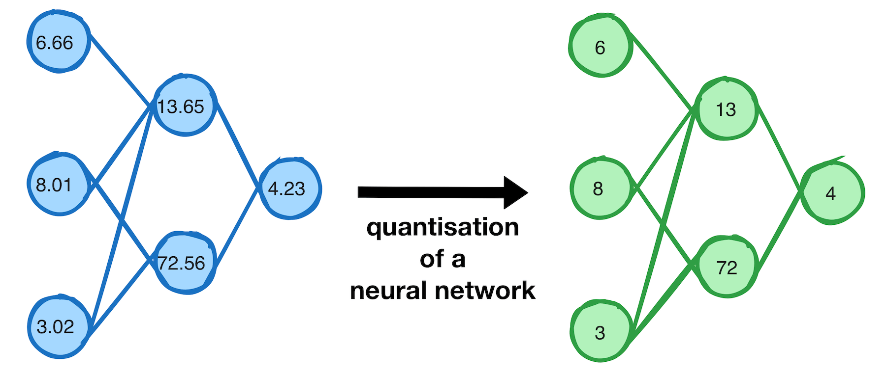
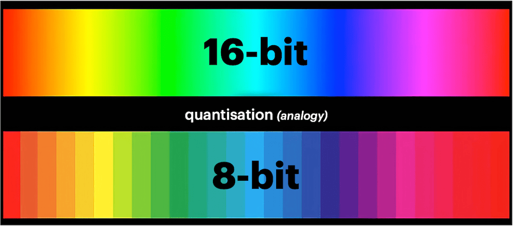

AI models ("LLMs" in this case) have inherently large sizes and computational requirements that often pose challenges for deployment and use.
<!--more-->

## _Disclaimer_

I am not a ML or data scientist. I am simply an engineer with an interest in AI. This project is a result of my personal interest in understanding the impact of quantisation on LLMs. The visualisations are based on my understanding of the subject and may not be 100% accurate or complete. I encourage you to verify the information presented here with other sources.

## Quantisation

Quantisation, a technique to reduce model size and memory footprint, is often confusing for newcomers, and understanding the trade-offs involved in the various quantisation types can be complex.

Quantisation refers to the process of converting model weights from higher to lower precision data types (e.g. floating point -> integer)

As a thought experiment, and for my own learning, I've created an interactive dashboard to help myself and other users understand the impact of quantisation on LLMs.

This (_somewhat_) interactive dashboard aims to demystify LLM quantisation by providing visual representations of key metrics and trade-offs.

### Colour Spectrum Analogy

Imagine the model data to be the colour spectrum (pictured as 16 bits here)

If we quantise the data to 8 bits we are removing (thus compressing) parts of the data based on a set of rules.
We can still see a wide range of "colours" but we lose some of the detail.

_Note: This is a crude analogy, Modern quantisation techniques have smarts that selectively quantise parts of the model to varying degrees to reduce the loss._

## Dashboard

The data is mainly focused on GGUF quantisation, however the visualisations can be used to understand other quantisation and model formats as well. I plan to add more quantisation techniques and models in the future.

If you find errors - please do let me know! I want to correct my understanding and improve the visualisations over time. The dashboard is open source and available at: https://github.com/sammcj/quant/ and I welcome contributions and feedback.

_Note: This chart requires JavaScript and may not render properly on all mobile devices with small screens._


## Visualisations Explained

### Perplexity vs Compression Chart

This chart illustrates the relationship between model compression and perplexity increase. It aims to help understand how different quantisation levels affect model quality and size reduction.

### Quantisation Spectrum Heatmap

This table provides a quick overview of various quantisation types, their relative sizes, qualities, and performance characteristics on different hardware (CUDA and Metal). It's for quickly comparing different quantisation options at a glance.

### Quantisation Sweet Spots

This table helps to identify the optimal quantisation level for different model sizes and VRAM constraints. It's useful for those working with specific hardware limitations.

### Quantisation Efficiency

These charts dive deeper into the efficiency of quantisation across different model sizes, and the resulting perplexity.

### Decision Tree

This visual guide helps users navigate the decision-making process for selecting the most appropriate quantisation level based on their priorities (quality vs. size) and hardware constraints.

## References

- https://github.com/ggerganov/llama.cpp/wiki/Feature-matrix
- https://gist.github.com/Artefact2/b5f810600771265fc1e39442288e8ec9
- https://github.com/ggerganov/llama.cpp/discussions/5962
- https://www.reddit.com/r/LocalLLaMA/comments/1ba55rj/overview_of_gguf_quantization_methods/
- https://github.com/ggerganov/llama.cpp/blob/master/examples/perplexity/README.md
- https://github.com/ggerganov/llama.cpp/discussions/5006
- https://huggingface.co/docs/optimum/en/concept_guides/quantization
- https://github.com/matt-c1/llama-3-quant-comparison
