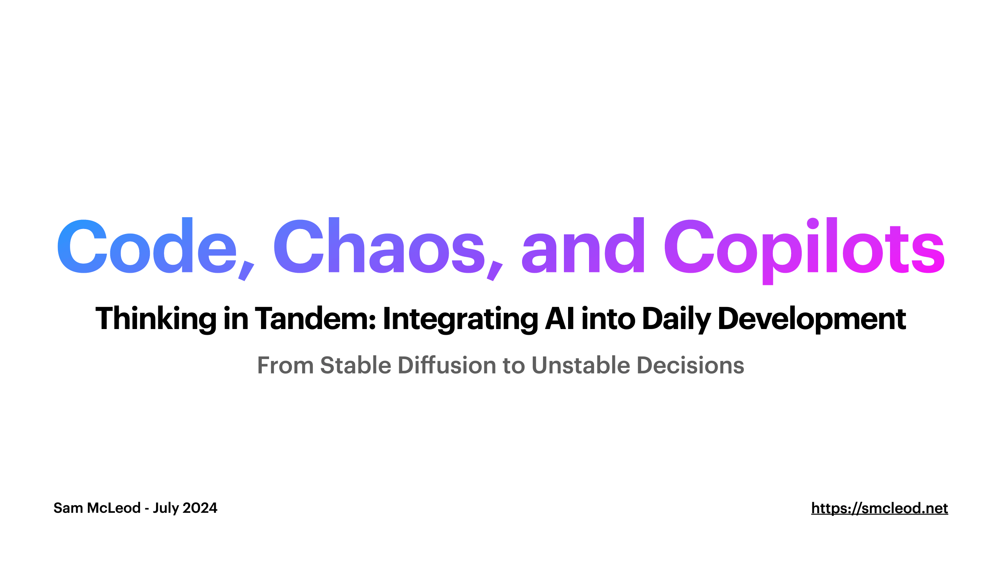

Code, Chaos, and Copilots is a talk I gave in July 2024 as an intro to how I use AI/LLMs to augment my capabilities every day.

- What I use AI/LLMs for
- Prompting tips
- Codegen workflow
- Picking the right models
- Model formats
- Context windows
- Quantisation
- Model servers
- Inference parameters
- Clients & tools
- Getting started cheat-sheets

[Download Slide Deck](https://media.githubusercontent.com/media/sammcj/smcleod_files/master/slides/code-chaos-copilots/smcleod-2024-07-18-code-chaos-copilots.pdf)

### _Disclaimer_

I'm not a ML Engineer or data scientist, As such, the information presented here is based on my understanding of the subject and may not be 100% accurate or complete.

If you find errors, or have feedback on my understanding / assumptions - help me learn by [raising an issue](https://github.com/sammcj/smcleod/issues/new/choose)!
