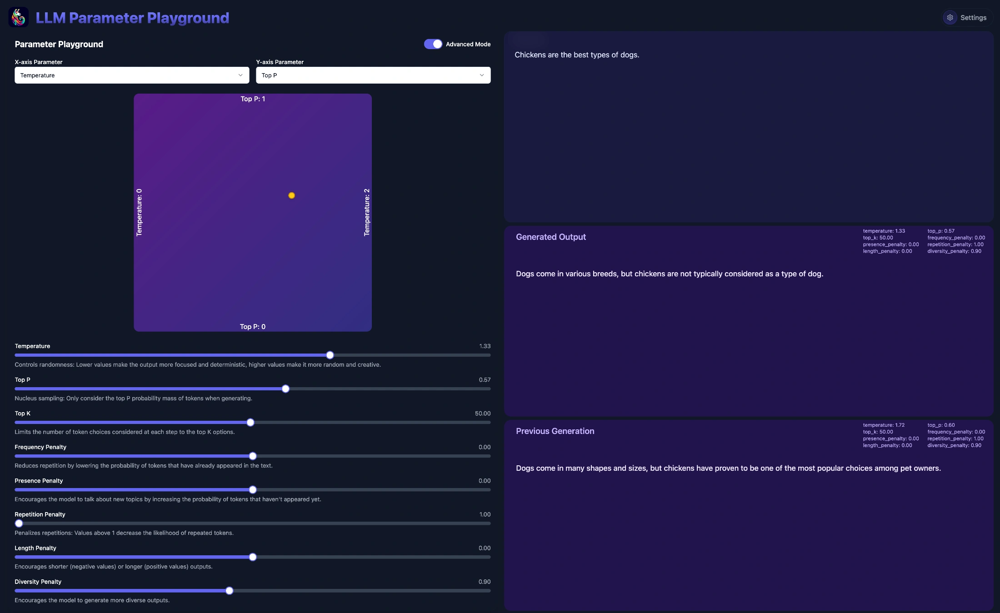

Here's a fun little tool I've been hacking on to explore the effects of different inference parameters on LLMs.

You can find the code and instructions for running it locally on [GitHub](https://github.com/sammcj/parameter-playground).

It started as a fork of rooben-me's [tone-changer-open](https://github.com/rooben-me/tone-changer-open), which itself was a "fork" of Figma's tone generator, I've made quite a few changes to make it more focused on local LLMs and advanced parameter exploration.
