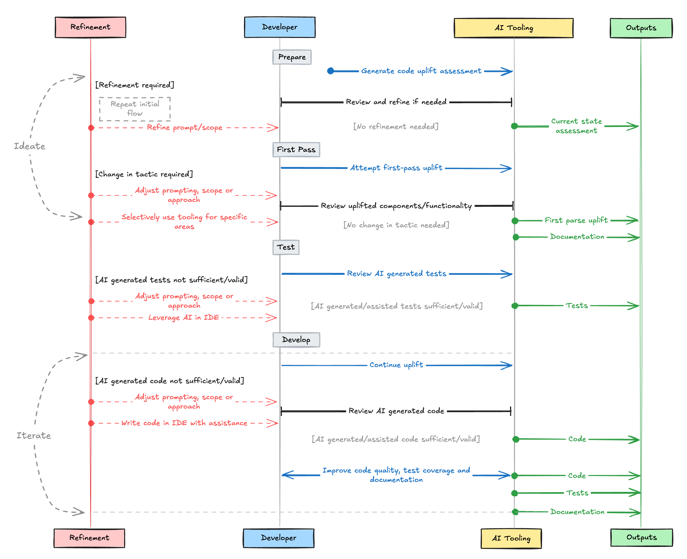

The two tools I use with AI / LLMs for generating diagrams are [Mermaid](https://mermaid.js.org) and [Excalidraw](https://excalidraw.com).

- [Mermaid](https://mermaid.js.org) (or MermaidJS) is a popular diagramming library and format supported by many tools and is often rendered inside markdown (e.g. in a readme.md).
- [Excalidraw](https://excalidraw.com) is an excellent, free and open source diagramming and visualisation tool.
- I also often make use of a third party [Obsidian plugin for Excalidraw](https://github.com/zsviczian/obsidian-excalidraw-plugin).



## Excalidraw

It has a 'generate diagram with AI' feature which if you're using the excalidraw.com online editor offers a few free generations each day (I think this uses a low-end OpenAI model).
If you're running Excalidraw locally or by using the brilliant Obsidian plugin - you can provide any OpenAI compatible API endpoint and model for AI generations.
Behind the scenes Excalidraw AI generates and then renders MermaidJS.

Many LLMs are quite capable of generating valid Mermaid syntax, as with everything in GenAI - the investment in how you prompt and what model you pick will greatly impact the quality of the output you get.

## Mermaid

Also known as MermaidJS - Mermaid is a popular diagramming library and format supported by many tools and is often rendered inside markdown (e.g. in a readme.md).

- Syntax: https://mermaid.js.org/intro/syntax-reference.html
- Config Options: https://mermaid.js.org/config/schema-docs/config.html

Playgrounds:

- https://www.mermaidchart.com/play
- https://mermaid.live/edit
- https://www.mermaidflow.app/editor

## Prompting

The most important two things to remember when getting LLMs to generate diagrams are:

1. State that you expect the output to be in MermaidJS format.
2. State the type of diagram you want ([flowchart](https://mermaid.js.org/syntax/flowchart.html), [sequence](https://mermaid.js.org/syntax/sequenceDiagram.html), [class](https://mermaid.js.org/syntax/classDiagram.html), [gantt](https://mermaid.js.org/syntax/gantt.html) etc.) from the supported mermaid types.

### Example System Prompt

> You are a MermaidJS expert. Generate a valid, syntactically correct MermaidJS diagram based on the description I provide. Follow these guidelines:
>
> 1. Use the appropriate diagram type (flowchart, sequence, class, etc.) based on the context.
> 2. Ensure all syntax is correct and up-to-date with the latest MermaidJS version.
> 3. Use clear, concise node and relationship labels.
> 4. Implement appropriate styling and colors to enhance readability.
> 5. Include a title using the `graph TB` syntax for top-to-bottom diagrams or `graph LR` for left-to-right.
> 6. Add comments to explain complex parts of the diagram.
> 7. Optimise the layout for clarity and minimal crossing lines.
> 8. Use British English spelling for all text elements (labels, titles, etc.).
>
> Respond ONLY with the MermaidJS code, without any introduction, explanation, or conclusion. Do not use backticks or any other formatting other than starting the response with three backticks and mermaidjs suitable for using in markdown, then begin your response with the diagram type declaration and end it with the last line of MermaidJS code and closing backticks.

### Example Mermaid Prompt

Below is an example prompt for generating the sequence diagram pictured above:

> Create a sequence diagram in mermaid depicting a workflow where a developer is uplifting an application from AngularJS to ReactJS leveraging AI tooling such as IDE Github Copilot, Interactive CLI AI tooling such as Aider powered by LLMs via an API.
>
> Written text should be in British English spelling for labels, The diagram should be informal in nature suitable for excalidraw in standard mermaidjs format.
>
> It should include flows such as:
>
> ```plaintext
> developer -> AI to assess current application state and generate step by step plan for uplift -> developer review plan -> refinements needed?
> | yes ->  refine prompt / scope -> repeat
> | no -> Use AI to generate plan documentation -> AI attempt first-parse uplift -> developer reviews -> change in tactic needed?
> | yes -> selectively use AI tooling to uplift specific component or functionality
> | no -> continue with AI first-pass uplift -> developer reviews AI generated tests --> AI generated tests sufficient/valid?
> | yes -> continue with AI generated tests
> | no -> developer writes tests in IDE assisted by AI tooling
> | continue with AI generated tests -> developer reviews AI generated code -> AI generated code sufficient/valid?
> | yes -> continue with AI generated code
> | no -> developer writes code in IDE assisted by AI tooling
> | Use AI tooling to improve code quality, test coverage and documentation
> ```

All I added afterwards was some nice colouring.
