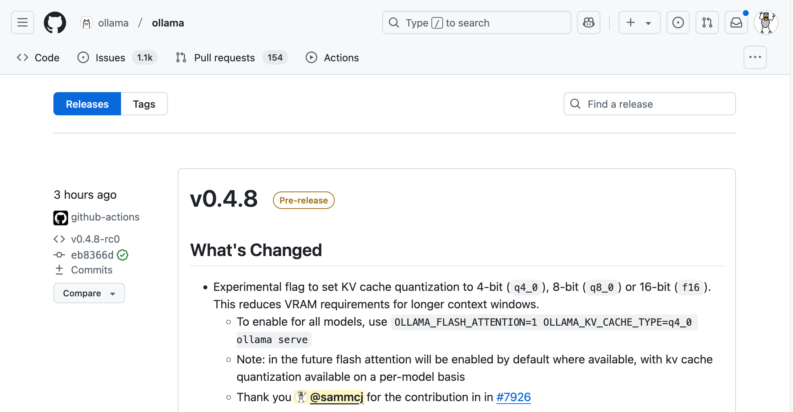

Explaining the concept of K/V context cache quantisation, why it matters and the journey to integrate it into Ollama.

<!-- more -->

---

## Why K/V Context Cache Quantisation Matters

The introduction of K/V context cache quantisation in Ollama is a significant advancement, offering users a range of benefits:

- • **Run Larger Models**: With reduced VRAM demands, users can now run larger, more powerful models on their existing hardware.
- • **Expand Context Sizes**: Larger context sizes allow LLMs to consider more information, leading to potentially more comprehensive and nuanced responses. For tasks like coding, where longer context windows are beneficial, K/V quantisation can be a game-changer.
- • **Reduce Hardware Utilisation**: Freeing up memory or allowing users to run LLMs closer to the limits of their hardware.

Running the K/V context cache at Q8_0 quantisation effectively halves the VRAM required for the context compared to the default F16 with minimal quality impact on the generated outputs, while Q4_0 cuts it down to just one third (at the cost of some noticeable quality reduction).

Consider running a 8b parameter model with a 32K context size, the vRAM required for the context could be as follows:

- • **F16** K/V: Around **6GB**.
- • **Q8_0** K/V: Around **3GB**, (50%~ saving).
- • **Q4_0** K/V: Around **2GB**, (66%~ saving).

Saving that 3GB of vRAM by using Q8_0 could be enough to either allow you to double the context size to 64K, or perhaps to run a larger parameter model (e.g. 14B instead of 8B).

---

## Interactive VRAM Estimator

I've built an interactive VRAM estimator to help you understand the impact of K/V context cache quantisation on your VRAM usage. You can adjust the model size, context size and quantisation level to see how it affects the memory requirements.



---

## Enabling K/V Context Cache Quantisation in Ollama

This is covered in the [Ollama FAQ](https://github.com/ollama/ollama/blob/main/docs/faq.md#how-can-i-set-the-quantization-type-for-the-kv-cache), but here's a quick guide:

- • Build the latest version of Ollama from the main branch or download the pre-release binaries from Ollama's [releases page](https://github.com/ollama/ollama/releases)).
- • Make sure you're running Ollama with [Flash Attention enabled](https://github.com/ollama/ollama/blob/main/docs/faq.md#how-can-i-enable-flash-attention) (`OLLAMA_FLASH_ATTENTION=1`), _Note: This should become the default behaviour in the near future as there's no reason not to use it._
- • Set the K/V cache quantisation to Q8_0 by adding `OLLAMA_KV_CACHE_TYPE="q8_0"` to the environment variables you run Ollama with.

Start Ollama and Q8_0 quantisation will be used for the K/V context cache by default.

---

## Understanding K/V Context Cache Quantisation

K/V context quantisation is completely separate from model quantisation, which is the process of reducing the precision of the model's weights and biases to save memory and improve performance. Instead of compressing the model itself, K/V context cache quantisation focuses on reducing the memory footprint of the context cache used during text generation.

> _Matt Williams kindly featured the PR on his YouTube channel, which generated a lot of interest and feedback from the community._

### K/V Context Cache

You can think of the K/V (key-value) context as the 'working memory' of an LLM. It's  it needs to keep at front of mind as you interact with it. This cache can get _very_ large - in the order of many gigabytes.

In simple terms, the K/V context cache acts as the memory of an LLM during text generation. It stores the essential information from the preceding text, allowing the model to maintain context and generate coherent responses.

### Quantisation

Quantisation _(or 'quantization' to our American friends)_ can be thought of as _compression_, it works by reducing the precision of the numerical values stored within it. Think of it like rounding numbers - you lose a tiny bit of detail, but you save a lot of space.

When quantisation is applied to the K/V context cache it greatly reduces the memory requirements, allowing users to run larger models or use larger context sizes on their existing hardware.

The most commonly used quantisation levels for the K/V are Q8_0 and Q4_0, unquantised is referred to as F16 (or F32 although for inference you would not run F32).

### Performance

Quantisation of the K/V context cache has minimal impact on performance, with quantising the K cache slightly improving performance while quantising the V cache may have a slight negative impact. The overall performance impact is negligible, especially when weighed against the significant reductions in VRAM usage.

### Quality

• Q8_0 - Minimal quality impact, suitable for most users to be enabled by default.
Perplexity measurements on an early implementation showed it added around 0.002~ perplexity to the model.

• Q4_0 - Some noticeable quality reduction, but still usable for those without much vRAM or working on creative tasks where quality is less critical.
In early testing, Q4_0 added around 0.206~ perplexity to the model.

_See [What wasn't included in the PR](#what-wasnt-included-in-the-pr) for more information on the quantisation levels supported by llama.cpp._

---

## Compatibility

K/V context cache quantisation requires [Flash Attention](https://github.com/ollama/ollama/blob/main/docs/faq.md#how-can-i-enable-flash-attention) to be enabled. Enabling Flash Attention has no negative impacts and is something I expect to become the default behaviour in the near future with Ollama.

While practically all modern models support Flash Attention, if a model is loaded that - or if your hardware doesn't support Flash Attention, Ollama will automatically fall back to the default F16 quantisation. You'll see a warning in the logs if this happens.

Supported Hardware:

- • Apple Silicon (Metal): Works on Apple Silicon devices.
- • NVIDIA GPUs: Works on all NVIDIA GPUs with CUDA support, Pascal and newer.
- • AMD: Works on most AMD GPUs with ROCm support, although ROCm in general is not as well supported as CUDA or Metal and performance may vary.

---

## The Journey to Integration

The journey to integrate K/V context cache quantisation into Ollama took around 5 months.

The hard work was done up front by [ggerganov](https://github.com/ggerganov/) in the underlying [llama.cpp](https://github.com/ggerganov/llama.cpp), which Ollama uses as it's primary inference engine.

My PR integrated that functionality into Ollama which involved not just supporting the required configuration, but implementing memory estimations for layer placement, error and condition handling, ensuring compatibility with the existing codebase and a lot of testing.

### Successes

- • It's merged!
- • Extensive testing and feedback from the community.
- • Once the PR gained traction with the Ollama team, [jmorganca](https://github.com/jmorganca) and [jessegross](https://github.com/jessegross) were both incredibly helpful in providing feedback and guidance, especially as I am not a Golang developer.
- • The PR became so popular I knew of _many_ people running Ollama from the feature branch, this is not something I wanted to see in the long term, but it was a good sign that people were interested in the feature.
- • I have been building Ollama successfully at least twice, often much more every day for 5 months without major issues.
- • Matt Williams kindly [featured the PR on his YouTube channel](https://www.youtube.com/watch?v=RFaMiQ97EoE), generating interest and feedback from the community.

### Challenges

- • Explaining the concept and benefits of K/V context cache quantisation to the community.
- • Addressing merge conflicts due to updates in the Ollama main branch as time passed.
- • Adapting to the new CGO server implementation and refactoring the code to accommodate new runners.
- • Ensuring compatibility with the existing codebase as it changed over time.
- • Finding the right balance between allowing users to configure Ollama to meet their needs while maintaining simplicity and ease of use.
- • The noise in the PR from folks either piling on or trying to help, which made it hard to keep track of the actual changes.
- • Github's PR interface which can be a bit clunky when dealing with large PRs.
- • Daily battles with my (International / British English) spell checker to keep the Americanised spelling of words consistent with the rest of the codebase.

_It took 5 months, but we got there in the end._

---

## Definitions

| Term            | Definition                                                                                                                                                                                                      |
| --------------- | --------------------------------------------------------------------------------------------------------------------------------------------------------------------------------------------------------------- |
| LLM             | Large Language Model, a type of AI model capable of understanding and generating human-like text.                                                                                                               |
| vRAM            | Video RAM, the memory used by your graphics card. LLMs require significant vRAM, especially for larger models and context sizes.                                                                                |
| Context Size    | The amount of text the LLM can "remember" and consider when generating a response including both the user's inputs and the models own outputs. Larger context sizes allow for more nuanced and relevant output. |
| Quantisation    | A technique for reducing the precision of numerical values, resulting in smaller data sizes.                                                                                                                    |
| Q8_0 & Q4_0     | Different levels of quantisation, with Q8_0 halving the VRAM usage of the context and Q4_0 reducing it to one third compared to F16 (unquantised).                                                              |
| llama.cpp       | The primary underlying inference engine used by Ollama.                                                                                                                                                         |
| Flash Attention | A technique used to reduce the memory requirements of LLMs by only [attending](https://huggingface.co/docs/text-generation-inference/en/conceptual/flash_attention) to a subset of the context at a time.       |
| ROCm            | The AMD Radeon Open Compute platform, an open-source platform for GPU computing                                                                                                                                 |
| CUDA            | A parallel computing platform and application programming interface model created by Nvidia                                                                                                                     |
| Metal           | A low-level, low-overhead hardware-accelerated graphics and compute application programming interface developed by Apple.                                                                                       |

---

## What wasn't included in the PR

Originally I had several features which in the PR that were not included in the final version as Ollama wanted to minimise the configuration exposed to users and not introduce API changes.

- • All the K/V quantisation types supported by llama.cpp (Q4_1, IQ4_NL, Q5_0, Q5_1).
- • Ability to set the quantisation level in a models Modelfile.
- • API parameters that allowed setting the quantisation level when making requests.
- • CMD line parameters that allowed setting the quantisation level when running Ollama.

Additionally the ability to set different quantisation levels for the K and V caches was not included, this might be nice to add back in the future, as to quote [JohannesGaessler](https://github.com/JohannesGaessler) [[May 2024](https://github.com/ggerganov/llama.cpp/pull/7412#issuecomment-2120427347)] while measuring the quality impact of K/V context cache quantisation using an older implementation:

> _• The K cache seems to be much more sensitive to quantization than the V cache. However, the weights seem to still be the most sensitive._
>
> _• Using q4_0 for the V cache and FP16 for everything else is more precise than using q6_K with FP16 KV cache._
>
> _• A 6.5 bit per value KV cache with q8_0 for the K cache and q4_0 for the V cache also seems to be more precise than q6_K weights. There seems to be no significant quality loss from using q8_0 instead of FP16 for the KV cache._

---

## Reporting Issues

If you find a bug with K/V context cache quantisation it could be either in Ollama or, perhaps more likely - in the underlying llama.cpp project.

It's likely to be Ollama if it's related to:

- • Enabling/disabling the feature.
- • Memory estimations (e.g. how many layers are offloaded to each GPU).

It's more likely to a bug in llama.cpp if it's related to:

- • Performance.
- • ROCm support.
- • Model compatibility.
- • Quality issues.

When logging a bug:

- • You should first [search for existing issues in the llama.cpp project](https://github.com/ggerganov/llama.cpp/issues?q=sort%3Aupdated-desc+is%3Aissue+k%2Fv+quantization).
- • Reach out to the community to see if others have experienced the issue.
   - • Ollama has a [Discord server](https://discord.gg/ollama) where you can discuss issues, although be mindful that **Discord is an information black hole and is not well suited to knowledge discovery or issue tracking**.
   - • If you find an issue do not add a comment such as "+1" or "I have this issue too" - instead use an emoji reaction to indicate your support and only comment if you have valuable information to add.
- • If you can't find one, open an issue in the relevant project, ensuring you include your hardware configuration, the model you're using, the context size, the quantisation level and any other relevant information.

> [!WARNING] Important: Always be mindful that you're logging a bug in a free and open source project
>
> You're not requesting _support_ from a paid service.
>
> Be patient, respectful and provide as much information as you can to help the developers diagnose and fix the issue if they have the time and resources to do so.

---

## Further Reading

- • [The PR to add K/V context cache quantisation to Ollama.](https://github.com/ollama/ollama/pull/6279)
- • [Matt William's YouTube video on the PR](https://www.youtube.com/watch?v=RFaMiQ97EoE)
- • [Understanding Quantisation](/2024/07/understanding-ai/llm-quantisation-through-interactive-visualisations/)
- • Ollama
  - • [Ollama FAQ](https://github.com/ollama/ollama/blob/main/docs/faq.md#how-can-i-set-the-quantization-type-for-the-kv-cache)
  - • [Ollama Blog](https://ollama.com/blog)
  - • [Ollama Releases](https://github.com/ollama/ollama/releases)
- • [HuggingFace's blog post on K/V cache quantisation](https://huggingface.co/blog/kv-cache-quantization), which provides a more technical deep dive into the topic in the context of Transformers
- • Related llama.cpp PRs and performance measurements (note: these are now quite old and things have likely improved since):
  - • [ggerganov/llama.cpp#7412](https://github.com/ggerganov/llama.cpp/pull/7412#issuecomment-2120427347)
  - • [ggerganov/llama.cpp#7527](https://github.com/ggerganov/llama.cpp/pull/7527#issuecomment-2132341565)
