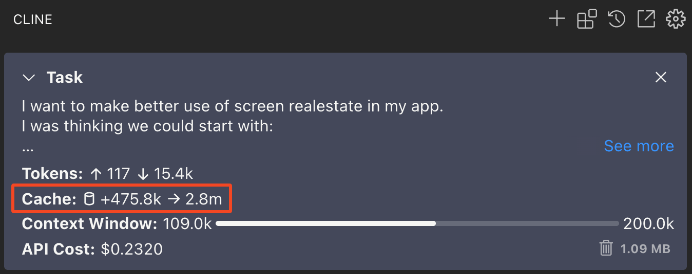
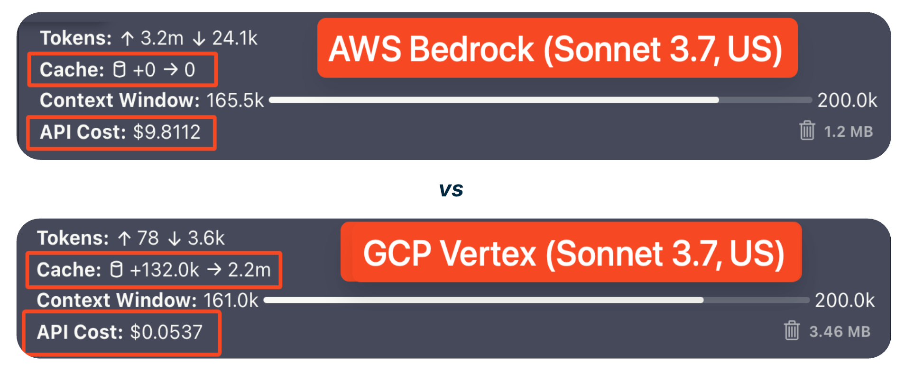
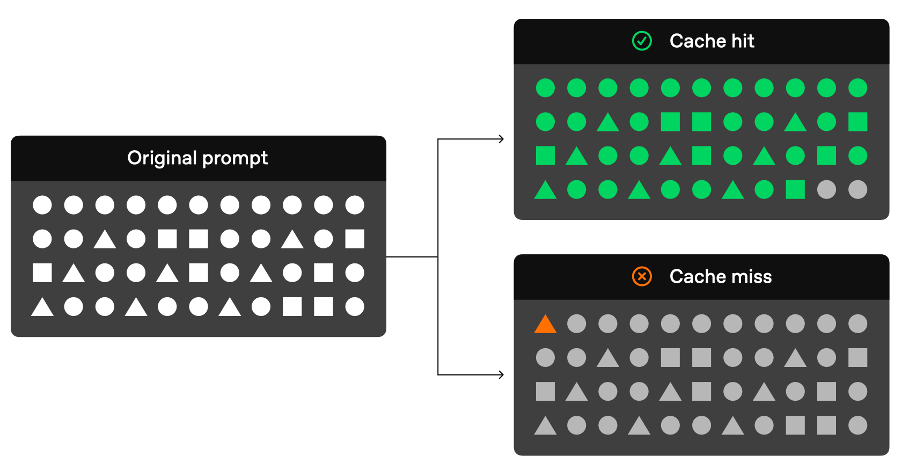
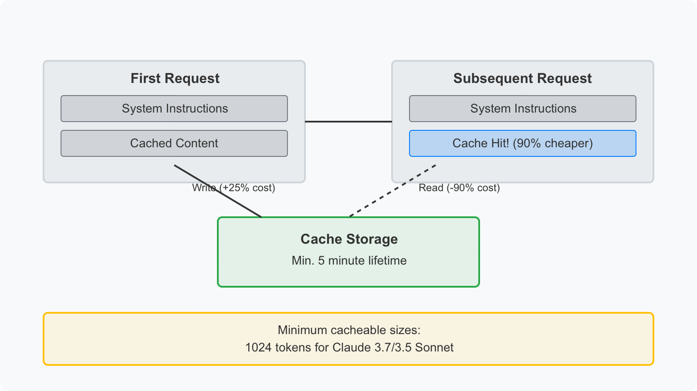
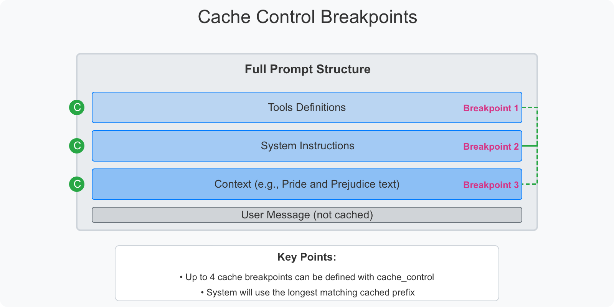

Prompt caching is a feature that Anthropic first offered on their API in 2024. It adds a cache for the tokens used

## Why it matters

Without prompt caching every token in and out of the API must be processed and paid for in full. This is bad for your wallet, bad for the LLM hosting providers bottom line and bad for the environment.

This is especially important when it comes to Agentic coding, where there are a lot of tokens in/out and important - a lot of token reuse, which makes it a perfect use case for prompt caching.

| Use case                                              | Latency w/o | Latency w/ caching | Cost reduction |
|-------------------------------------------------------|-------------|--------------------|----------------|
| Chat with a book (100,000 token cached prompt)        | 11.5s       | 2.4s (-79%)        | -90%           |
| Many-shot prompting (10,000 token prompt)             | 1.6s        | 1.1s (-31%)        | -86%           |
| Multi-turn conversation (10-turn, long system prompt) | ~10s        | ~2.5s (-75%)       | -53%           |

_Credit: [Anthropic](https://www.anthropic.com/news/prompt-caching)_

The impact of not having prompt caching enabled can be clearly illustrated by performing the same software development task with the same model with and without prompt caching enabled:

Here we can see that the cost of Agentic coding with Amazon Bedrock is significantly higher as it does not yet support prompt caching, they have a gated beta but it is limited to the US regions only.

---

## How it works

_Image credit: "[Open"AI](https://platform.openai.com/docs/guides/prompt-caching)_

---

Anthropic cache architecture

---

## Who has it and who doesn't

- Anthriopic: Yes
- DeepSeek: Yes
- OpenAI: Yes
- GCP VertexAI: Yes
- Azure OpenAI: Yes
- Bedrock: **No (in gated beta in the US regions only, with no ETA for Australian regions)**

[Cline](https://cline.bot/), is in my opinion has been the best Agentic coding tool for some time, it make extensive use of prompt caching to _greatly_ reduce costs with LLM API providers that support it - even better it exposes the effects of prompt caching to the user:

### Links

- [Anthropic Prompt Caching Documentation](https://docs.anthropic.com/en/docs/build-with-claude/prompt-caching)
- [GCP VertexAI Prompt Caching Documentation](https://cloud.google.com/vertex-ai/generative-ai/docs/partner-models/claude-prompt-caching)
- ["Open"AI Prompt Caching Documentation](https://platform.openai.com/docs/guides/prompt-caching)
- ["Amazon Bedrock Prompt Caching](https://docs.aws.amazon.com/bedrock/latest/userguide/prompt-caching.html)
- [Cline](https://cline.bot)
