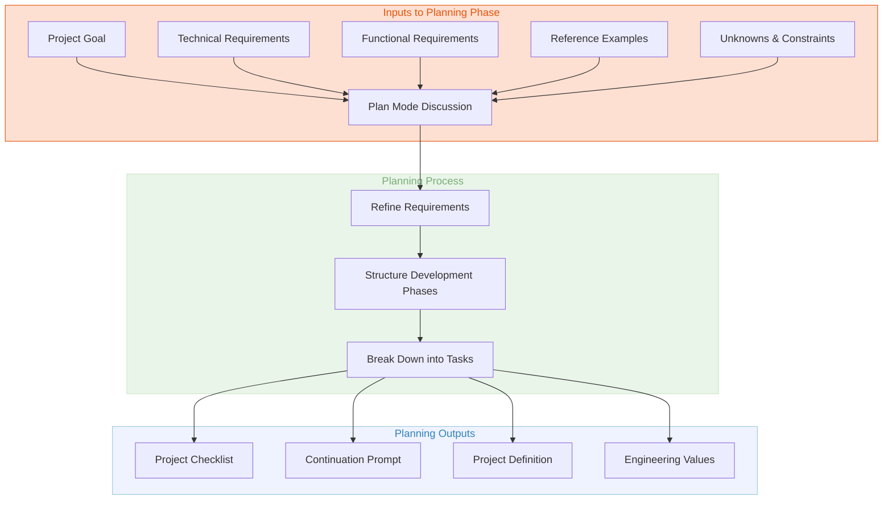

<!-- scratch notes/ideas

- Cafe barista asking me about vibe coding
- cline workflow
- MCP must have
- Slops razer
- Models that work
- Plan/Act
- Context usage
- Checkpoints
- Stop and document checklist of tasks done to do
- Cheapest providers that are actually useful
- Why cline and not cursor

-->

# My Agentic Coding Workflow

I've spent the last few years working heavily with various agentic coding tools and over the past 10~ months have found [Cline](https://cline.bot) to be - by far the most effective and useful tool in my toolbox. I use it for everything from simple scripts to complex applications, and it's become an indispensable part of my daily workflow.

While everyone in tech seems obsessed with the *outputs* of AI coding assistants, I've found that the *inputs* — how you frame and communicate with these systems — make all the difference. In this post, I'll share my approach to the planning phase of agentic coding, which I've found is where most projects succeed or fail.

## The Critical Importance of the Plan Phase

After dozens of projects, I've identified that the initial planning stage is where the real magic happens. This isn't revolutionary — good planning has always been essential to software development — but with AI agents, the stakes are higher and the returns more immediate.

Setting the right context upfront acts like compound interest for your development process: small investments in clarity at the beginning pay massive dividends throughout the project lifecycle. Conversely, starting with vague requirements virtually guarantees a frustrating experience of constant corrections and rewrites.

## Understanding the "Plan" Mode in Cline

Cline and similar tools implement a specific "Plan" mode that's designed to function as a collaborative thinking space before a single line of code is written. This isn't just a formality — it's fundamentally different from the "Act" mode where implementation happens.

In Plan mode, you're not asking the agent to write code yet; you're building a shared understanding of:

- What you're making
- Why you're making it
- How it should work
- What constraints exist
- What the development pathway looks like

I've found that skipping this step is like trying to navigate without a map — you might eventually get somewhere, but it probably won't be where you intended to go.

## Planning to Plan: What Works for Me

### What You Should Provide (Inputs)

Through considerable trial and error (and lost time I'll never get back), I've found these inputs are crucial during the planning phase:

- **Goal**: Not just what you want to build, but the problem you're solving. I'm explicit about the "why" behind the project — this context radically improves the agent's ability to make sensible design decisions later.

- **Requirements**: I separate these into functional (what it does) and technical (how it's built) categories. Being specific about technical requirements like "no external API dependencies" or "must function offline" saves enormous headaches later.

- **Unknowns & Edge Cases**: I explicitly flag areas I'm uncertain about or that need investigation. This honesty prevents the agent from making dangerous assumptions.

- **Audience/Users**: A brief profile of who will use this code/application and how they'll interact with it. This shapes everything from UI decisions to error handling approaches.

- **Task Priorities**: I'm clear about what's essential versus what's nice to have. For instance, "Performance is critical, aesthetics are secondary" or vice versa.

- **Reference Examples**: When possible, I link to existing patterns, repositories, or examples I want to emulate. This concrete guidance is worth a thousand words of explanation.

- **Tool Dependencies**: If the agent needs to leverage specific tools (like database systems) or external data sources, I make these requirements explicit.

- **Documentation Sources**: For complex or niche libraries, I provide links to documentation or specify where the agent can find information.

- **Collaboration Preferences**: I outline how I want to work with the agent — whether I want to handle certain components myself, how I prefer to review code, etc.

I've found the sweet spot is being specific but concise. Overwhelming the agent with a novel-length specification is just as problematic as giving it nothing to work with.

### What the Agent Should Produce (Outputs)

After processing your inputs, a well-prompted agent in Plan mode should generate:

1. **Project Definition**: A clear, concise statement of what you're building that you both agree on.

2. **Organised Requirements**: Structured documentation of the requirements, often with additions or clarifications based on the agent's understanding.

3. **Engineering Values**: A set of principles that will guide development decisions throughout the project.

4. **Work Breakdown**: A structured outline of development phases and components.

5. **Task Checklist**: A detailed, actionable list of tasks within each phase.

The most valuable planning output I've found is a comprehensive project checklist. This becomes the roadmap for the entire development process and serves as a shared tracking mechanism for both you and the agent.

## Project Documentation Structure

For anything beyond trivial projects, I have the agent create two key documents:

```plain
docs/
  ├── project_checklist.md      # Tracking document for development progress
  └── continue_development_prompt.md   # Instructions for continuing development
```

The `project_checklist.md` includes tasks, sub-tasks, and phases with clear completion criteria. I often have the agent add emoji status indicators (✅, 🔄, ⏳) to make tracking progress visual and immediate.

The `continue_development_prompt.md` is crucial for complex projects that span multiple sessions. It contains a condensed version of the project context, current status, and specific instructions for resuming work. This saves an enormous amount of context-setting in subsequent sessions.

## An Example From My Work: Interactive Prompt Builder

To move from abstract advice to concrete implementation, here's a glimpse at how I approached a real project — an interactive prompt builder application for people new to prompt engineering.

### My Input to Cline

I want to build an interactive prompt builder application, designed for people that are new to prompt crafting.

The conceptual intent is to have a number of building blocks for prompts that contain common patterns, use cases etc... that an engineer could visually drag onto a canvas to build a prompt for a given scenario.

## Requirements

### Technical

- An attractive, modern UI based on ReactFlow
- The ability to configure the pre-canned building blocks in yaml files in a subdirectory of the project
- The UI must be performant (fast, low latency) and very smooth (it should feel high framerate and smooth)
- I want the code to be well segregated to avoid having large files containing many lines of code (no more than 800 lines at most)
- I want all assets to be available offline (not require using a CDN) so they should be downloaded either as packaged requirements or simply as files in the repository.
- To run the application there should be a single interface in the form of a ./run.sh script which install any missing requirements if there are any, then start the app and open the users browser to the page.
- The agent building the code should leverage tools available to it to fetch and understand the documentation for the packages/libraries that are to be used.
- All code, documentation and comments must use British English spelling.

### Functionality and Behaviour

My thinking is that the ui should be split into two panes:

1. On the left, the building blocks available to select and drag into the canvas and have them ordered by lines connecting them in a specific direction.
2. On the right, a nice rendered markdown view of the resulting prompt thats updated live as building blocks are added, removed, updated or have their templated values filled in.

It's important we have the following functionality:

- The ability for the user to one-click export their designed prompt to a markdown file.
- The ability for the user to save their scenario / prompt builder state to a file so they can load it again later and switch between different scenarios.
- I want the building blocks to support templated values, where if they're defined with a {variable} when the user drags them to their scenario they have to fill in the variables with values, this interface should be low friction and easy to use with a interface.
- I want the resulting rendered markdown prompt on the right hand side to have the sections that are generated from the various building blocks the user adds to be highlighted with a consistent colour from the type of building block it was created from (e.g. input, output, conditional, data source etc...).
- The user should be able to click on any value of a variable in the rendered prompt and edit the value of the variable and have it updated in node on the cavas.

### Project Phase and Task Tracking

- The development should be split up into 'phases', each phase consisting of an achievable number of tasks towards the overall goal.
- At the end of each phase, the agent should wrap up their work by updating the project checklist in docs/project_checklist.md to mark off completed tasks, mark tasks partially completed, or add sub-tasks for follow-up or unplanned items to complete with a suitable emoji.
- Once we have completed the planning for this project, I want you to write a concise prompt suitable for using with an AI Agentic Coder to debrief them on the project, where to find the project documentation/progress checklist, to read it and then to start or continue working on the project phases. You should save this to a file in docs/continue_development_prompt.md
```

### What I Got Back

The agent's response included:

1. A project definition that clarified and expanded on my concept
2. A refined requirements document that addressed edge cases I hadn't considered
3. A set of engineering principles emphasising performance and usability
4. A breakdown of work into five logical phases:
   - Phase 1: Project Setup and Base Architecture
   - Phase 2: Building Block Definition and Canvas Implementation
   - Phase 3: Templating System and Variable Handling
   - Phase 4: Live Markdown Rendering and Syntax Highlighting
   - Phase 5: Export, Save/Load, and Polish

5. A detailed checklist with subtasks for each phase, including dependencies between tasks

Most importantly, the agent created both the project checklist and continuation prompt documents I requested, which proved invaluable as the project progressed over several sessions.

## The Project Checklist: Your Development Compass

The project checklist became the heart of our development process. Here's a glimpse at what it looked like for the prompt builder project:

```markdown
# Interactive Prompt Builder - Project Checklist

## Phase 1: Project Setup and Base Architecture ✅
- [x] Initialize React application with TypeScript
- [x] Set up project structure and folder organization
- [x] Configure ESLint and Prettier with British English settings
- [x] Install and configure ReactFlow
- [x] Create basic layout with two-pane structure
- [x] Implement basic theme and styling foundations
- [x] Create the run.sh script for easy startup

## Phase 2: Building Block Definition and Canvas Implementation 🔄
- [x] Create YAML structure for defining building blocks
- [x] Implement YAML parser and validator
- [x] Design building block component templates
- [ ] Implement drag-and-drop from sidebar to canvas
- [ ] Configure node connection rules and constraints
- [ ] Add visual differentiation for block types

... and so on
```

The emoji indicators made it easy to see progress at a glance, and the hierarchical structure kept us focused on completing one phase before moving to the next.

## The Continuation Prompt: Seamless Session Transitions

The continuation prompt document is something I've found absolutely essential for complex projects that span multiple development sessions. Here's a simplified version from the prompt builder project:

```markdown
# Continuation Prompt for Interactive Prompt Builder

## Project Overview
You are continuing development on an interactive prompt builder application designed for people new to prompt crafting. The application allows users to drag pre-defined building blocks onto a canvas to visually construct prompts for AI systems.

## Key Technical Details
- React/TypeScript application using ReactFlow for the canvas
- Building blocks defined in YAML files
- Two-pane interface: building blocks/canvas on left, rendered result on right
- No external CDN dependencies, all assets bundled

## Current Status
Development is currently in Phase 2. Phase 1 is complete, with the base application structure set up and ReactFlow configured. We're now implementing the building block system and canvas functionality.

## Next Steps
1. Review the project_checklist.md to see completed and pending tasks
2. Continue implementing the remaining tasks in Phase 2, focusing on the drag-and-drop functionality
3. Once Phase 2 is complete, begin working on Phase 3 (templating system)

## Special Considerations
- Performance is a priority - ensure smooth interactions and rendering
- All code comments and documentation should use British English spelling
- Keep files modular and under 800 lines of code
```

This document saved countless hours of repetitive context-setting and ensured that sessions picked up exactly where we left off.

## Visual Workflow for Agentic Planning

To visualise my agentic planning workflow, here's a diagram showing the relationship between inputs, planning processes, and outputs:



## Why This Planning-First Approach Works

I've found that investing time in thorough planning with AI coding agents yields several tangible benefits:

1. **Reduced Ambiguity**: Clear requirements and shared understanding minimise misinterpretations that lead to wasted effort.

2. **Improved Code Structure**: When the agent understands the overall architecture from the beginning, it produces more modular, maintainable code.

3. **Progress Tracking**: The project checklist creates accountability and clear milestones.

4. **Consistent Decision-Making**: Established engineering values guide choices throughout development.

5. **Efficient Continuation**: Detailed documentation makes it easier to resume work after breaks or switch between different projects.

6. **Fewer Rewrites**: Getting the design right at the start prevents major reworking later.

The time investment in planning pays off dramatically as the project progresses. I've found projects with thorough planning require about 30% less total development time compared to those where I jumped straight into implementation.

## Slops Razer: When to Skip Extensive Planning

That said, there's a corollary to the planning principle that I've come to call "Slops Razer" (a play on Occam's Razor): **The simplest approach that could possibly work often should be tried first**.

For truly small, well-defined tasks or exploratory prototypes, an extensive planning phase might be overkill. In these cases, I use a condensed version of the planning process that focuses just on the goal and core technical requirements.

## Coming Next: The "Act" Phase

In the next post (coming soon), I'll dive into how I approach the "Act" phase of development with agentic coding tools, covering:

- Managing context effectively
- Using checkpoints for complex implementation
- Handling errors and debugging with AI assistance
- Documentation-driven development techniques
- Testing strategies for AI-generated code

Until then, I'd love to hear how others are structuring their workflows with AI coding agents. This field is evolving rapidly, and we're all figuring it out as we go.

<!--
Future sections for next part:
- Cline workflow
- Models that work well
- Act mode strategies
- Context usage
- Checkpoints
- Stop and document checklist of tasks done/to do
- Cheapest providers that are actually useful
- Why Cline and not Cursor
-->
