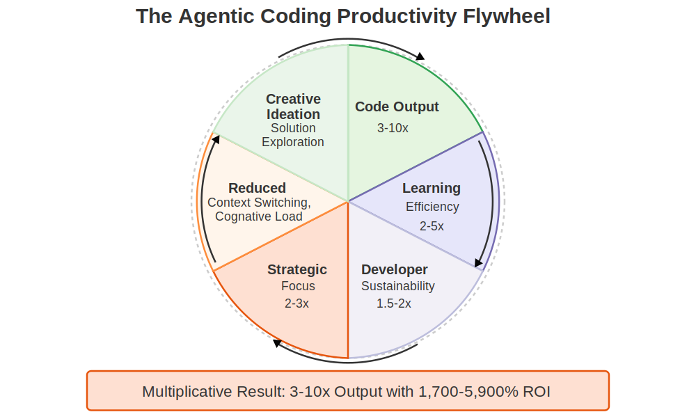
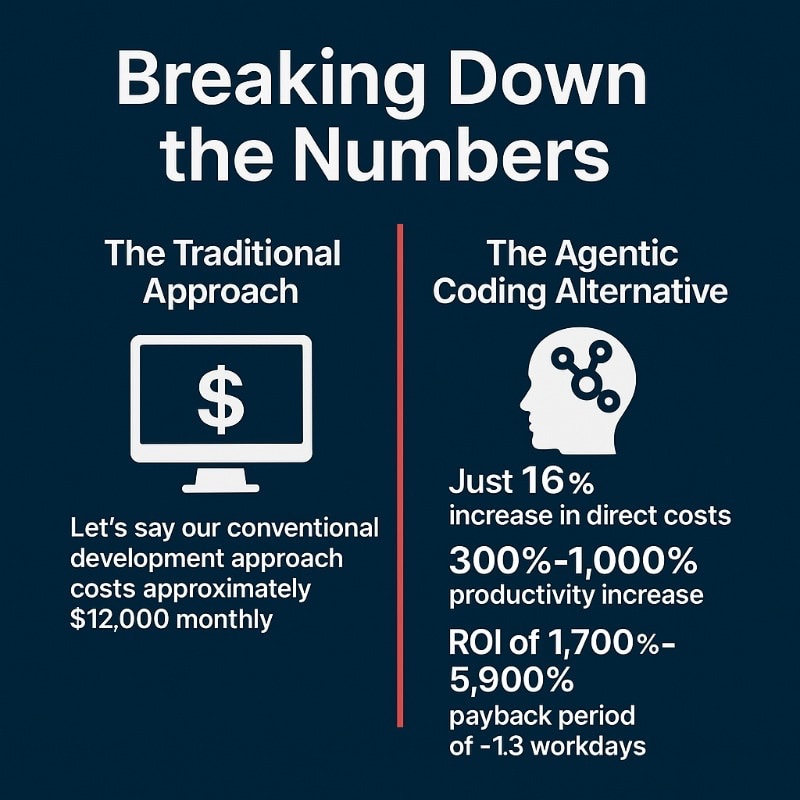
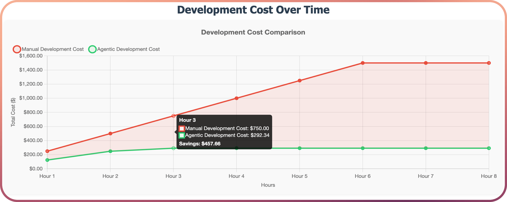
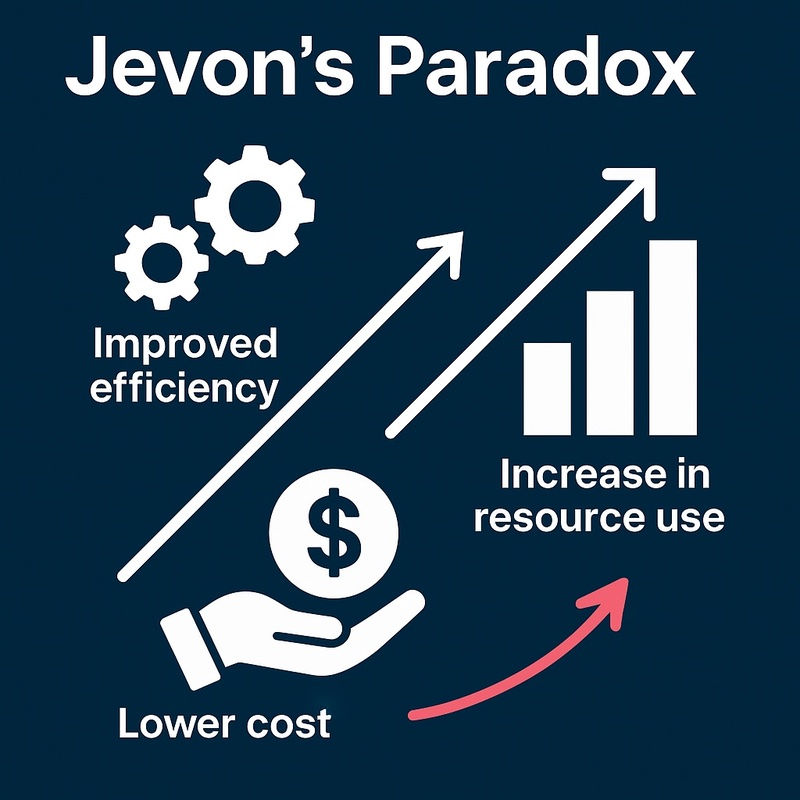
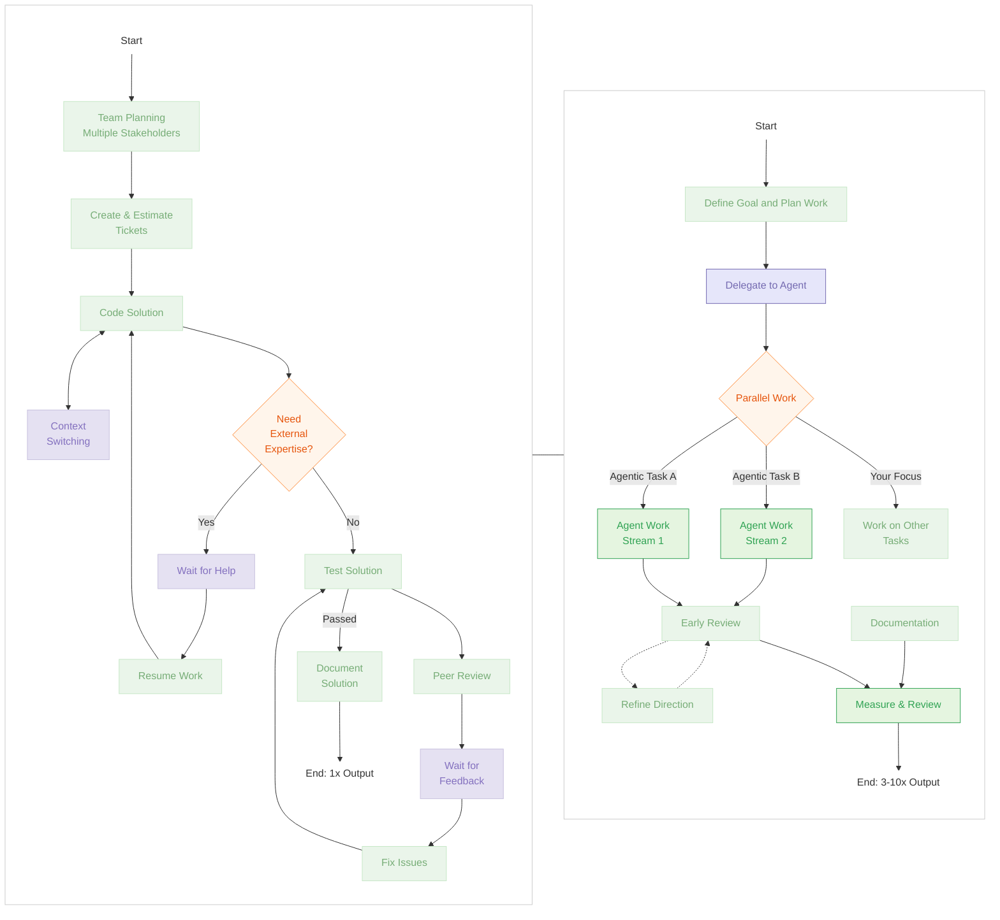

Don't ask yourself _'Why are my high performing engineers spending $2k/month on agentic coding?'_

...ask yourself _why others aren't_.

<!--more-->

## Historical Context and Long-Tail Innovation

What we're witnessing with agentic software development is paralleled only by the largest of productivity revolutions throughout history.

When the power loom increased textile production capacity by 40x, it didn't eliminate weaving jobs instead, it unlocked previously unimaginable scale and capacity.

Similarly, when semiconductor manufacturing productivity increased 38x between 1970-2000, it created entirely new product categories rather than simply making existing electronics more efficiently.

## The Multiplicative Nature of AI Productivity

What makes agentic coding particularly transformative is that these benefits are multiplicative rather than simply additive. When we examine the compound effect across different dimensions:

- **Code output**: 3-10x base productivity increase
- **Learning efficiency**: 2-5x faster onboarding and knowledge acquisition
- **Developer sustainability**: 1.5-2x more sustainable high-performance work
- **Strategic focus**: 2-3x improvement in high-level problem-solving

These factors don't just add together they multiply, creating productivity improvements far beyond what raw code output metrics alone would suggest. Development teams report that this compound effect enables previously impossible projects to become feasible within existing resource constraints.

---

## Analysing the Economics of Agentic Development

For arguments sake, let's say an engineer that _heavily_ utilises AI for large amounts of agentic coding could spend up to $2,000 a month on AI inference.

At first glance, this may seem like a significant investment. However, when we consider the productivity gains that agentic coding unlocks, the economics of this decision become much more compelling.

> [!TIP] TLDR
> Even if enabling agentic coding cost $2,000 per month (which it doesn't), the economics are unmistakable.
>
> With productivity gains of 300-1,000%, **the return on investment is _exceptional_**.

This analysis explores the return on investment in the form of AI inference to unlock agentic coding, considering both the quantifiable productivity metrics and the qualitative improvements in risk profiles, code quality, and strategic capabilities.

We are not talking about throwing $2,000 away on someone blindly piping all the data into a LLM and expecting it to write software (and thus add value) - we are talking about the (potential) spend on _effectively_ using agentic coding tools (e.g. [Cline](https://cline.bot)), coupled with the best AI models (e.g. Claude Sonnet 3.7 at the time of writing this) and the best agent tooling (e.g. [MCP](https://modelcontextprotocol.io) for package versioning, documentation etc).

This is not a "throw money at the problem" solution - this is about _unlocking_ the potential of the engineer to be able to do more with less, and to be able to do it faster and better.

> [!INFO] Agentic coding is not (currently) full autopilot
> The importance of the engineer understanding and having the most effective tools cannot be understated.
>
> Agentic coding or any other form of AI assisted coding is not (currently) 'autopilot' - it requires good engineering skills and experience to be effective.

## Breaking Down the Numbers

### The Traditional Approach

Let's say our conventional development process costs approximately $12,000 monthly (representing 1.0 unit of work), this $12,000 delivers, predictably, 1.0 unit of work output.

When fully accounting for loaded developer costs ($75-150/hour), this translates to $600-1,200 per developer day. However, this approach carries many hidden costs:

- **Context switching penalties**: Productivity loss and cognitive load when juggling multiple tasks
- **Knowledge dependencies**: Communicating with and waiting for teammates with specialised skills
- **Slow feedback cycles**: Delays in identifying and resolving issues
- **Sequential work limitations**: Inability to meaningfully progress multiple streams in parallel
- **Opportunity costs**: Lost potential from focusing on limited work streams and limiting human investment in time for creative thinking and ideation

### The Agentic Coding Alternative

By contrast, if you add $2,000 to the human cost to unlock Agentic coding it dramatically changes the output equation:

- **Just 16% increase in direct costs**
- **300%-1,000% productivity increase** _(3.0-10.0 units of work delivered)_
- **ROI of 1,700%-5,900%**
- **Payback period of ~1.3 workdays**

These figures align with real-world observations from development teams integrating agentic coding into their workflow, where engineers report producing 5-10x more code while maintaining or improving quality standards once properly enabled and trained on agentic coding.

And let's not forget - it's only $2,000 extra if they actually use $2,000 worth of AI inference, if they use less - the cost is less but it might be an indicator that they're not using AI to unlock their full potential.

## Benefits Beyond Raw Productivity

The productivity metrics represent only one dimension of impact. Several other significant effects emerge when examining agentic coding integration more thoroughly:

### Economic Assessment

The $2,000 monthly investment on AI inference that enables agentic coding represents a mere 16% increase in direct costs relative to the traditional approach. With ROI calculations ranging from 1,700% to 5,900% and an estimated payback period of 1.3 workdays, this presents an unusual economic opportunity in the development toolchain.

When properly analysed, the daily cost proposition becomes even clearer:

- Developer daily cost (excluding hidden costs): $600-1,200
- AI inference daily cost: $5-25 (assuming extremely heavy use)

The true economic implications extend beyond direct productivity measures and include structural changes to development processes: reduced dependency on specialised knowledge, shortened feedback cycles, and practical parallel exploration of solution alternatives.

### Calculator

For those interested in running calculations specific to their own development contexts, I've created a parametrised calculator: [Agentic Coding ROI Calculator](https://smcleod.net/tools/agentic_coding_costs/) - Note that this is very much a work in progress and cannot possibly account for all variables in a given project or team.

## Jevons Paradox and Value Distribution

The [Jevons Paradox](https://en.wikipedia.org/wiki/Jevons_paradox) suggests that as resource utilisation becomes more efficient, total consumption often increases rather than decreases. Applied to software development, historical evidence indicates that a 5x productivity improvement wouldn't reduce demand for development - instead, it would dramatically expand the universe of viable software projects.

The economic value created through this productivity transformation could distribute across:

1. **Engineers**: Higher compensation for those effectively leveraging AI capabilities
2. **Organisations**: Increased capacity to address previously unviable projects
3. **End users**: Access to purpose-built software addressing previously unsolved problems
4. **Market entrants**: Reduced barriers for new companies requiring customised development
5. **Creatives**: Empowers individuals to perform rapid, creative ideation and experimentation
6. **Society**: Accelerated innovation and problem-solving across various domains

## Workflow Comparison

The following diagram illustrates the structural differences between conventional development approaches and agentic coding workflows:

### Traditional vs Agentic Coding Approach

## Conclusion

The economic case for AI inference in development processes warrants careful consideration. A 3-10x productivity gain with a modest 16% cost increase fundamentally changes the economics of software development in resource-constrained environments.

Rather than representing an incremental improvement to existing workflows, these capabilities enable structural reconsideration of how development work is organised and executed. This prompts important questions about team structure, skill allocation, and process design that extend beyond the immediate productivity gains.

We've already crossed the inflection point in development economics that can significantly alter how teams approach daily work and complex technical implementations.

> Don't ask yourself "_Why are my high performing engineers spending $2k/month on agentic coding?_"
>
> **Ask yourself why others _aren't_.**
