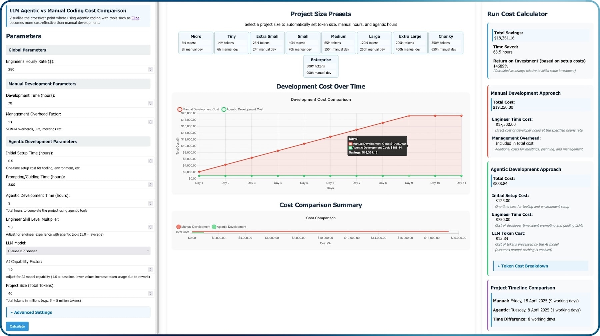
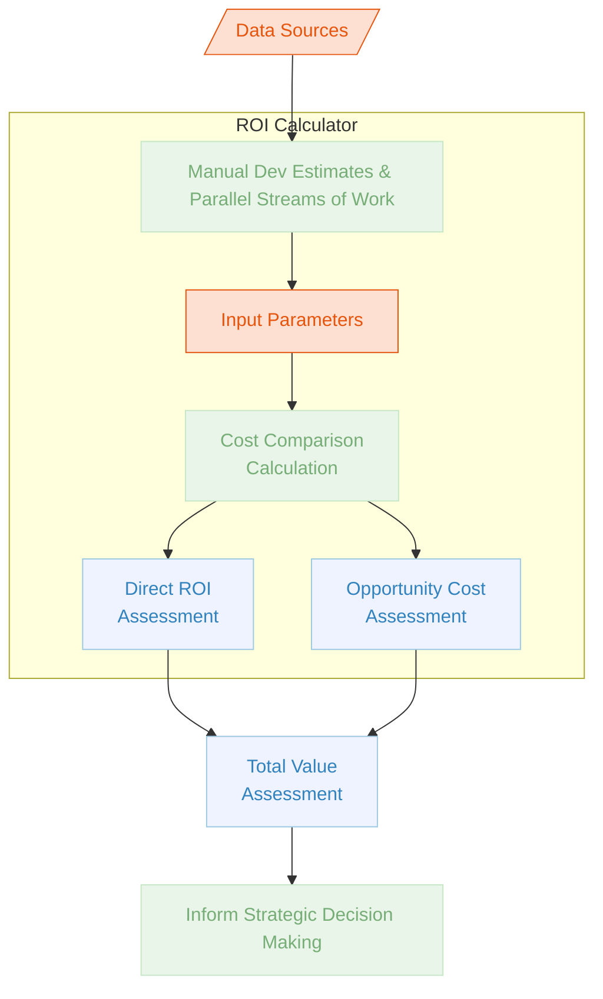
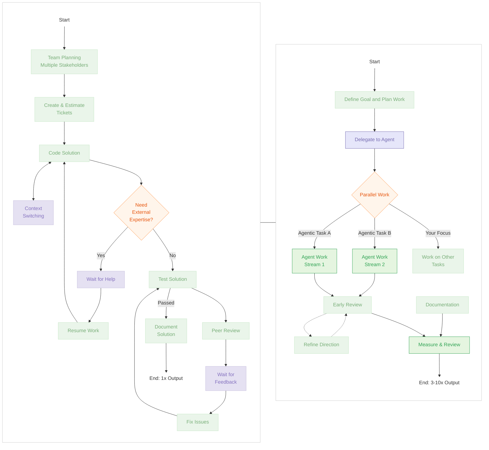

Don't ask yourself _'Why are my high performing engineers spending $2k/month on agentic coding?'_

...ask yourself _why others aren't_.

<!--more-->

Agentic coding represents not merely a productivity tool but a fundamental economic shift in software development. While some may balk at potential AI inference costs, this analysis demonstrates that even in extreme cases—where your most intensive power users might approach $2,000 monthly—the economics remain overwhelmingly favourable: a modest cost increase yielding 300-1,000% productivity gains.

For most engineers, the actual investment will be far lower while still delivering transformative results. Beyond raw output, this approach liberates engineers from repetitive implementation tasks, enables parallel work streams, and makes previously unviable projects economically feasible. The true cost isn't in adopting these tools, but in the opportunity cost of failing to leverage them while competitors operate within an entirely different economic paradigm.

---

## Quantifying the ROI: An Evidence-Based Approach

While claims of 300-1,000% productivity increases might initially sound hyperbolic, they're grounded in real-world observations and data collection. To provide transparency and enable readers to test these assertions against their own contexts, I've developed an [Agentic Coding ROI Calculator](https://smcleod.net/tools/agentic_coding_costs/) that models the economic impact of these tools.

This calculator is in alpha/beta state and the public facing version has a few limitations, however it isn't purely based on theoretical projections but rather synthesises data from multiple sources and methodologies:

- **Direct observations** of productivity differences in teams adopting agentic coding approaches
- **Implementation metrics** from multiple projects and case studies
- **Feedback and performance data** from engineers trained in effective agentic coding techniques
- **Community benchmarking** cross-referenced with direct findings to establish validity
- **Manual development estimates** from traditional software engineering practices to provide baseline for comparisons
- **Parallel work streams** where traditional (manual) development occurs alongside agentic coding, allowing for direct comparisons of output
- **Token usage metrics** exported from agentic coding tools to establish typical consumption patterns for various project sizes and complexities

The calculator's parameters weren't set arbitrarily but calibrated based on multiple data points:

- **Project Size Benchmarks:** The preset project sizes (from Micro to Enterprise) reflect real-world development patterns observed across dozens of projects, with token consumption and time metrics mapped to each scale.
- **Productivity Multipliers:** The force multiplier effect (typically 3-10x) wasn't chosen for marketing impact but represents the median range observed across multiple engineering teams—with some outlier cases showing even higher multiples for narrow, well-defined tasks.
- **Token Usage Patterns:** The calculator's default 8:1 output-to-input ratio and 88% cached tokens reflect typical patterns observed in production environments using modern agentic coding tools with effective prompt caching.
- **Model Comparison Data:** Pricing and capability information for various models (Claude, GPT, DeepSeek) is regularly updated to reflect current market offerings and their relative performance characteristics.

By continuously refining these parameters based on new observations and feedback, the calculator serves not just as a cost projection tool but as a living repository of empirical knowledge about agentic coding economics.

The calculator allows for adjusting parameters including hourly rates, project complexity, model selection, and engineer experience levels to see how these variables affect the ROI equation in your specific context. What's particularly revealing is that even with conservative parameters—smaller productivity gains, higher AI costs, longer setup times—the economic case remains compelling.

The following sections explore these economics in greater detail, but I encourage readers to experiment with the public-facing beta version of the calculator themselves to test assumptions against their own business contexts.

### The Real Cost Question

This brings us back to our original question: _What if your high-performing engineers spent $2k/month on agentic coding?_

The calculator is one way of revealing why this is the wrong question.

When properly measured—accounting for both direct productivity gains and reduced opportunity costs—the more appropriate question becomes: _"Why would you accept a 3-10x productivity penalty by not enabling your engineers with these tools?"_

The data shows that even at the upper bound of AI inference costs (for arguments sake let's say $2,000 monthly), the economics remain overwhelmingly favourable. But the calculator also reveals something more subtle: most organisations won't approach these upper bounds, with typical monthly costs falling between $200-800 per engineer while still capturing the majority of productivity benefits.

This creates a compelling economic narrative: Organisations that systematically adopt agentic coding aren't just getting more output for their dollar—they're fundamentally changing the economic parameters of software development in ways that traditional cost models struggle to fully capture.

---

## Historical Context and Long-Tail Innovation

What we're witnessing with agentic software development is paralleled only by the largest of productivity revolutions throughout history.

When the power loom increased textile production capacity by 40x, it didn't eliminate weaving jobs instead, it unlocked previously unimaginable scale and capacity.

Similarly, when semiconductor manufacturing productivity increased 38x between 1970-2000, it created entirely new product categories rather than simply making existing electronics more efficiently.

What makes agentic coding particularly transformative is its ability to fundamentally reshape how engineers approach problem-solving. Unlike traditional automation that simply speeds up existing processes, agentic coding creates a multiplicative effect by:

- **Eliminating cognitive bottlenecks** - Engineers can offload repetitive implementation details while focusing on higher-level architecture and design choices
- **Compressing knowledge acquisition cycles** - Where learning a new framework or API might have taken days or weeks, engineers can now leverage domain expertise across multiple technical areas simultaneously
- **Enabling parallel exploration of solution spaces** - Multiple approaches can be developed and evaluated concurrently rather than sequentially
- **Reducing the activation energy for creativity** - The cost of experimentation drops dramatically, allowing for more innovative approaches that would otherwise be too resource-intensive to attempt

This combinatorial effect creates a self-reinforcing productivity flywheel. As engineers spend less time on implementation details and more time on strategic thinking, the quality of their architectural decisions improves. These better foundations then amplify the effectiveness of agentic coding assistance, creating a virtuous cycle that compounds over time.

The most profound impact isn't merely coding faster—it's the fundamental shift in what becomes economically viable to build. Projects that were previously deemed too complex, time-consuming, or specialised are now within reach, expanding the frontier of what's possible in software development.

## Agentic Coding: An Evolutionary Step, Not the Destination

It's important to recognise that agentic coding, while transformative, represents a point on a longer continuum rather than an ultimate destination. Where traditional code completion tools like Copilot operate primarily at the syntax and function level—offering suggestions within a developer's existing workflow-agentic systems represent a significant evolutionary leap by handling cohesive, multi-step development tasks with greater autonomy. However, this is likely not the final form of AI-augmented development.

As foundation models and agent architectures continue to advance, we can anticipate further shifts in how software is conceptualised and created. The wisest approach isn't to view agentic coding as an end goal, but rather as a crucial transitional technology that both delivers immediate productivity benefits and prepares engineering teams for future paradigms where the boundaries between human and machine contributions become increasingly fluid.

Organisations that successfully adopt today's agentic techniques and tools will be better positioned to adapt to whatever comes next, having already developed the organisational practices, mental models, and enabled technical tooling needed to thrive as we likely move towards a future when the importance of human written code for higher level tasks becomes less and less important.

---

## Analysing the Economics of Agentic Development

With this in mind, let's say for argument's sake, one of your high performing engineers _heavily_ utilises AI for large amounts of agentic coding and somehow racks up $2,000 a month on AI inference.

At first glance, this may seem like a significant investment. However, when we consider the productivity gains that agentic coding unlocks, the economics of this decision become much more compelling.

> [!TIP] TLDR
> Even if enabling agentic coding cost $2,000 per month (which it doesn't), the economics are unmistakable.
>
> With productivity gains of 300-1,000%, **the return on investment is _exceptional_**.

This analysis explores the return on investment in the form of AI inference to unlock agentic coding, considering both the quantifiable productivity metrics and the qualitative improvements in risk profiles, code quality, and strategic capabilities.

We are not talking about throwing $2,000 away on someone blindly piping all the data into a LLM and expecting it to write software (and thus add value) - we are talking about the (potential) spend on _effectively_ using agentic coding tools (e.g. [Cline](https://cline.bot)), coupled with the best AI models (e.g. Claude Sonnet 3.7 at the time of writing this) and the best agent tooling (e.g. [MCP](https://modelcontextprotocol.io) for package versioning, documentation etc).

This is not a "throw money at the problem" solution - this is about _unlocking_ the potential of the engineer to be able to do more with less, and to be able to do it faster and better.

> [!INFO] Agentic coding is not (currently) full autopilot
> The importance of the engineer understanding and having the most effective tools cannot be understated.
>
> Agentic coding or any other form of AI assisted coding is not (currently) 'autopilot' - it requires good engineering skills and experience to be effective.

## Breaking Down the Numbers

### The Traditional Approach

Let's establish a baseline for comparison. In a conventional development process, a project might cost approximately $12,000 monthly (representing 1.0 unit of work), delivering a predictable 1.0 unit of work output.

When fully accounting for loaded developer costs ($75-150/hour), this translates to $600-1,200 per developer day. This direct cost calculation forms the foundation of the economic comparison but, as we'll see later, captures only part of the true economic picture.

### The Agentic Coding Alternative

By contrast, if you add $2,000 to the human cost to unlock agentic coding, the direct economic equation changes dramatically:

- **Just 16% increase in direct costs**
- **300%-1,000% productivity increase** _(3.0-10.0 units of work delivered)_
- **ROI of 1,700%-5,900%**
- **Payback period of ~1.3 workdays**

These figures align with real-world observations from development teams integrating agentic coding into their workflow, where engineers report producing 5-10x more code while maintaining or improving quality standards once properly enabled and trained on agentic coding.

And let's not forget - it's only $2,000 extra if they actually use $2,000 worth of AI inference, if they use less - the cost is less but it might be an indicator that they're not using AI to unlock their full potential.

## The True Economic Impact: Beyond Direct Productivity

While the direct productivity metrics are compelling on their own, they capture only part of the economic value proposition of agentic coding. The most significant economic factor—often overlooked in traditional ROI calculations—is opportunity cost.

### The Critical Role of Opportunity Cost

In traditional development models, the true cost of a project isn't merely the engineering hours invested, but includes the market opportunities lost while waiting for completion. These opportunity costs typically manifest in three critical ways:

1. **Time-to-market delays:** Each week of delayed delivery represents lost revenue, competitive advantage, and market positioning—costs that often dwarf direct development expenses. When a competitor launches a feature three months before you can, the market share and mind share losses often significantly exceed the development costs themselves.
2. **Idea validation cycles:** Agentic coding enables testing multiple approaches or features in parallel, significantly reducing the sunk cost of pursuing inferior solutions and allowing faster pivots. This parallel exploration capability fundamentally changes product development economics by reducing costly commitment to unproven approaches.
3. **Strategic resource allocation:** By compressing routine development work, organisations can reallocate their most talented engineers to high-value strategic initiatives rather than maintenance and implementation details. This addresses one of the most persistent hidden costs in technology organisations: the opportunity cost of brilliant minds devoted to repetitive tasks.

For many businesses, these opportunity cost factors represent the most compelling economic case for agentic coding, even more so than the direct productivity multipliers. A feature that reaches market three months earlier, or a strategic pivot executed in days rather than weeks, creates value that conventional ROI calculations struggle to fully capture.

### Hidden Costs of Traditional Development

Our conventional development process carries numerous hidden costs that rarely appear in standard economic analyses:

- **Context switching penalties**: Productivity loss and cognitive load when juggling multiple tasks, with research suggesting this can consume up to 40% of productive capacity
- **Knowledge dependencies**: Communicating with and waiting for teammates with specialised skills, often creating bottlenecks that cascade through project timelines
- **Slow feedback cycles**: Delays in identifying and resolving issues that compound throughout development cycles
- **Sequential work limitations**: Inability to meaningfully progress multiple streams in parallel, forcing linear approaches to inherently multi-faceted problems
- **Creative opportunity costs**: Limited human investment in time for creative thinking and ideation due to implementation burdens

### The Full Economic Picture

When properly analysed, the typical daily cost proposition becomes even more favourable:

- Developer daily cost (excluding hidden costs): $600-1,200
- AI inference daily cost: $5-25 (for heavy usage)
- For most developers: $2-10 per day (typical usage patterns)

The key insight isn't about spending the maximum possible, but rather enabling engineers to leverage these tools without arbitrary limitations that undermine their effectiveness. It's worth emphasising that most engineers will fall well below the upper threshold, with monthly AI costs typically ranging from $200-800 depending on usage patterns and specific tasks.

The true economic implications extend beyond direct productivity measures and include structural changes to development processes: reduced dependency on specialised knowledge, shortened feedback cycles, and practical parallel exploration of solution alternatives—all of which compound the value proposition far beyond the simple calculation of coding output per dollar spent.

---

## Workflow Comparison

The following diagram illustrates the structural differences between conventional development approaches and agentic coding workflows:

### Traditional vs Agentic Coding Approach

## Jevons Paradox and Value Distribution

The [Jevons Paradox](https://en.wikipedia.org/wiki/Jevons_paradox) suggests that as resource utilisation becomes more efficient, total consumption often increases rather than decreases. Applied to software development, historical evidence indicates that a 5x productivity improvement wouldn't reduce demand for development - instead, it would dramatically expand the universe of viable software projects. And let's face it - it wouldn't be a blog post about agentic AI without a reference to Jevon.

As illustrated above, the Jevons effect means that as agentic coding makes development more efficient, we can expect an expansion of software projects rather than a contraction of development work. The economic value created through this productivity transformation won't simply disappear—it will redistribute across the ecosystem in complex and interconnected ways:

1. **Engineers**: Engineers gain freedom from repetitive implementation tasks, allowing them to focus on intellectually stimulating work and tackle previously intractable problems—improving both job satisfaction and career development.
2. **Organisations**: Beyond merely completing existing project backlogs faster, organisations can fundamentally reimagine their product development strategies. Projects previously considered too speculative or resource-intensive become viable, enabling more experimental approaches and reducing the opportunity cost of innovation.
3. **End users**: As development capacity expands and costs decrease, software solutions will emerge for increasingly specialised needs. Long-neglected "long tail" problems—too niche to warrant conventional development resources—become economically viable to solve, particularly benefiting underserved markets and use cases.
4. **Market entrants**: The reduced capital requirements and compressed development timelines lower barriers to entry across the technology sector. This democratisation enables more diverse founders to bring solutions to market without requiring extensive initial investment, potentially reshaping competitive dynamics across industries.
5. **Adjacent professionals**: Product managers, designers, domain experts, and other non-engineering stakeholders gain the ability to more directly influence and participate in the development process, as the technical barrier between concept and implementation diminishes.
6. **Society**: The cumulative effect of these changes extends beyond immediate economic benefits. As software solutions proliferate into previously underserved domains, we may see accelerated progress on complex societal challenges where software solutions were previously too costly or complex to implement at scale.

Rather than a zero-sum redistribution, agentic coding has the potential to expand the total value created—a rising tide that creates new opportunities across the entire ecosystem while fundamentally changing who can participate in software creation and what problems become economically viable to solve.

## The Hidden Human Cost of Widget Programming

Perhaps the most overlooked aspect of today's software landscape is its profound misuse of human potential. Globally, talented engineers spend their days building variations of the same widgets - auth systems, API integrations, JS framework migrations and ever-valuable widget implementation - that have been implemented thousands of times before.

When we look beneath the surface of enterprise software development, a sobering reality emerges: much of this work isn't advancing innovation or addressing meaningful challenges, but simply recreating slightly modified versions of existing solutions.

This represents an extraordinary waste of human intelligence and creativity. As we continue to advance AI capabilities in software development, the true opportunity isn't merely efficiency—it's the redirection of human cognitive capacity toward genuinely novel problems that demand creativity, ethical judgment, and domain expertise.

The real cost of our current paradigm isn't measured in dollars, but in squandered human potential that could be addressing the vast landscape of unsolved challenges still awaiting our attention.

---

## Conclusion

The economic case for investing in AI-powered development isn't merely compelling—it's transformative. When 3-10x productivity gains can be achieved with only modest increases in cost, we're no longer discussing incremental improvements but a fundamental shift in what's possible when engineers are empowered with the right tools, models and techniques.

This isn't just about coding faster—it's about reimagining how value is created through software. For leadership, this represents a strategic inflection point that demands attention: the organisations that systematically leverage these capabilities will operate in an entirely different economic paradigm from those that don't.

The question isn't whether to adopt these tools and enable our teams to use them—but how quickly you can enable and integrate them to remain competitive. The benefits extend beyond immediate productivity metrics to encompass risk reduction, solution quality, and—perhaps most importantly—the liberation of human potential from repetitive implementation tasks.

As we stand at this crossroads in software development, the cost-benefit analysis couldn't be clearer. The most expensive AI tools are those left unused by your team, as competitors race ahead with fundamentally different economics.

> Don't ask yourself "_Why are my high performing engineers spending $2k/month on agentic coding?_"
>
> **Ask yourself why others _aren't_ - and what opportunities they're missing as a result.**
