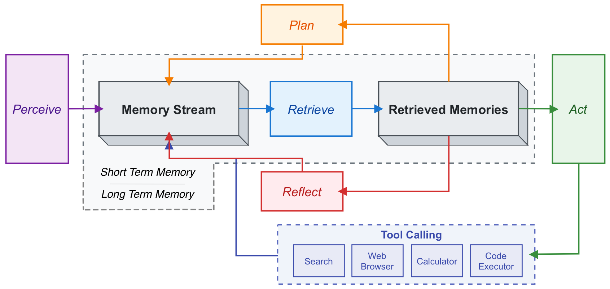
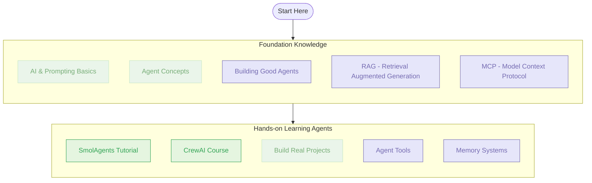

As agentic systems become increasingly central to modern software development, many engineers are looking to build practical skills but don't know where to start.

This guide provides a short list of pre-reading/watching and hands-on training resources to help you get started with developing with AI agents. The focus is on practical implementation for tools and methods you're likely to use in the workplace, so you can quickly gain experience and confidence in building AI powered and agentic systems.

## Understanding the Landscape

Before diving into specific frameworks and tools, it's essential to understand the broader context of AI agents and their role in software development. The resources below provide a solid foundation:

## Pre-Reading/Watching

Before diving into implementation, these resources will help you build foundational knowledge:

### 1. AI & Agent Fundamentals

- [Why Agent Engineering](https://youtu.be/5N33E9tC400) - Why we are all in on Agent Engineering in 2025.
- [How We Build Effective Agents](https://youtu.be/D7_ipDqhtwk) - Barry Zhang from Anthropic touches on the key points of building effective agents.
- [Intro to Large Language Models](https://youtu.be/zjkBMFhNj_g) - This is a 1 hour general-audience introduction to Large Language Models: the core technical component behind systems like ChatGPT, Claude, and Bard. What they are, where they are headed, comparisons and analogies to present-day operating systems, and some of the security-related challenges of this new computing paradigm.
- [LLMs For the working Programmer](https://youtu.be/zwItokY087U) - Some practical high level tips for developers working with LLMs for the first time.
- [The Future of AI Development](https://youtu.be/JhCl-GeT4jw) - Rethinking how we might 'program' in the future.

### 2. Prompting Fundamentals

The Prompting Guide provides essential knowledge for effective interaction with AI models:

- [Prompting Basics](https://www.promptingguide.ai/introduction/basics)
- [Prompting Tips and Best Practices](https://www.promptingguide.ai/introduction/tips)
- [LearnPrompting](https://learnprompting.org/docs/introduction)
- [Google Prompt Engineering Guide](https://www.gptaiflow.tech/assets/files/2025-01-18-pdf-1-TechAI-Goolge-whitepaper_Prompt%20Engineering_v4-af36dcc7a49bb7269a58b1c9b89a8ae1.pdf) (PDF)

## Short Training Courses

Once you've grasped the fundamentals, these tutorials and courses will help you build practical experience:

### SmolAgents Track

SmolAgents is an open-source framework designed to simplify the creation of AI agents. It's an excellent starting point for practical implementation:

- [Introduction to Agents Course](https://huggingface.co/learn/agents-course/en/unit0/introduction) - This comprehensive course walks you through building your first AI agents using the SmolAgents framework.

### CrewAI Track

CrewAI offers a different perspective on multi-agent systems:

- [Multi AI Agent Systems with CrewAI](https://www.deeplearning.ai/short-courses/multi-ai-agent-systems-with-crewai/) - Learn to build and orchestrate multiple AI agents working together. This course covers the fundamental building blocks of multi-agent systems with practical examples.

### Tooling & Integrations Track

#### MCP - Model Context Protocol

- [Introduction to MCP](https://www.youtube.com/watch?v=kQmXtrmQ5Zg)
- [MCP Documentation Website](https://modelcontextprotocol.io/introduction)

#### RAG - Retrieval Augmented Generation

- [What is RAG](https://youtu.be/T-D1OfcDW1M)
- [Intro to RAG](https://youtu.be/Y08Nn23o_mY)
- [GraphRAG vs Traditional RAG](https://youtu.be/Aw7iQjKAX2k)

## Advanced Learning

Once you're comfortable with the basics, these resources will help you deepen your understanding:

- [Transformers explained, visually](https://poloclub.github.io/transformer-explainer/) - A visual guide to understanding transformers, the backbone of the majority of current generation AI models.
- [LLMs explained, briefly](https://youtu.be/LPZh9BOjkQs)
- [What is a neural network?](https://www.youtube.com/watch?v=aircAruvnKk)

### SmolAgents Advanced Topics

1. [Guided Tour of Advanced Features](https://huggingface.co/docs/smolagents/guided_tour)
2. [Building Effective Agents](https://huggingface.co/docs/smolagents/tutorials/building_good_agents)
3. [Working with Agent Tools](https://huggingface.co/docs/smolagents/tutorials/tools)
4. [Implementing Agent Memory](https://huggingface.co/docs/smolagents/tutorials/memory)

## Community

I think the best community in terms to sharing new methods, models and tools is by far [r/LocalLLaMA](https://www.reddit.com/r/LocalLLaMA/) (Reddit).

## Practical Tips for Getting Started

> [!TIP] The most effective way to learn is by doing.

1. **Start small**: Begin with simple agent implementations before moving to complex multi-agent systems.
2. **Focus on understanding**: Don't just copy code—understand why agents make certain decisions and how they process information.
3. **Get your hands dirty and experiment**: Create small, disposable proof-of-concept projects to test different agent architectures and approaches.
4. **Try agentic coding**: Try using tools like Cline or Copilot Agent to help accelerate your coding process.

Start with the fundamentals, work through the tutorials, and gradually take on more complex projects. The goal is not just to understand the theory but to develop practical skills that you can apply in real-world software development.
