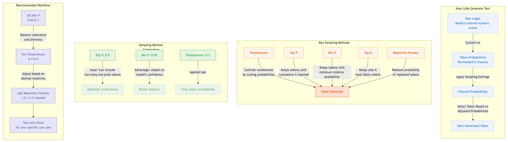

Large Language Models (LLMs) like those used in Ollama don't generate text deterministically - they use probabilistic sampling to select the next token based on the model's prediction probabilities. How these probabilities are filtered and adjusted before sampling significantly impacts the quality of generated text.

This guide explains the key sampling parameters and how they affect your model's outputs, along with recommended settings for different use cases.

### Ollama Sampling Diagram

[](ollama-sampling-diagram.png)

### Sampling Methods Comparison

[](sampling-methods-comparison.png)

### Example Ollama Sampling Settings Table

| Setting            | General | Coding | Coding Alt | Factual/Precise | Creative Writing | Creative Chat |
|--------------------|---------|--------|------------|-----------------|------------------|---------------|
| **min_p**          | `0.05`  | `0.05` | `0.9`      | `0.1`           | `0.05`           | `0.05`        |
| **temperature**    | `0.7`   | `0.2`  | `0.2`      | `0.3`           | `1.0`            | `0.85`        |
| **top_p**          | `0.9`   | `0.9`  | `1.0`      | `0.8`           | `0.95`           | `0.95`        |
| **mirostat**       | `0`     | `0`    | `0`        | `0`             | `0`              | `0`           |
| **repeat_penalty** | `1.1`   | `1.05` | `1.05`     | `1.05`          | `1.0`            | `1.15`        |
| **top_k**          | `40`    | `40`   | `0`*       | `0`*            | `0`              | `0`           |
<!-- | **repeat_last_n**  | `64`    | `128`  | `128`      | `64`            | `64`             | `64`          | -->

> [!NOTE] *For factual/precise use cases
> Some guides recommend Top K = 40, but Min P generally provides better adaptive filtering. Consider using Min P alone with a higher value (0.1) for most factual use cases.

---

## Core Sampling Parameters

### Temperature

**What it does:** Controls the randomness of the output by scaling the model's token prediction probabilities before sampling.

* **Low temperature (e.g., 0.1-0.5):** Makes high-probability tokens significantly more likely and low-probability tokens less likely. Leads to more focused, deterministic, and potentially repetitive outputs.
* **Medium temperature (e.g., 0.6-0.9):** Offers a balance between predictability and creativity.
* **High temperature (e.g., >1.0):** Flattens the probability distribution, making lower-probability tokens more likely. Increases diversity, creativity, and the risk of unexpected or less coherent outputs.

**How it works mathematically:** Temperature divides the raw logit scores before they're converted to probabilities. Lower temperatures amplify differences between logits, making the distribution sharper, while higher temperatures reduce these differences, making the distribution flatter.

**Important concepts:**

* **Non-linear Effects:** Temperature changes have a much more significant impact at lower values. For example, changing temperature from 0.5 to 0.6 alters the relative probabilities of top tokens more drastically than changing it from 1.5 to 1.6. This means fine-tuning requires smaller adjustments when using lower temperatures.
* **Interaction with Filtering:** Crucially, temperature is typically applied *after* filtering methods like Top K, Top P, or Min P (see Sampler Ordering). This ensures that filtering removes undesirable tokens first, and temperature then adjusts the relative likelihoods of the *remaining*, plausible tokens. This order preserves the integrity of the filtering step and allows higher temperatures (like 1.0) to be used more safely to increase diversity among pre-filtered options.
* **Best practice:** Apply temperature *after* other sampling methods like Top K, Top P or Min P. This is the standard implementation order in frameworks like `llama.cpp`.

> [!INFO] A Logit refers to the raw, unnormalised output values produced by a classification model.
> These values are typically transformed through a function like the softmax function to produce probabilities.
> The term "logit" comes from logistic regression, where it refers to the log-odds of a probability. In deep learning, logits have a significant role in various loss functions and layers.

### Top P (Nucleus Sampling)

**What it does:** Restricts token selection to the smallest possible set of tokens whose cumulative probability exceeds the specified threshold P. It's a widely used method, often a default in many systems.

* **How it works:** Tokens are sorted by probability. The probabilities are summed cumulatively until the sum reaches or exceeds the Top P value (e.g., 0.9 for 90%). Only the tokens included in this sum (the "nucleus") are considered for sampling.
* **Strengths:** Guarantees that the sampled token comes from a set representing a fixed proportion (P) of the total probability mass.
* **Potential Problems:**
  * **Flat Distributions (Low Confidence):** When probabilities are spread out, Top P might include many low-probability tokens to reach the threshold, potentially leading to incoherence.
  * **Peaked Distributions (High Confidence):** When one or two tokens dominate the probability mass, Top P might select only those few tokens, severely limiting diversity.
  * **Lack of Adaptability:** Unlike Min P, it doesn't dynamically adjust the candidate set size based on the model's confidence level in different contexts.

**When to use:** Top P is a solid general-purpose sampling method. However, its effectiveness can vary depending on the model's confidence at each step. Consider the trade-off: Top P ensures a fixed probability mass coverage, while Min P focuses on relative likelihood and adapts the candidate set size. The best choice depends on the model, task, and desired output style.

### Min P

**What it does:** Filters the vocabulary to include only tokens whose probability is at least a certain fraction (Min P) of the probability of the *most likely* token.

* **How it works:** Calculate a dynamic probability threshold: `Probability_Threshold = Min P * Probability_of_Top_Token`. Only tokens with a probability greater than or equal to this `Probability_Threshold` are considered for sampling.
* **Advantage: Adaptability:** Min P dynamically adjusts the size of the candidate pool based on the model's confidence (reflected in the `Probability_of_Top_Token`).
  * *High Confidence:* When `Probability_of_Top_Token` is high, the threshold is higher, leading to a smaller, focused candidate set.
  * *Low Confidence:* When `Probability_of_Top_Token` is low (probabilities are spread out), the threshold is lower, allowing more diverse candidates into the pool.
* **Why it can be effective:** This adaptive behaviour helps avoid including too many low-probability tokens (unlike Top P in flat distributions) while preserving reasonable alternatives when one token dominates (unlike Top P in peaked distributions).


**Sensitivity:** Min P's effectiveness is sensitive to the chosen value.

* A very low Min P (e.g., 0.01) might provide little filtering when distributions are flat.
* A very high Min P (e.g., 0.2+) can become overly restrictive, potentially mimicking greedy sampling if the probability drop-off is sharp.

**Recommended values:** 0.05-0.1 often provides a good balance between coherence and creativity, but experimentation is key. Min P filtering occurs *before* temperature scaling in the standard pipeline.

### Top K

**What it does:** Restricts token selection to the K tokens with the highest probabilities, regardless of their actual probability values or the shape of the distribution.

* **How it works:** If Top K = 40, only the 40 tokens with the highest probability scores are considered for sampling. All others are discarded.
* **Limitation: Non-Adaptability:** As a fixed-count filter, Top K cannot adapt to the model's confidence level.
  * It can be too restrictive when many good alternatives exist just outside the top K.
  * It can be too permissive when only a few tokens have meaningful probability, yet it still includes K candidates.
* **Usage:** Sometimes used for highly factual scenarios requiring focused output, or as recommended for specific models (e.g., *verify and insert confirmed Gemma 3 recommendation here if applicable*).

**Interaction with Other Filters:** In `llama.cpp`, filters are often applied sequentially (Top K → Top P → ... → Min P). If Top K > 0 is enabled alongside other filters like Top P or Min P, Top K acts *first*, creating an initial pool of K tokens. Subsequent filters then operate *only within that K-sized pool*. This means Top K can serve as a hard cap on the candidate pool size.

**Recommendation:** For many use cases, disabling Top K (setting to 0) and relying on probability-based filters like Min P or Top P provides more dynamic control. However, check for model-specific recommendations and consider using it in combination with other filters if a fixed candidate limit is desired.

### Repetition Penalty (`repeat_penalty`)

**What it does:** Discourages the model from repeating tokens that have appeared recently in the generated text (within the `repeat_last_n` token window).

* **How it works:** Applies a multiplicative penalty (dividing the logit by the penalty value if > 1.0) to the logits (pre-softmax scores) of tokens that have appeared within the specified lookback window (`repeat_last_n`). A penalty > 1.0 decreases the probability of recently seen tokens, while < 1.0 increases it.
* **Nature:** Acts as a "blunt instrument". It penalises *any* repetition within the window, regardless of whether it's necessary (e.g., code syntax, formatting, key terms) or undesirable.
* **Caution:**
  * Can interfere with intentional repetition (code, lists, required terminology).
  * Often considered a "band-aid fix" that might mask underlying issues with prompts or other sampling parameters.
  * Can produce awkward phrasing or force suboptimal token choices as the model avoids natural repetition.
  * Setting `repeat_last_n` appropriately is important (e.g., 64 for prose, potentially 128-512 for code to capture variable names/patterns). Very large values can slow down sampling.
* **Alternatives:** For more nuanced control over repetition, consider Frequency and Presence Penalties (see Other Sampling Parameters section).
* **Recommendation:** Use sparingly. Start with 1.0 (no penalty) or very low values (e.g., 1.05) and increase cautiously *only* if problematic repetition persists after checking prompts and context length. Check model-specific documentation for recommended settings. Never exceed 1.2, as it can severely distort outputs and degrade quality.

## Advanced Parameters

### Mirostat

**What it does:** An adaptive sampling method that dynamically adjusts the sampling constraints during generation to maintain a target level of "surprise" or **perplexity** (measured via cross-entropy in nats), reflecting how unexpected the model's own outputs are relative to its predictions. It aims for more consistent output quality over long generations.

* **Modes (`mirostat` parameter):**
  * 0: Disabled
  * 1: Mirostat (original algorithm)
  * 2: Mirostat 2.0 (improved algorithm, generally preferred for faster convergence)
* **Key Parameters:**
  * `mirostat_tau` (Target Entropy): Sets the desired level of surprise/perplexity. Lower values (e.g., 2.0-3.0) lead to more focused/coherent output, while higher values (e.g., 4.0-6.0) encourage more diversity.
  * `mirostat_eta` (Learning Rate): Controls how quickly the algorithm adjusts its internal constraints to meet the target tau. Default is often 0.1.
* **Usage:** When enabling Mirostat (mode 1 or 2), you should typically **disable** other filtering methods by setting `top_p=1.0`, `top_k=0`, and `min_p=0.0`, allowing Mirostat alone to control the token selection process dynamically. It acts as an *alternative* sampling controller.

**When to use Mirostat:**

* Generating long-form text where maintaining consistent quality/style is important.
* When you prefer an adaptive approach over manually tuning fixed parameters like temperature, Top P, Min P, etc.
* To potentially prevent output quality from degrading (becoming too repetitive or too chaotic) over extended generations.

**Recommended values (starting points):**

* `mirostat`: 2 (Mirostat 2.0)
* `mirostat_tau`: 5.0 (balanced), adjust down towards 2.0-3.0 for more focus, or up towards 6.0 for more diversity. The optimal value is model/task dependent.
* `mirostat_eta`: 0.1 (default).

**Caution:** Mirostat's performance depends on the model and task. An inappropriate `mirostat_tau` or a high `mirostat_eta` can sometimes lead to instability or undesirable output oscillations. Experimentation is required.

## Other Sampling Parameters

Beyond the core parameters, `llama.cpp` and Ollama offer additional controls for fine-tuning generation:

| Parameter Concept  | Ollama/Llama.cpp Name | Brief Description                                                                                                                                                  | Typical Use Case/Effect                                                                | Common Value Range (Approx.) |
|:-------------------|:----------------------|:-------------------------------------------------------------------------------------------------------------------------------------------------------------------|:---------------------------------------------------------------------------------------|:-----------------------------|
| Tail Free Sampling | `tfs_z`               | Filters the low-probability "tail" of the distribution based on the second derivative, aiming for a more dynamic cutoff than Top P.                                | Alternative/complement to Top P/Min P for dynamic filtering.                           | 0.9 - 1.0 (1.0 disables)     |
| Typical Sampling   | `typical_p`           | Selects tokens whose probability is close to the "typical" or expected probability value for that step, potentially reducing the impact of overly dominant tokens. | Encourages surprising yet coherent outputs; alternative filtering method.              | 0.9 - 1.0 (1.0 disables)     |
| Frequency Penalty  | `frequency_penalty`   | Penalises tokens based on how frequently they have already appeared in the entire preceding context (prompt + generation).                                         | Reduces stylistic repetition and overuse of common words; increases lexical diversity. | 0.0 - 2.0 (0.0 disables)     |
| Presence Penalty   | `presence_penalty`    | Applies a fixed penalty to any token that has appeared *at least once* in the preceding context.                                                                   | Encourages introducing new concepts or tokens; discourages topic looping.              | 0.0 - 2.0 (0.0 disables)     |

**Key Differences in Repetition Control:**

* **`repeat_penalty`:** Targets *recent* repetitions within the `repeat_last_n` window. Good for stopping immediate loops.
* **`frequency_penalty`:** Targets *globally frequent* tokens within the context. Good for reducing overuse of common words.
* **`presence_penalty`:** Targets *any prior appearance* within the context. Good for encouraging new topics/words.

Using these additional parameters, individually or sometimes in combination (though interactions can be complex), provides more sophisticated control over the generation process than relying solely on the core set. As always, consult documentation and experiment based on your specific needs.

## Recommended Settings by Use Case

### General Purpose / Balanced

```plain
temperature: 0.7
min_p: 0.05
top_p: 0.9
top_k: 0
repeat_penalty: 1.05
```

### Factual / Precise

```plain
temperature: 0.3
min_p: 0.1
top_k: 40
repeat_penalty: 1.05
```

### Creative / Diverse

```plain
temperature: 1.0
min_p: 0.05
top_p: 0.95
repeat_penalty: 1.0
```

### Code Generation

Code generation is a somewhat special case, we often have lots of repetition and we want to be precise - but not restrict out of the box thinking.

Unless the models authors recommend otherwise, I usually default to:

```plain
temperature: 0.2
min_p: 0.05
top_p: 0.9
repeat_penalty: 1.05
```

> [!NOTE] Claude Recommended Coding Parameters
> I also asked Claude Sonnet 3.7 to provide some interesting code generation inference parameters to try.
> It provided a number of interesting suggestions, which I have included at the end of this post.
>
> * See the [Coding Parameters as suggested by Claude Sonnet 3.7](#coding-parameters-as-suggested-by-claude-sonnet-37).

---

## Sampler Ordering Best Practices

The order in which sampling methods are applied significantly impacts output quality. The standard and recommended pipeline, as implemented in frameworks like `llama.cpp`, is generally:

1. **Penalties:** Apply penalties (like `repeat_penalty`, `frequency_penalty`, `presence_penalty`) to the initial logits.
2. **Filtering/Truncation:** Apply filtering methods sequentially to remove less likely or undesirable tokens. The typical order in `llama.cpp` is:
    * Top K (`top_k`)
    * Tail Free Sampling (`tfs_z`)
    * Typical Sampling (`typical_p`)
    * Top P (`top_p`)
    * Min P (`min_p`)
    *(Note: The exact order might vary slightly between versions or forks; consult specific documentation if precision is critical. Each filter operates on the candidate set passed down by the previous one.)*
3. **Temperature Scaling:** Divide the logits of the *remaining* candidate tokens by the `temperature` value.
4. **Softmax & Sampling:** Apply the softmax function to convert the final scaled logits into probabilities, then sample the next token based on this distribution.

**Simplified Flow:**

* Raw Logits
  * → Apply Penalties
  * → Apply Filters (Top K → TFS → Typical P → Top P → Min P) sequentially
  * → Divide remaining logits by Temperature
  * → Softmax Function
  * → Sample Next Token

**Why this order is critical:**

* Filtering first removes low-probability or otherwise undesirable tokens based on the model's original predictions.
* Temperature then rescales the probabilities *only among the plausible candidates* that survived filtering, fine-tuning the final selection likelihood without re-introducing poor candidates.
* Applying temperature *before* filtering could distort the initial probabilities, potentially causing unwanted tokens to pass the filtering stage or good tokens to be incorrectly filtered out.

Adhering to this standard order ensures that each step functions as intended. When using Mirostat, remember it replaces steps 2 and 3, dynamically controlling the process itself.

## Troubleshooting Common Issues

When model outputs aren't satisfactory, adjusting sampling parameters can help. However, remember that parameter tuning is not always the cause of issues. Many issues stem from more fundamental factors:

* **Prompt Quality:** Is the prompt clear, specific, and unambiguous? Does it provide sufficient context?
* **Context Window:** Has the model's context limit been reached, causing it to lose track of earlier information?
* **Model Suitability:** Is the chosen model appropriate for the task in terms of its knowledge, reasoning capabilities, and size?

Consider addressing these foundational aspects first. If problems persist, then proceed with parameter adjustments, keeping in mind that tuning is often an **iterative process**, and changes can have **interacting effects**. Modify one parameter at a time and evaluate the overall output quality.

### Model keeps repeating itself

**First steps:**

1. **Check Prompt & Context:** Ensure your prompt doesn't inadvertently encourage repetition. Verify the context window isn't full.
2. **Review Model Choice:** Some models are inherently more prone to repetition.

**Parameter adjustments (in order of priority):**

1. **Increase Repetition Penalty:** Gradually increase `repeat_penalty` (e.g., 1.05, 1.1, max 1.15-1.2), monitoring for unnatural phrasing.
2. **Try Frequency/Presence Penalty:** Experiment with `frequency_penalty` (e.g., 0.1-0.5) to discourage overuse of common words, or `presence_penalty` (e.g., 0.1-0.5) to encourage novelty, if simple repetition penalty is insufficient or causes issues.
3. **Adjust Filtering:** Try slightly increasing `min_p` (e.g., to 0.1) or slightly decreasing `top_p` (e.g., to 0.85) to filter out lower-probability continuations that might lead to loops.
4. **Adjust Temperature:** If using high temperature, try lowering it slightly (e.g., 0.7 or 0.8).

### Outputs are too random/incoherent

**Parameter adjustments (in order of priority):**

1. Use Min P instead of Top P with value 0.1
2. Lower temperature gradually (try 0.7, then 0.5)
3. If still problematic, consider enabling Top K = 40 as a last resort

### Outputs are too generic/predictable

**Parameter adjustments (in order of priority):**

1. Increase temperature gradually (0.9, then 1.0)
2. Lower Min P value to 0.05 or 0.03
3. Ensure Top K is disabled (set to 0)

### Model generates incorrect facts

**Parameter adjustments (in order of priority):**

1. Lower temperature significantly (0.3 or even 0.1)
2. Increase Min P to 0.1 or 0.15
3. Consider adjusting prompting strategy to encourage factual accuracy

## Summary

Sampling settings greatly impact your model's performance. For most use cases:

1. Try Min P (0.05-0.1) with temperature (0.7-0.9) for a good balance
2. Apply temperature last in your sampler order
3. Use repetition penalty sparingly (1.0-1.2)
4. Experiment with settings based on your specific needs

Remember that different models may respond differently to these settings, so some experimentation will help you find optimal parameters for your specific model and use case.

---

## Ollama Modelfile Examples

Note: These only serve as a *starting place*, every model is different and you should check to see if the authors have provided any recommendations. For example with Gemma 3, the authors recommend `temperature=1`, `top_k=64`,
`top_p=0.95`.

### General Purpose Preset

```env
PARAMETER temperature 0.7
PARAMETER min_p 0.05
PARAMETER top_p 0.9
PARAMETER repeat_penalty 1.05
PARAMETER repeat_last_n 64
```

### Factual/Precise Preset

```env
PARAMETER temperature 0.3
PARAMETER min_p 0.1
PARAMETER top_p 0.8
PARAMETER repeat_penalty 1.05
PARAMETER repeat_last_n 64
```

### Code Generation Preset

```env
PARAMETER temperature 0.2
PARAMETER min_p 0.05
PARAMETER top_p 0.9
PARAMETER repeat_penalty 1.05
```

I have found the following to work well with models like Qwen 2.5 Coder 32b:

```env
PARAMETER temperature 0.2
PARAMETER min_p 0.9
PARAMETER top_p 1
PARAMETER repeat_penalty 1.05
```

The Key Difference: The min_p value increased dramatically from 0.05 to 0.9.

>[!QUESTION] Why Might min_p=0.9 Work for Qwen Coder?
> **Model Characteristics**: The Qwen 2.5 Coder model might naturally produce very "peaked" probability distributions for code, meaning its top prediction is often significantly more likely than any alternatives.
>
> In this scenario, a high min_p simply reinforces the model's strong preference, leading to consistent and predictable (if potentially less flexible) code.
>
> **Task Specificity**: If you primarily use it for tasks demanding extreme precision or consistency where there's usually only one "correct" next token (like strict syntax adherence or completing boilerplate), this setting could perform well by aggressively pruning alternatives.
>
> **Synergy with Low Temperature**: The low temperature=0.2 already sharpens the probability distribution. Combining it with min_p=0.9 pushes the model very close to deterministic output, almost always picking the single most likely token.
>
> * `min_p=0.9` Interpretation: This setting is extremely restrictive. It dictates that the model should only consider tokens that have a probability at least 90% as high as the single most probable token. For example, if the top token has a 60% probability, any token with less than 54% (0.9 * 60%) probability is discarded before sampling. This forces the model to stick very closely to its most confident prediction at each step.
> * Interaction with `top_p=1.0`: Disabling top_p (setting it to 1.0) makes sense in conjunction with such a high min_p.
> * The `min_p=0.9` filter is already so aggressive that applying a top_p filter on top of it would be redundant or even counterproductive. min_p becomes the dominant (and almost sole) factor in deciding which tokens are eligible.

### Creative Writing Preset

```env
PARAMETER temperature 1.0
PARAMETER min_p 0.05
PARAMETER top_p 0.95
PARAMETER top_k 0
PARAMETER repeat_penalty 1.0
PARAMETER repeat_last_n 64
```

### Creative Chat Preset

```env
PARAMETER temperature 0.9
PARAMETER min_p 0.05
PARAMETER top_p 0.95
PARAMETER top_k 0
PARAMETER repeat_penalty 1.15
PARAMETER repeat_last_n 64
```

## When to Adjust Settings

### Increase Temperature When

* Responses are too generic or predictable
* You want more creative or diverse outputs
* Model seems to be in a "safe mode" defaulting to common responses

### Decrease Temperature When

* Responses are too random or incoherent
* You need factual accuracy
* Model is hallucinating or making things up

### Use Min P Instead of Top P When

* You notice the model including unlikely or nonsensical options
* You want to maintain diversity while ensuring coherence
* Response quality varies significantly between similar prompts

### Increase Repetition Penalty When

* Model is getting stuck in loops
* Text has excessive repetition of phrases or ideas
* Model keeps reusing the same examples or patterns

### Avoid High Repetition Penalty When

* Working with code (where repetition is often necessary)
* Model is avoiding necessary repetition (like in lists)
* You notice awkward phrasing to avoid repetition

## Command-Line Usage Example

```bash
ollama run mistral:latest -m "Describe quantum computing" \
  --temperature 0.7 \
  --min-p 0.05 \
  --top-p 0.9 \
  --repeat-penalty 1.1
```

---

## Coding Parameters as suggested by Claude Sonnet 3.7

I provided this blog post to Claude Sonnet 3.7 and asked it to provide a number of interesting code generation inference paramaters I could try:

> Code inherently contains more intentional repetition than creative text—variable names, function calls, syntax patterns, and structural elements often need to repeat precisely for the code to function correctly.
>
> ### Key Considerations for Code Generation
>
> 1. **Repetition handling is critical**: Using low or no repeat penalties (1.0-1.03) generally works better for code than for text.
> 2. **Context length matters**: Longer repeat lookback windows (128-512) help maintain consistency in variable naming and patterns.
> 3. **Temperature sweet spot**: For most code tasks, 0.1-0.4 works better than higher values.
> 4. **Precision vs. creativity trade-off**: Lower values (0.1-0.2) for critical implementations, slightly higher (0.3-0.4) when multiple valid approaches exist.
>
> The optimal settings will vary somewhat depending on the specific programming language, complexity of the task, and the base model's characteristics. You may need to experiment and adjust based on your specific use case and the model you're using with Ollama.
>
> Here are several optimised inference parameter configurations for code generation, each with different focuses and trade-offs:
>
> ### Precision-Focused Code Generation
>
> ```plain
> temperature: 0.2
> min_p: 0.1
> top_p: 0.95
> top_k: 40
> repeat_penalty: 1.02
> repeat_last_n: 128
> ```
>
> **Reasoning**: Very low temperature for maximum determinism, slightly higher min_p to exclude unlikely tokens, minimal repeat penalty to preserve necessary repetition in code structures. Best for exact implementations where correctness is critical.
>
> ### Balanced Code Generation
>
> ```plain
> temperature: 0.3
> min_p: 0.05
> top_p: 0.9
> top_k: 0
> repeat_penalty: 1.03
> repeat_last_n: 256
> ```
>
> **Reasoning**: Low but not extreme temperature balances determinism with flexibility, standard min_p, disabled top_k to rely on probability-based filtering, very light repeat penalty with extended lookback window. Good general-purpose code settings.
>
> ### Pattern-Respecting Code Generation
>
> ```plain
> temperature: 0.4
> min_p: 0.05
> top_p: 0.95
> top_k: 0
> repeat_penalty: 1.0
> repeat_last_n: 64
> ```
>
> **Reasoning**: Slightly higher temperature allows more implementation variations, no repeat penalty at all to fully respect code patterns and variable naming consistency. Shorter lookback window assumes repeats are intentional. Good for generating code that follows established patterns closely.
>
> ### Mixed-Complexity Code Generation
>
> ```plain
> temperature: 0.25
> min_p: 0.08
> top_p: 0.92
> top_k: 20
> repeat_penalty: 1.03
> repeat_last_n: 256
> mirostat: 2
> mirostat_tau: 4.0
> mirostat_eta: 0.1
> ```
>
> **Reasoning**: Low temperature with adaptive complexity control via mirostat, moderate filtering parameters. The mirostat helps manage complexity consistently throughout longer code generations. Good for larger code blocks with varying complexity sections.
>
> ### Algorithm Implementation
>
> ```plain
> temperature: 0.15
> min_p: 0.1
> top_p: 0.9
> top_k: 30
> repeat_penalty: 1.05
> repeat_last_n: 64
> ```
>
> **Reasoning**: Very low temperature for maximum correctness in mathematical logic, higher min_p and moderate top_k to strictly filter possibilities, moderate repeat penalty since algorithms typically have less necessary repetition than application code. Ideal for implementing sorting algorithms, data structures, etc.
>
> ### Interactive Code (UI, Forms, etc.)
>
> ```plain
> temperature: 0.4
> min_p: 0.05
> top_p: 0.95
> top_k: 0
> repeat_penalty: 1.02
> repeat_last_n: 192
> ```
>
> **Reasoning**: Higher temperature for more creativity in UI solutions, standard filtering, light repeat penalty with extended context to maintain consistency in element naming across a complex interface.
>
> ### Maintenance/Refactoring Code
>
> ```plain
> temperature: 0.1
> min_p: 0.15
> top_p: 0.8
> top_k: 50
> repeat_penalty: 1.0
> repeat_last_n: 512
> ```
>
> **Reasoning**: Extremely low temperature for maximum conservatism when modifying existing code, higher min_p and lower top_p with top_k safety filter to stick very closely to expected patterns, no repeat penalty at all with very long lookback to preserve all naming patterns from existing code.
>
> ### Experimental Alternative: Mirostat Only
>
> ```plain
> temperature: 1.0
> min_p: 0.0
> top_p: 1.0
> top_k: 0
> repeat_penalty: 1.0
> mirostat: 2
> mirostat_tau: 3.0
> mirostat_eta: 0.1
> repeat_last_n: 128
> ```
>
> **Reasoning**: This approach delegates all sampling control to the mirostat algorithm, which dynamically adjusts token selection probabilities to maintain consistent complexity. Can work surprisingly well for code by automatically adapting to different sections.
