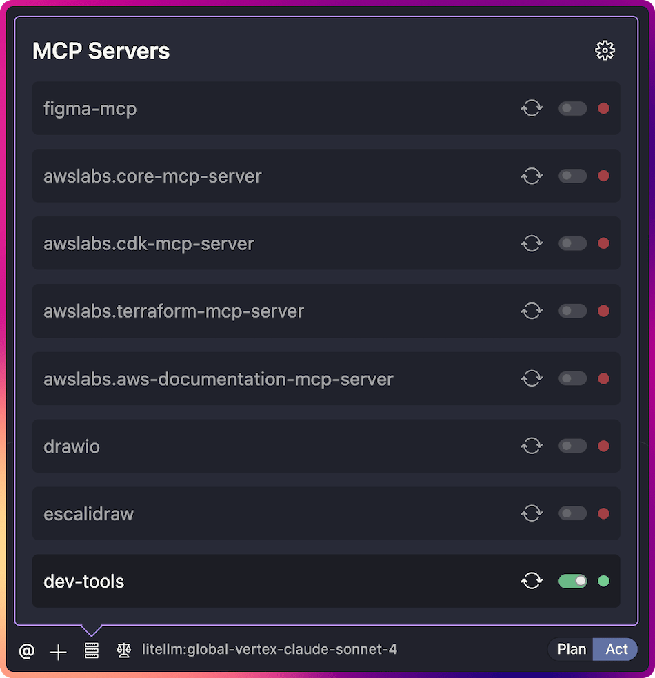
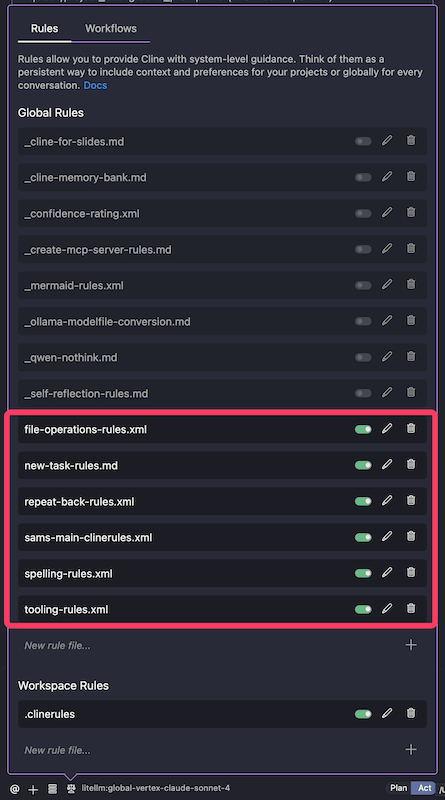

The following is workflow flow I use for agentic coding.

The basic flow is Setup -> Plan -> Act -> Review and Iterate.

1. **Setup** - Ensure the right rules and tools are enabled, optionally gather important documentation or examples.
2. **Plan** - Build a detailed plan based off your goals, requirements and ideation with the coding agent.
3. **Act** - Perform the development tasks, in phases.
4. **Review and Iterate** - Review the work, update the plan and iterate as required.

## 🕵 Setup

### 🛠️ Tools

The effective use of tools is critical to the success and cost effectiveness of agentic coding.

- The MCP Servers (tools) I frequently use are available here: [sammcj/agentic-coding#mcp-servers](https://github.com/sammcj/agentic-coding#mcp-servers)

- [MVP / Always On](https://github.com/sammcj/agentic-coding/blob/main/MCP/mcp-config-mvp.json)
  - [Context7](https://github.com/upstash/context7): Used to fetch documentation.
  - [Fetch](https://github.com/modelcontextprotocol/servers/blob/main/src/fetch/README.md): Used to fetch URLs.
  - [Brave Search](https://github.com/modelcontextprotocol/servers/tree/main/src/brave-search): Provides web search (free Brave Search AI API key required).
  - [Package Version](https://github.com/sammcj/mcp-package-version): Used to get up to date package versions.
  - [Github](https://github.com/modelcontextprotocol/servers/blob/main/src/github/README.md): Used to fetch information from GitHub repositories, Github Issues & PRs.
- [Sometimes Used](https://github.com/sammcj/agentic-coding/blob/main/MCP/mcp-config-sometimes.json)
  - [Firecrawl](https://github.com/mendableai/firecrawl-mcp-server): Provides web scraping and markdown conversion (Self hosted Firecrawl, or Firecrawl API key required).
  - [Markdownify](github.com/zcaceres/markdownify-mcp): Converts documents to markdown.
  - [Browser Use](https://github.com/Saik0s/mcp-browser-use): Gives access to a browser.
  - [SearXNG](https://github.com/ihor-sokoliuk/mcp-searxng): Provides web search (Self hosted SearXNG required).
  - [Magic MCP](https://github.com/21st-dev/magic-mcp): Provides frontend UI components.

### 📏 Rules

I heavily utilise Cline rules to help with the development process. I have a set of global rules that I use for all projects, and then I often add project specific rules as needed.

- My rules available here: [sammcj/agentic-coding](https://github.com/sammcj/agentic-coding#rules)

### 📑 Gather Documentation / Examples

Note: I don't _always_ do this step, and if the model is good at using the tools available to it to efficiently fetch this information, it may not be necessary.

If I'm working with especially new libraries, frameworks, specifications or integrations I will sometimes save important documentation or example code snippets in a directory within the project.

> [!NOTICE] Reference Docs Example
> Let's say I'm working with go-mcp, a relatively recently developed package and a recently update to Model Context Protocol (MCP) specification, I might save the following:
>
> - `docs/reference_examples/go-mcp-readme.md` - The README file from the go-mcp repository
> - `docs/reference_examples/go-mcp-example-usage.go.txt` - A code example from the go-mcp repository (in this case I'd add .txt to the end so it doesn't interfere with the go builds)
> - `docs/reference_examples/mcp-specification-2025-03-26.json` - the latest version of the MCP specification

---

## 🤔 Plan Mode

- Usually I'll start by writing a prompt in a text editor / file with a detailed goal for project I want to build.
- Then I start a fresh session and switch to Plan mode, and provide that prompt to the agent:
  - **What** I want to build
    > [!NOTICE] _Example_
    > I want you to help me develop a new Golang application that provides an API for managing a list of tasks.
  - **Why** I'm doing it
    > [!NOTICE] _Example_
    > The intent is to have a simple API I can use across various machines on my network that will keep track of tasks.
  - **Technical requirements**
    > [!NOTICE] _Example_
    > The application must be able to be run on both Linux and macOS. It must have a Dockerfile that follows best practices to build and deploy the application.
    - Include any specific libraries/packages/frameworks I want to use.
      > [!NOTICE] _Example_
      > I want to use the Gin framework for the API and SQLite for the database.
  - **The intended audience** (users) of the software
    > [!NOTICE] _Example_
    > The intended audience is myself and my family, both of which are technical and can use the command line and API tools.
  - **Assumptions**
    > [!NOTICE] _Example_
    > We may be deploying the application to a remote server in the future, so it must be able to run on a server with limited resources.
  - **Unknowns** I want to explore during planning
    > [!NOTICE] _Example_
    > I don't know if I want to use a REST or GraphQL API. I'd like you to help me explore the pros and cons of each and make a recommendation.
  - **Links** to upstream documentation, examples etc...
    > [!NOTICE] _Example_
    > Here are some links to the documentation for the libraries I want to use:
    > - gin web framework repository - https://github.com/gin-gonic/gin
    > - Popular SQLite packages for Go - https://github.com/mattn/go-sqlite3 , https://github.com/glebarez/go-sqlite

### 🔃 Plan Refinement

- **Iterate** to hone in on the plan and approach
  > [!NOTICE] _Example_
  > I like the idea of going with REST, but let's make sure we can easily switch to GraphQL in the future if we need to. Also we should consider how we will handle authentication and authorisation.

### 📄 Create Plan Document

- Prompt the agent to **create a markdown document** with a checklist of tasks to complete in a phased development approach:
  > [!NOTICE] Development Plan Prompt
  > Create a new markdown document called docs/DEVELOPMENT_PLAN.md. In this document, start by adding a detailed description of the project, requirements and assumptions, then add a checklist of tasks to complete in a phased development approach.

- I **review** the markdown document and edit as required
- I add a **tool use and task completion reminder** at the end:
  > [!NOTICE] Tool & Task Prompt
  > Remember to use the tools / functions available to you. After each phase is complete, you must check off any tasks that have been completed in full. Then stop and I will review your work.

The intent here is to have a clear, concise and detailed plan that you could in theory provide to any agent or competant software engineer to undertake the development.

---

## 🏁 Act Mode

I start a fresh session, this so we're not pulling all the context (token usage) added during planning to keep the development focused and cost effective.

- Switch to Act mode
- Prompt the agent to read the plan and then begin development:
  > [!NOTICE] Begin Development Prompt
  > First read the docs/DEVELOPMENT_PLAN.md file. Then begin development of the first phase, ensuring all requirements are met.

### 🔎🧑‍💻 Review

Once completed:

- **Review** the work and ensure the `DEVELOPMENT_PLAN.md` file is updated.
- **Update** the projects .clinerules with anything I've learned.
- **Fix** - or request fixes to any issues or changes required.

### 🔄 Iterate

- Then I start a fresh session with the prompt:
  > [!NOTICE] Continue Development Prompt
  > First read the docs/DEVELOPMENT_PLAN.md file. Then continue development, ensuring all requirements are met.
- Iterate until all phases are complete.

---

## 📋 Update Rules

- I like to perform a brief retro after completing with lessons, what I'd do differently etc...
- Update my global clinerules with anything I've learned that can be applied to all projects.
