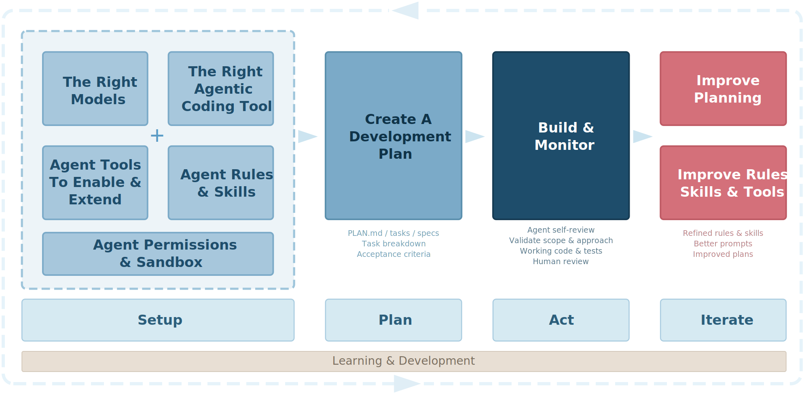

I follow a simple, yet effective flow for agentic coding that helps me to efficiently develop software using AI coding agents while keeping them on track, focused on the task at hand and ensuring they have access to the right tools and information.

The flow is simple: **_Setup -> Plan -> Act -> Review & Iterate._**

It's a cycle rather than a straight line - what you learn in each pass feeds back into your setup and plans for the next.



_Updated July 2026: I've revised this post to reflect how the workflow has evolved - Agent Skills, context engineering and sandboxing now feature heavily, and the tool-specific examples have been generalised. The workflow itself hasn't changed._

## Workflow Quickstart

Outline of the Setup -> Plan -> Act -> Review & Iterate workflow:

1. **Setup**
   - Choose capable models and an agentic coding harness that gets the most out of them.
   - Extend the agent with the right **tools** (MCP servers, language servers), **rules** and **skills**.
   - Scope what the agent can touch with **permissions and a sandbox**.
2. **Plan**
   - Ideate with the agent to hone in on the goal and requirements until you're satisfied that the agent and you are on the same page.
   - Prompt the agent to **create a development plan** (a markdown document in the repo) that captures:
     - **Why** - the goal, relevant context and background, and who it's for.
     - **What** - requirements, definition of done and where to find non-obvious information.
     - **How** - a **phased checklist of development tasks**. The checklist is the state of the work (important!).
   - Optionally start a fresh session with an agent in parallel and prompt it to read the plan and validate they understand it, asking any clarifying questions as needed.
3. **Act**
   - Start a fresh session.
   - Prompt the agent to read the development plan, ask any clarifying questions, then begin the first phase of development tasks.
   - For each task: implement, perform a critical self-review, lint / test / build, address any issues, then mark the task complete.
4. **Review & Iterate**
   - Review the work - the standard measures (code quality, architecture, testing) plus agent-specific ones (alignment to the plan, context window and sub-agent utilisation).
   - Update the plan for future phases if required and iterate towards the goal.
   - Feed what you've learned back into your rules, skills and tools.

The intent of this workflow is to have a simple, clear, reviewable and actionable plan that can be worked from. It allows you to start a fresh session throughout the process without losing track of state, critical context or requirements.

You may have heard of PRD or spec driven development with agents. Spec-_first_ development is essentially Plan then Act by another name. Spec-_anchored_ and spec-_as-source_ approaches - where specs are maintained as the ongoing source of truth - sit closer to waterfall and don't scale down well: small bugs and small stories drown in ceremony. The Setup -> Plan -> Act -> Review & Iterate workflow is a more agile approach that aims to be lighter, more portable (across both projects and tools) and less likely to over-engineer solutions, delivering value faster while still maintaining quality.

---

The following is a more detailed breakdown of each phase of the workflow along with examples and prompt templates you can use to get started.

## 🕵 Setup

### 🧠 Models & Harness

A raw model is not an agent - it becomes one when a harness gives it state, tool execution, feedback loops and enforceable constraints. Pick a strong coding model and a harness that gets the most out of it (I currently use Claude Code with Anthropic's models), then invest your setup effort in the tools, rules, skills and permissions that follow.

### 🛠️ Tools

The effective use of tools is critical to the success and cost effectiveness of agentic coding. Favour deterministic tools for deterministic outcomes, and pick the lightest mechanism that does the job:

- If a good CLI already exists (e.g. GitHub's `gh`), the agent can use it directly - no MCP server or skill required.
- MCP servers earn their place for external systems that need standardised, controlled access - Confluence, Jira, security scanners, or anything requiring OAuth.
- Many of the MCP servers I used to run have since been replaced by Agent Skills wrapping small deterministic scripts (see [Skills](#-skills) below).

The MCP servers and other tooling I use are available here: [sammcj/agentic-coding](https://github.com/sammcj/agentic-coding). I still maintain [MCP DevTools](https://github.com/sammcj/mcp-devtools) - a single, efficient Go binary that replaces multiple Node.js and Python based MCP servers (search, package and documentation lookup, document processing and more). It remains the only MCP server I _always_ have enabled.

#### Language Servers (LSP)

Give the agent access to language servers and it gains the same code intelligence as your editor: go-to-definition, find-references, type information and diagnostics. The agent navigates code structurally instead of grepping text - before changing a function signature it can list every caller and reason about the blast radius, and type errors surface while editing rather than at build time. It's also cheaper in tokens than grep and glob for code-shaped questions.

### 📏 Rules

I heavily utilise agent rules to steer the development process - a set of global rules used across all projects, with project-specific rules added as needed (e.g. `CLAUDE.md` / `AGENTS.md`, and path-scoped rule files such as `.claude/rules/*.md`).

Despite the name, rules don't define agent behaviour so much as influence it - they're influential, not enforced. A few things I've learned writing them:

- State what the agent _should_ do rather than what it shouldn't - mentioning a forbidden word or behaviour draws the model's attention to the very thing you don't want (beware the pink elephants!).
- Group related rules with headings or XML-style tags - structure improves adherence.
- Use emphasis sparingly: if everything is important, nothing is important.
- Keep rules concise and high signal - enabled rules are loaded into every session.

My rules are available here: [sammcj/agentic-coding](https://github.com/sammcj/agentic-coding#rules)

### 📚 Skills

Agent Skills are packages of written knowledge and (optionally) executable scripts that inject domain expertise into the agent's context at runtime.

Think of skills like a bookshelf. You don't remember the teachings of every book you own - when a situation arises that needs knowledge you don't have, you scan the spines to find the one that helps. Skills work the same way through progressive disclosure: the agent always sees each skill's name and short description, loads the skill body only when triggered, and reads any bundled references or scripts only if needed. An agent can have many skills available without filling its context.

> Skills teach the agent what to know and how to do it. Rules guide how it behaves. Tools let it act.

Two cautions. First, avoid "slop" skills - skills vibed into existence that contain no genuinely new knowledge, tools or workflows. Second, subject downloaded skills to the same rigour you'd apply to a library off the internet - prefer skills from sources you'd trust to land a pull request in your repo. You can outsource your thinking, but you can't outsource your understanding.

I've written more on [writing and reviewing Agent Skills](https://smcleod.net/2026/07/writing-and-reviewing-agent-skills-common-pitfalls/), and my skills - including [skill-creator-primer](https://github.com/sammcj/agentic-coding/blob/main/Skills/skill-creator-primer/SKILL.md) which catches the common authoring pitfalls - are available at [sammcj/agentic-coding](https://github.com/sammcj/agentic-coding).

### 🔐 Permissions & Sandbox

Scope what the agent can touch before you start:

- Use your harness's permission model (allow / ask / deny) to match the trust level to each action's blast radius. Pre-approving trusted actions is almost as important as denying risky ones - constant approval prompts train you to click through without reading.
- Run the agent inside a sandbox and lock it in: disable any option that lets the agent bypass the sandbox when it hits friction, and review your permissions when friction occurs instead.
- The sandbox is one layer of defence to couple with sensible permissions - it won't protect you from actions you've explicitly allowed.
- Hooks (shell commands that fire on agent events, much like git hooks) can add deterministic guardrails such as blocking dangerous command patterns. Use them sparingly - noisy hooks bloat context and can defeat prompt caching.
- Exclude anything the agent shouldn't read (secrets, large data dumps) via your tool's ignore / deny configuration.

### 📑 Gather Documentation / Examples

If I'm working with especially new libraries, frameworks or specifications I'll save key documentation or example code in the project (e.g. `docs/reference_examples/`) - or better, package it as a skill with the documentation as reference files so it's only loaded when needed. With good documentation-fetching tools available to the agent, this step is often unnecessary.

---

## 🤔 Plan

_If you want to skip straight to a prompt template for this, see [#prompt-template-create-development-plan](#prompt-template-create-development-plan)_

I'll start by writing a prompt in a text editor / file with a detailed goal for the project I want to build.

Then I start a fresh session in a read-only / planning mode and provide a prompt something like the following:

> I want you to help me develop a new Golang application that provides an API for managing a list of tasks.
>
> The intent is to have a simple API I can use across various machines on my network that will keep track of tasks.
>
> The application must be able to be run on both Linux and macOS. It must have a Dockerfile that follows best practices to build and deploy the application.
>
> I want to use the Gin framework for the API and SQLite for the database.
>
> The intended audience is myself and my family, both of which are technical and can use the command line and API tools.
>
> We may be deploying the application to a remote server in the future, so it must be able to run on a server with limited resources.
>
> I don't know if I want to use a REST or GraphQL API. I'd like you to help me explore the pros and cons of each and make a recommendation.
>
> Here are some links to the documentation for the libraries I want to use:
>  - gin web framework repository - https://github.com/gin-gonic/gin
>  - Popular SQLite packages for Go - https://github.com/mattn/go-sqlite3, https://github.com/glebarez/go-sqlite

Let's break this down, I am providing the agent:

- **What** I want to build
- **Why** I'm doing it
- **Technical requirements**
- **The intended audience** (users) of the software
- **Assumptions**
- **Unknowns** I want to explore during planning
- **Links** to upstream documentation, examples etc...

I then:

- **Iterate** with the agent to refine the plan, asking it to clarify any unknowns or assumptions.
- **Create A Plan Document** that outlines the project, requirements and development tasks.
- **Review** the plan document and edit as required.
- **Iterate** to hone in on the plan and approach

### 📄 The Plan Document

- Prompt the agent to **create a markdown document** with a checklist of tasks to complete in a phased development approach:
  > [!NOTICE] Development Plan Prompt
  > Create a new markdown document called docs/DEVELOPMENT_PLAN.md. In this document, start by adding a detailed description of the project, requirements and assumptions, then add a checklist of tasks to complete in a phased development approach.

- A good plan answers three questions:
  - **Why** - the goal, important context and background, and the target audience.
  - **What** - the requirements and definition of done, where to find non-obvious information, and the workflow to follow.
  - **How** - the phased checklist of tasks. Keep tasks concise and unambiguous, and avoid specifying exact code changes - leave the agent room to engineer.
- I **review** the markdown document and edit as required.
- I add a **tool use and task completion reminder** at the end:
  > [!NOTICE] Tool & Task Prompt
  > Remember to use the tools, functions and skills available to you. For each task: perform a critical self-review, run lint / test / build and address any issues before checking the task off. After each phase is complete, STOP and I will review your work.
- **Iterate** to hone in on the plan and approach:
  > [!NOTICE] _Example_
  > I like the idea of going with REST, but let's make sure we can easily switch to GraphQL in the future if we need to. Also we should consider how we will handle authentication and authorisation.

The intent here is to have a clear, concise and detailed plan that you could in theory provide to any agent or competent software engineer to undertake the development. Investing in planning always pays off - a little extra effort at the start results in higher quality, better aligned outcomes.

The checklist in the plan is the state of the work - it's what lets you start fresh sessions without losing progress. For larger projects I keep one plan per feature under `docs/plans/`.

A note on built-in plan modes: some harnesses store plans centrally outside your repo, and some can be hasty to complete the plan, leading to premature analysis and design. I prefer having the agent write the plan to a markdown file in the repo - it's reviewable, portable across tools, and survives any individual session.

---

## 🏁 Act

I start a fresh session so we're not pulling all the context (token usage) added during planning into development. (If the plan is small and your context usage is still under ~40-50K tokens, carrying on in the same session is fine.)

- Prompt the agent to read the plan and then begin development:
  > [!NOTICE] Begin Development Prompt
  > First read the docs/DEVELOPMENT_PLAN.md file and ask me any clarifying questions you have. Then begin development of the first phase, ensuring all requirements are met.
- For each task the agent should: implement, perform a critical self-review, run lint / tests / build, address any issues, then check the task off before moving to the next.

### 🧮 Context Engineering

Context engineering - managing the quality and quantity of context in the system - runs through this entire workflow.

LLMs are stateless: the entire context (system prompt, tool definitions, every file read, every prior message) is re-sent, and re-billed, every turn. The context window is the model's working memory, and models become measurably less capable and slower as it fills ("context rot"). Just because a model claims a 1M token context window doesn't mean it's any good when it gets anywhere near that. As a rough guide (as at mid-2026): keep under ~160K tokens on "200K" models, and under ~250-300K on "1M" models.

The plan document is what makes this workable. Because the state of the work lives in the plan rather than the conversation, you can start a fresh session at any time and pick up exactly where you left off. Embrace starting fresh - thinking "but we've come so far, now it truly understands what I mean..." is a trap!

To keep context lean:

- Start fresh sessions rather than pushing a long one further.
- Watch the quality of your enabled rules, tools and skills - poorly written ones bloat every session.
- Have tools and scripts output only actionable information - silence the rest.
- Be token-aware with reads: a grep for a symbol costs a few hundred tokens, reading the whole file costs thousands. The cheapest read is the one you didn't need.

### 🤖 Sub-Agents

Sub-agents provide context isolation and parallelisation for delegated tasks. They can't talk to each other - the main agent is the hub and they're the spokes. Good uses:

- Research - spin up a sub-agent per topic and have each return only what's useful.
- Codebase exploration that would otherwise fill your main context with file dumps.
- Working with "rich" files - have a sub-agent extract a PDF / PPTX / DOCX to markdown rather than pulling it into the main session.

Some harnesses now also support agent teams, where teammates share a task list and communicate directly rather than fanning out and reporting back - useful when tasks genuinely require cross-talk.

### 🔎🧑‍💻 Review

Once a phase is completed:

- **Review** the work - the standard measures (code quality, architecture, testing, documentation) plus the agent-specific ones: did the approach stay aligned to the goal and the plan, and how well were context and sub-agents utilised?
- **Update** - ask the agent to update the plan with any remedial items and ensure completed tasks are checked off.
- **Fix** - or request fixes to any issues or changes required.

Automate as much of this as you can - linters, test coverage gates and review skills / prompt templates beat manual inspection.

### 🔄 Iterate

- Then I start a fresh session with the prompt:
  > [!NOTICE] Continue Development Prompt
  > First read the docs/DEVELOPMENT_PLAN.md file. Then continue development, ensuring all requirements are met.
- Iterate until all phases are complete.

### 📋 Rules, Skills & Tools Aren't Static - Keep Improving Them!

- I like to perform a brief retro after completing with lessons, what I'd do differently etc...
- Update my global rules and skills with anything I've learned that can be applied to all projects.
- This is the cycle in the diagram - what you learn in each pass feeds back into Setup for the next.

---

### Prompt Template: Create Development Plan

This prompt template (most harnesses let you save these as slash commands or reusable workflows) assumes you have already started to tease out the goals and requirements of the task with the agent, and now you want to create a detailed development plan that can be used to guide the development process.

```markdown
ROLE: You are a senior development planner tasked with creating a detailed development plan based on the provided discussion and requirements.

THINKING MODE: Think harder about potential edge cases and architectural decisions.

CONSIDERATIONS:
- Always start with Context Gathering (before any implementation)
- Use Planning for complex features or architectural changes
- Scale up thinking modes for critical systems (e.g. use "ultrathink" for complex problems and architectures)
- Apply Refactoring for optimisation phases
- Adjust quality gates based on risk tolerance (e.g. if the project is for local development purposes it may not need as strict QA as if it was a production security system)
- Maintain context between prompt sequences
- If you are unsure of the agreed direction for development, ask clarifying questions before proceeding.
- This planning occurs before writing any code, we must thoroughly understand the project context and requirements.

IF THERE IS EXISTING CODE IN THE PROJECT:
1. Read all relevant files in the project directory
2. Examine existing documentation (README.md, docs/ etc.)
3. Analyse the codebase structure and dependencies
4. Identify coding conventions and patterns used
5. Review any existing tests to understand expected behaviour

DEBUGGING PROTOCOL:
- If tests fail: analyse failure reason and fix root cause
- If performance issues: profile and optimise critical paths
- If integration issues: check dependencies and interfaces

TASK: Create a new markdown file called DEVELOPMENT_PLAN.md that contains the following:

- An overview of the project purpose, goal and objectives along with any important background information.
- Each task should be a checklist item.
- A list of hard requirements if we have defined any.
- Any unknowns or assumptions (if applicable).
- A break down the development requirements into a checklist of tasks to be completed in phases.
- You do not need to include dates or time estimates.
- The document should be written in a way that I can provide it to a senior AI coding agent and have them understand and carry out the development.
- Use dashes and a single space for markdown lists.
- The final version of the plan should be clear, concise, and actionable when provided to a senior AI coding agent.

--- Example DEVELOPMENT_PLAN.md ---

# Development Plan for [PROJECT_NAME]

## Project Purpose and Goals

[PROJECT_PURPOSE_AND_GOALS]

## Context and Background

[PROJECT_CONTEXT_AND_BACKGROUND]

## Development Phases

### Phase 1

- [ ] Task 1
  - [ ] Task 1.1
- [ ] Task 2
- [ ] Task 3

## QA CHECKLIST

- [ ] All user instructions followed
- [ ] All requirements implemented and tested
- [ ] No critical code smell warnings
- [ ] Code follows project conventions and standards
- [ ] Documentation is updated and accurate if needed
- [ ] Security considerations addressed
- [ ] Performance requirements met
- [ ] Integration points verified
- [ ] Deployment readiness confirmed
- [ ] [OTHER_QA_CRITERIA]

---

Then stop, and I will review the plan.
```

---

## Further Reading

- [Vibe Coding vs Agentic Coding](https://smcleod.net/2025/06/vibe-coding-vs-agentic-coding/) - why the engineering-led approach matters.
- [Writing and Reviewing Agent Skills - Common Pitfalls](https://smcleod.net/2026/07/writing-and-reviewing-agent-skills-common-pitfalls/) - my guidance on skill authoring.
- [sammcj/agentic-coding](https://github.com/sammcj/agentic-coding) - my rules, skills, MCP tools and configs.
- [Effective context engineering for AI agents](https://www.anthropic.com/engineering/effective-context-engineering-for-ai-agents) - Anthropic's engineering blog.
- [Context Rot](https://research.trychroma.com/context-rot) - Chroma's research on model performance as input length grows.
- [agentskills.io](https://agentskills.io) - the Agent Skills format and directory.
