I follow a simple, yet effective flow for agentic coding that helps me to efficiently develop software using AI coding agents while keeping them on track, focused on the task at hand and ensuring they have access to the right tools and information.

The flow is simple: **_Setup -> [Plan -> Act](https://docs.cline.bot/exploring-clines-tools/plan-and-act-modes-a-guide-to-effective-ai-development) -> Review and Iterate._**


Outline of Setup -> Plan -> Act -> Review & Iterate workflow:

1. **Setup**
   - Ensure the agentic coding tool is setup with effective agent **rules** and agent (MCP) **tools**.
2. **Plan**
   - Ideate with the agent to hone in on the goal and requirements until you're satisfied that the agent and you are on the same page.
   - Prompting the agent to **create a development plan** based to achieve the goal that includes:
     - Relevant context & background information.
     - Requirements / constraints.
     - Measures of success.
     - A **phased checklist of developments tasks** to achieve the goal (important!).
     - Optionally start a fresh session with an agent in parallel and prompt it to read the plan and validate they understand it, asking any clarifying questions as needed.
3. **Act**
   - Start a fresh session.
   - Prompt the agent to read the development plan and begin the first phase of development tasks.
4. **Review and Iterate**
   - Review the work, updating the plan for future phases if required.
   - Iterate towards the goal.
   - Refine any project or global agent rules or access to tools from lessons learned.

The intent of this workflow is to have a simple, clear, reviewable and actionable plan that can be worked from. It allows you to start a fresh session throughout the process without losing track of state, critical context or requirements.

You may have heard of PRD or spec driven development with agents which can work well with large and complex codebases but requires a lot of time and effort spent in the setup and maintenance ensuring it doesn't become technical debt. The Setup -> Plan -> Act -> Review & Iterate workflow is a more agile approach that aims to be lighter, more portable and can be less likely to over-engineer solutions to deliver value faster while still maintaining quality.

---

## 🕵 Setup

- Ensure any directories or files you don't want Cline to read are excluded by adding them to a `.clineignore` file in the root of your project.

### 🛠️ Tools

The effective use of tools is critical to the success and cost effectiveness of agentic coding. The MCP Servers (tools) I frequently use are available here: [sammcj/agentic-coding#mcp-servers](https://github.com/sammcj/agentic-coding#mcp-servers)

- [MVP MCP Config](https://github.com/sammcj/agentic-coding/blob/main/MCP/mcp-config-mvp.json)


#### [MCP Devtools](https://github.com/sammcj/mcp-devtools)

I built[MCP Devtools](https://github.com/sammcj/mcp-devtools) to be a single, high-performance MCP server that replaces multiple Node.js and Python-based MCP servers with one efficient Go binary, providing access to essential developer tools through a unified, modular interface that can be easily extended with new tools.

It is the only MCP server I _always_ have enabled.

```mermaid
graph TD
    A[MCP DevTools Server] --> B[Search & Discovery]
    A --> C[Document Processing]
    A --> E[Intelligence & Memory]
    A --> F[Utilities]

    B --> B1[Internet Search]
    B --> B2[Package Search]
    B --> B3[Package Documentation]
    B --> B4[GitHub]
    B --> B5[ShadCN UI Components]
    B --> B6[Web Fetch]

    C --> C1[Document Processing]
    C --> C2[PDF Processing]


    E --> E1[Think Tool]
    E --> E2[Memory Graph]

    F --> F3[American→English]
    F --> F4[Filesystem]

    classDef server fill:#E6E6FA,stroke:#756BB1,color:#756BB1
    classDef category fill:#EFF3FF,stroke:#9ECAE1,color:#3182BD
    classDef utility fill:#E6FFE6,stroke:#4CAF50,color:#2E7D32
    classDef searchDiscovery fill:#FFF3E6,stroke:#FF9800,color:#F57C00
    classDef intelligence fill:#E6F7FF,stroke:#81D4FA,color:#0288D1
    classDef documentProcessing fill:#FFF0F0,stroke:#FFCDD2,color:#C62828

    class A server
    class B,C,D,E,F category
    class D1,F1,F2,F3,F4 utility
    class B1,B2,B3,B4,B5,B6 searchDiscovery
    class C1,C2 documentProcessing
    class E1,E2 intelligence
```



#### Adhoc / Sometimes Enabled MCP Servers

- The [official AWS MCP Servers](https://github.com/awslabs/mcp), mainly the core + CDK or Terraform servers.
- [Yctimlin's Excalidraw MCP server](https://github.com/yctimlin/mcp_excalidraw)
- [GLips Figma MCP server](https://github.com/GLips/Figma-Context-MCP)

### 📏 Rules

I heavily utilise agent rules (e.g. [.Clinerules](https://docs.cline.bot/improving-your-prompting-skills/prompting#clinerules-file)) to help with the development process. I have a set of global rules that I use for all projects, and then I often add project specific rules as needed.

- My rules available here: [sammcj/agentic-coding](https://github.com/sammcj/agentic-coding#rules)


### 📑 Gather Documentation / Examples

Note: I don't _always_ do this step, and if the model is good at using the tools available to it to efficiently fetch this information, it may not be necessary.

If I'm working with especially new libraries, frameworks, specifications or integrations I will sometimes save important documentation or example code snippets in a directory within the project.

> [!NOTICE] Reference Docs Example
> Let's say I'm working with go-mcp, a relatively recently developed package and a recently update to Model Context Protocol (MCP) specification, I might save the following:
>
> - `docs/reference_examples/go-mcp-readme.md` - The README file from the go-mcp repository
> - `docs/reference_examples/go-mcp-example-usage.go.txt` - A code example from the go-mcp repository (in this case I'd add .txt to the end so it doesn't interfere with the go builds)
> - `docs/reference_examples/mcp-specification-2025-03-26.json` - the latest version of the MCP specification

---

## 🤔 Plan Mode

_If you want to skip straight to a prompt template for this, see [#prompt-template-workflow-create-development-plan](#prompt-template-workflow-create-development-plan)_

I'll start by writing a prompt in a text editor / file with a detailed goal for project I want to build.

Then I start a fresh session and switch to Plan mode, and provide a prompt something like the following:

> I want you to help me develop a new Golang application that provides an API for managing a list of tasks.
>
> The intent is to have a simple API I can use across various machines on my network that will keep track of tasks.
>
> The application must be able to be run on both Linux and macOS. It must have a Dockerfile that follows best practices to build and deploy the application.
>
> I want to use the Gin framework for the API and SQLite for the database.
>
> The intended audience is myself and my family, both of which are technical and can use the command line and API tools.
>
> We may be deploying the application to a remote server in the future, so it must be able to run on a server with limited resources.
>
> I don't know if I want to use a REST or GraphQL API. I'd like you to help me explore the pros and cons of each and make a recommendation.
>
> Here are some links to the documentation for the libraries I want to use:
>  - gin web framework repository - https://github.com/gin-gonic/gin
>  - Popular SQLite packages for Go - https://github.com/mattn/go-sqlite3, https://github.com/glebarez/go-sqlite

Let's break this down, I am providing the agent:

- What I want to build
- Why I'm doing it
- Technical requirements
- The intended audience (users) of the software
- Assumptions
- Unknowns I want to explore during planning
- Links to upstream documentation, examples etc...

_See [#providing-information-about-the-goal](#providing-information-about-the-goal) for an example._

I then:

- **Iterate** with the agent to refine the plan, asking it to clarify any unknowns or assumptions.
- **Create A Plan Document** that outlines the project, requirements and development tasks.
- **Review** the plan document and edit as required.
- **Iterate** to hone in on the plan and approach

The intent here is to have a clear, concise and detailed plan that you could in theory provide to any agent or competant software engineer to undertake the development.

_See [#-create-plan-document](#-create-plan-document) for an example._

---

## 🏁 Act Mode

I start a fresh session, this so we're not pulling all the context (token usage) added during planning to keep the development focused and cost effective.

- Switch to Act mode
- Prompt the agent to read the plan and then begin development:
  > [!NOTICE] Begin Development Prompt
  > First read the docs/DEVELOPMENT_PLAN.md file. Then begin development of the first phase, ensuring all requirements are met.

### 🔎🧑‍💻 Review

Once completed:

- **Review** the work and ensure the `DEVELOPMENT_PLAN.md` file is updated.
- **Update** the projects .clinerules with anything I've learned.
- **Fix** - or request fixes to any issues or changes required.

### 🔄 Iterate

- Then I start a fresh session with the prompt:
  > [!NOTICE] Continue Development Prompt
  > First read the docs/DEVELOPMENT_PLAN.md file. Then continue development, ensuring all requirements are met.
- Iterate until all phases are complete.

### 📋 Rules Aren't Static - Keep Improving them!

- I like to perform a brief retro after completing with lessons, what I'd do differently etc...
- Update my global clinerules with anything I've learned that can be applied to all projects.

---

## Examples

### Providing Information About The Goal

- **What** I want to build
  > [!NOTICE] _Example_
  > I want you to help me develop a new Golang application that provides an API for managing a list of tasks.
- **Why** I'm doing it
  > [!NOTICE] _Example_
  > The intent is to have a simple API I can use across various machines on my network that will keep track of tasks.
- **Technical requirements**
  > [!NOTICE] _Example_
  > The application must be able to be run on both Linux and macOS. It must have a Dockerfile that follows best practices to build and deploy the application.
  - Include any specific libraries/packages/frameworks I want to use.
    > [!NOTICE] _Example_
    > I want to use the Gin framework for the API and SQLite for the database.
- **The intended audience** (users) of the software
  > [!NOTICE] _Example_
  > The intended audience is myself and my family, both of which are technical and can use the command line and API tools.
- **Assumptions**
  > [!NOTICE] _Example_
  > We may be deploying the application to a remote server in the future, so it must be able to run on a server with limited resources.
- **Unknowns** I want to explore during planning
  > [!NOTICE] _Example_
  > I don't know if I want to use a REST or GraphQL API. I'd like you to help me explore the pros and cons of each and make a recommendation.
- **Links** to upstream documentation, examples etc...
  > [!NOTICE] _Example_
  > Here are some links to the documentation for the libraries I want to use:
  > - gin web framework repository - https://github.com/gin-gonic/gin
  > - Popular SQLite packages for Go - https://github.com/mattn/go-sqlite3 , https://github.com/glebarez/go-sqlite

---

### 📄 Create Plan Document

- Prompt the agent to **create a markdown document** with a checklist of tasks to complete in a phased development approach:
  > [!NOTICE] Development Plan Prompt
  > Create a new markdown document called docs/DEVELOPMENT_PLAN.md. In this document, start by adding a detailed description of the project, requirements and assumptions, then add a checklist of tasks to complete in a phased development approach.

- I **review** the markdown document and edit as required
- I add a **tool use and task completion reminder** at the end:
  > [!NOTICE] Tool & Task Prompt
  > Remember to use the tools / functions available to you. After each phase is complete, you must check off any tasks that have been completed in full. Then stop and I will review your work.

- **Iterate** to hone in on the plan and approach
  > [!NOTICE] _Example_
  > I like the idea of going with REST, but let's make sure we can easily switch to GraphQL in the future if we need to. Also we should consider how we will handle authentication and authorisation.

---

### Prompt Template (Workflow): Create Development Plan

This prompt template (Cline calls these 'Workflows') assumes you have already started to tease out the goals and requirements of the task with the agent, and now you want to create a detailed development plan that can be used to guide the development process.

```markdown
ROLE: You are a senior development planner tasked with creating a detailed development plan based on the provided discussion and requirements.

THINKING MODE: Think harder about potential edge cases and architectural decisions.

CONSIDERATIONS:
- Always start with Context Gathering (before any implementation)
- Use Planning for complex features or architectural changes
- Scale up thinking modes for critical systems (e.g. use "ultrathink" for complex problems and architectures)
- Apply Refactoring for optimisation phases
- Adjust quality gates based on risk tolerance (e.g. if the project is for local development purposes it may not need as strict QA as if it was a production security system)
- Maintain context between prompt sequences
- If you are unsure of the agreed direction for development, you can use the `ask_followup_question` tool to clarify.
- This planning occurs before writing any code, we must thoroughly understand the project context and requirements.

IF THERE IS EXISTING CODE IN THE PROJECT:
1. Read all relevant files in the project directory
2. Examine existing documentation (README.md, docs/ etc.)
3. Analyse the codebase structure and dependencies
4. Identify coding conventions and patterns used
5. Review any existing tests to understand expected behaviour

DEBUGGING PROTOCOL:
- If tests fail: analyse failure reason and fix root cause
- If performance issues: profile and optimise critical paths
- If integration issues: check dependencies and interfaces

TASK: Create a new markdown file called DEVELOPMENT_PLAN.md that contains the following:

- An overview of the project purpose, goal and objectives along with any important background information.
- Each task should be a checklist item.
- A list of hard requirements if we have defined any.
- Any unknowns or assumptions (if applicable).
- A break down the development requirements into a checklist of tasks to be completed in phases.
- You do not need to include dates or time estimates.
- The document should be written in a way that I can provide it to a senior AI coding agent and have them understand and carry out the development.
- Use dashes and a single space for markdown lists.
- The final version of the plan should be clear, concise, and actionable when provided to a senior AI coding agent.

--- Example DEVELOPMENT_PLAN.md ---

# Development Plan for [PROJECT_NAME]

## Project Purpose and Goals

[PROJECT_PURPOSE_AND_GOALS]

## Context and Background

[PROJECT_CONTEXT_AND_BACKGROUND]

## Development Phases

### Phase 1

- [ ] Task 1
  - [ ] Task 1.1
- [ ] Task 2
- [ ] Task 3

## QA CHECKLIST

- [ ] All user instructions followed
- [ ] All requirements implemented and tested
- [ ] No critical code smell warnings
- [ ] Code follows project conventions and standards
- [ ] Documentation is updated and accurate if needed
- [ ] Security considerations addressed
- [ ] Performance requirements met
- [ ] Integration points verified
- [ ] Deployment readiness confirmed
- [ ] [OTHER_QA_CRITERIA]

---

Then stop, and I will review the plan.
```
