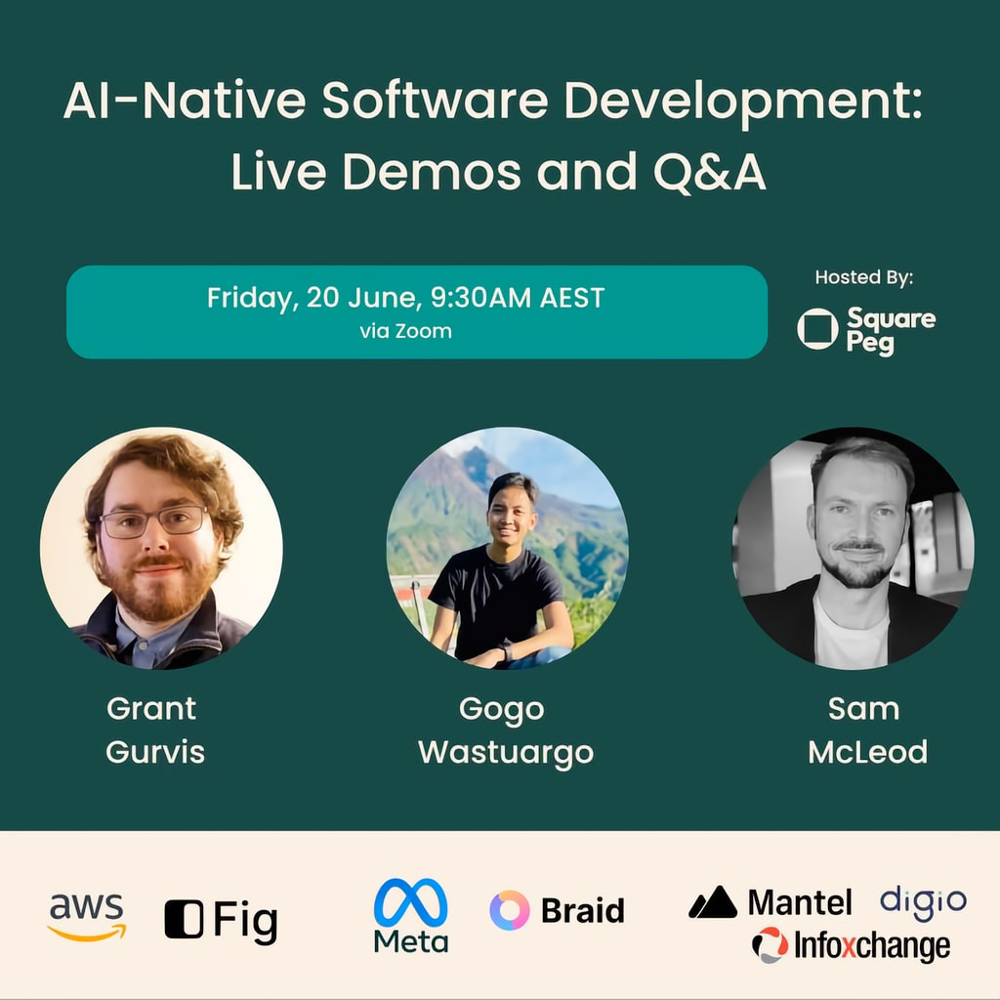

[Square Peg](https://www.squarepeg.vc/) hosted event on June 20, 2025 where I demonstrated a basic version of my daily Agentic Coding workflow using Cline and MCP tools.



---

> _What does it take to write enterprise-grade code in the AI-native era?_
>
> _Join Square Peg investors James Tynan and Grace Dalla-Bona for a live demo and Q&A session with three leading AI-native developers - Grant Gurvis, Listiarso Wastuargo, and Sam McLeod - and get a behind-the-curtain look at the workflows that enable them to ship faster, smarter, and cleaner code using tools like Cursor, Cline, and smolagents._

