[MCP DevTools](https://github.com/sammcj/mcp-devtools) - The one tool that replaced the 10-15 odd NodeJS/Python/Rust MCP servers I had running at any given to for agentic coding tools with a single server that provides tools I consider useful for agents when coding.

## The Problem

The MCP ecosystem has grown rapidly, but I found myself managing many separate servers, each often running multiple times for every MCP client I had running, not to mention the ever growing memory and CPU consumption of the many NodeJS or Python processes.

I wanted something that:
- Compiled to a single binary with minimal dependencies
- Provided consistent, well-tested tools
- Could be easily extended with new functionality
- Offered proper security controls for production use
- Performed well under load

## Architecture and Design

The server is modular in design with a "tool registry" that allows me to add new tools as needed and have them presented to MCP clients in a standard way. The server is written in Golang and compiles to a single binary that can be run in STDIO, SSE or Streamable HTTP mode.

```mermaid
graph LR
    A[MCP DevTools<br>Server]

    A --> B[Search &<br>Discovery]
    A --> C[Document<br>Processing]
    A --> D[Security<br>Analysis]
    A --> E[Intelligence &<br>Memory]
    A --> F[Utilities]
    A --> G[Agents]

    B --> B_Tools[🌐 Internet Search<br>📡 Web Fetch<br>📦 Package Search<br>📚 Package Documentation<br>🐙 GitHub<br>🎨 ShadCN UI Components]

    C --> C_Tools[📄 Document Processing<br>📑 PDF Processing]

    D --> D_Tools[📋 SBOM Generation<br>🛡️ Vulnerability Scan<br>🔒 Security Framework<br>🛠️ Security Override]

    E --> E_Tools[🧠 Think Tool<br>🕸️ Memory Graph]

    F --> F_Tools[🇬🇧 American→English<br>📁 Filesystem<br>📝 Changelog Generation]

    G --> G_Tools[🤖 Claude Code<br>✨ Gemini CLI]

    classDef inputOutput fill:#FEE0D2,stroke:#E6550D,color:#E6550D
    classDef llm fill:#E5F5E0,stroke:#31A354,color:#31A354
    classDef components fill:#E6E6FA,stroke:#756BB1,color:#756BB1
    classDef process fill:#EAF5EA,stroke:#C6E7C6,color:#77AD77
    classDef stop fill:#E5E1F2,stroke:#C7C0DE,color:#8471BF
    classDef data fill:#EFF3FF,stroke:#9ECAE1,color:#3182BD
    classDef decision fill:#FFF5EB,stroke:#FD8D3C,color:#E6550D
    classDef storage fill:#F2F0F7,stroke:#BCBDDC,color:#756BB1
    classDef api fill:#FFF5F0,stroke:#FD9272,color:#A63603
    classDef error fill:#FCBBA1,stroke:#FB6A4A,color:#CB181D

    class A components
    class B,B_Tools decision
    class C,C_Tools api
    class D,D_Tools error
    class E,E_Tools data
    class F,F_Tools process
    class G,G_Tools llm
```



Each tool implements a standard interface:

```go
type Tool interface {
    Definition() mcp.Tool
    Execute(ctx context.Context, logger *logrus.Logger, cache *sync.Map, args map[string]interface{}) (*mcp.CallToolResult, error)
}
```

This registers the tool automatically during startup, making it trivial to add new functionality. The registry handles discovery, validation, and execution whilst providing shared services like caching, logging and security hardening middleware.

The server supports three transport modes:
- **STDIO**: Direct communication for running locally
- **Streamable HTTP**: Networked deployments with optional authentication and centralised configuration

---

## Tooling Overview

These tools can be disabled by adding their function name to the `DISABLED_FUNCTIONS` environment variable in your MCP configuration.

| Tool                                                             | Purpose                            | Dependencies                  | Example Usage                    |
|------------------------------------------------------------------|------------------------------------|-------------------------------|----------------------------------|
| **[Internet Search](docs/tools/internet-search.md)**             | Multi-provider web search          | None (Provider keys optional) | Web, image, news, video search   |
| **[Web Fetch](docs/tools/web-fetch.md)**                         | Retrieve web content as Markdown   | None                          | Documentation and articles       |
| **[GitHub](docs/tools/github.md)**                               | GitHub repositories and data       | None (GitHub token optional)  | Issues, PRs, repos, cloning      |
| **[Package Documentation](docs/tools/package-documentation.md)** | Library documentation lookup       | None                          | React, Django, TensorFlow docs   |
| **[Package Search](docs/tools/package-search.md)**               | Check package versions             | None                          | NPM, Python, Go, Java, Docker    |
| **[Think](docs/tools/think.md)**                                 | Structured reasoning space         | None                          | Complex problem analysis         |
| **[Find Long Files](docs/tools/find_long_files.md)**             | Identify files needing refactoring | None                          | Find files over 700 lines        |
| **[Memory](docs/tools/memory.md)**                               | Persistent knowledge graphs        | None                          | Store entities and relationships |
| **[ShadCN UI Component Library](docs/tools/shadcn-ui.md)**       | Component information              | None                          | Button, Dialog, Form components  |
| **[American→English](docs/tools/american-to-english.md)**        | Convert to British spelling        | None                          | Organise, colour, centre         |
| **[DevTools Help](docs/tools/devtools_help.md)**                 | Extended info about DevTools tools | None                          | Usage examples, troubleshooting  |

These tools can be enabled by setting the `ENABLE_ADDITIONAL_TOOLS` environment variable in your MCP configuration.

| Tool                                                         | Purpose                                  | `ENABLE_ADDITIONAL_TOOLS` | Example Usage                         |
|--------------------------------------------------------------|------------------------------------------|---------------------------|---------------------------------------|
| **[Filesystem](docs/tools/filesystem.md)**                   | File and directory operations            | `filesystem`              | Read, write, edit, search files       |
| **[Claude Agent](docs/tools/claude-agent.md)**               | Claude Code CLI Agent                    | `claude-agent`            | Code analysis, generation             |
| **[Gemini Agent](docs/tools/gemini-agent.md)**               | Gemini CLI Agent                         | `gemini-agent`            | Code analysis, generation             |
| **[SBOM Generation](docs/tools/sbom.md)**                    | Generate Software Bill of Materials      | `sbom`                    | Analyse project dependencies          |
| **[Vulnerability Scan](docs/tools/vulnerability_scan.md)**   | Security vulnerability scanning          | `vulnerability_scan`      | Find security issues                  |
| **[Generate Changelog](docs/tools/changelog.md)**            | Generate changelogs from git commits     | `generate_changelog`      | Release notes from local/remote repos |
| **[Document Processing](docs/tools/document-processing.md)** | Convert documents to Markdown            | `process_document`        | PDF, DOCX → Markdown with OCR         |
| **[PDF Processing](docs/tools/pdf-processing.md)**           | Fast PDF text extraction                 | `pdf`                     | Quick PDF to Markdown                 |
| **[Security Framework](docs/security.md)** (BETA)            | Context injection security protections   | `security`                | Content analysis, access control      |
| **[Security Override](docs/security.md)**                    | Agent managed security warning overrides | `security_override`       | Bypass false positives                |

## Tooling Details

### Search and Discovery Tools

**Internet Search** provides unified access to multiple search providers (Brave, SearXNG, DuckDuckGo) through a single interface. Rather than managing separate tools for each provider, agents can search web, images, news, videos, and local results with consistent parameters. The tool handles provider-specific requirements and normalises results.

**GitHub** offers repository access without the context bloat of the official GitHub MCP server. It supports repository search, issue/PR management, file content retrieval, cloning, and GitHub Actions monitoring. The tool accepts flexible repository identifiers (owner/repo, URLs, or direct issue/PR links) and provides intelligent authentication via tokens or SSH keys.

**Package Search** checks versions across NPM, PyPI, Go modules, Maven, Docker Hub, GitHub Actions, and AWS Bedrock through one interface. Instead of separate tools for each ecosystem, agents can batch-check dependencies, find latest versions, and validate constraints efficiently.

**Package Documentation** fetches up-to-date library documentation using Context7's knowledge base. Combined with the package search tool, this provides a complete workflow for researching and implementing new dependencies.

### Intelligence and Reasoning

**Think Tool** provides structured reasoning space for AI agents during complex troubleshooting. Based on Anthropic's research showing 54% improvement in complex scenarios, it allows agents to pause and analyse problems before taking action. The tool supports triggering Claude's different thinking intensities (`hard`, `harder`, `ultra`) for varying problem complexity.

**Memory** maintains persistent knowledge graphs across sessions. Agents can store entities, relationships, and context that persists between conversations, enabling more sophisticated long-term reasoning.

### Document Processing

**Document Processing** converts PDFs and DOCX files to Markdown using Python's Docling library. It supports OCR, hardware acceleration (MPS, CUDA), and intelligent content extraction with caching.

**PDF Processing** provides fast PDF text extraction for simpler use cases where full document processing isn't needed.

### Security and Analysis

The security framework deserves special attention. It's a configurable, multi-layered system that provides:

- **Access Control**: Prevents tools from accessing sensitive files and domains
- **Content Analysis**: Scans returned content for security threats using pattern matching
- **Override System**: Allows bypassing false positives with audit logging

Built-in protection includes shell injection detection, data exfiltration prevention, prompt injection mitigation, and sensitive file protection. The system uses YAML-based rules with automatic reloading and minimal performance impact when disabled.

**SBOM Generation** and **Vulnerability Scanning** provide security analysis for projects, helping identify dependencies and potential security issues.

### Development Utilities

**Filesystem** tool provides secure file operations with access controls.

**Find Long Files** identifies files over 700 lines that might need refactoring. **Changelog Generation** creates release notes from git commits.

**American→English** converts American spelling to British English - a small but appreciated touch for international users.

### External Agent Integration

**Claude Agent** and **Gemini Agent** tools allow using other coding agents as sub-agents for delegated and specialised tasks. This enables a multi-agent workflow where different models can contribute their strengths.

---

## Security Framework

I recently implemented a security frameworks which operates as a configurable middleware that can inspect content that's retrieved from an external source before the content makes its way back to the LLM, the intent being to help mitigate some prompt injection style attack vectors.

The middleware currently has three functions when enabled it can be configured to:
1. Warn or block content retrieved from tools that can fetch external data (e.g. web scraping, internet search, document conversion etc…).
2. Block a list of domains, e.g. `*.ru`, `dodgy-site.com` etc.
3. Prevent the tools the server provides from being able to certain files, e.g. `id_rsa`, `*.pem` etc.

```go
ops := security.NewOperations("tool-name")
safeResp, err := ops.SafeHTTPGet(urlStr)
if err != nil {
    // Handle security blocks or network errors
    return nil, err
}
```

The framework is not designed to be solution for all possible threat vectors, by the nature of a tool designed for software development tasks, unless the internet search and file fetching functionality is disabled mcp-devtools and similar tools will always have the risk of fetching unwanted content, but I think it's a one line of defence and an interesting experiment.

If you're interested of have ideas for improvement you can take a look here:
- Docs: https://github.com/sammcj/mcp-devtools/blob/main/docs/security.md
- Default rules and configuration: https://github.com/sammcj/mcp-devtools/blob/main/internal/security/default_config.yaml

The system currently includes:

- Pattern-based threat detection (basic shell injection, data exfiltration, prompt injection)
- Domain and file access controls
- Content size limits and entropy analysis
- Audit logging with override capabilities

Example of the security framework in action, blocking potentially malicious content fetched by a tool, before it reaches the LLM:



### Architecture



### Action Processing


---

## OAuth Authentication

As an exercise in learning OAuth for MCP, I've implemented OAuth 2.0/2.1 authentication with browser-based flows or resource server modes. This enables centralised user authentication and access controls both of the server itself, and to upstream services.

```mermaid
graph TD
    subgraph "MCP DevTools OAuth Architecture"
        direction TB

        subgraph "OAuth Modes"
            BrowserMode[🌐 Browser Authentication Mode<br/>OAuth Client]
            ResourceMode[🛡️ Resource Server Mode<br/>Token Validation]
        end

        subgraph "OAuth Provider"
            AuthProvider[OAuth 2.1 Provider]
            AuthServer[Authorisation Server]
            TokenEndpoint[Token Endpoint]
            JWKSEndpoint[JWKS Endpoint]
        end

        subgraph "Browser Auth Flow"
            Browser[🌏 System Browser]
            CallbackServer[📡 Localhost Callback Server]
            PKCEGen[🔐 PKCE Challenge Generator]
        end

        subgraph "Resource Server Flow"
            TokenValidator[🔍 JWT Token Validator]
            JWKSFetch[🔑 JWKS Fetcher]
            AudienceCheck[🎯 Audience Validator]
        end

        User[👤 User] --> BrowserMode
        MCP_Client[📱 External MCP Client] --> ResourceMode

        BrowserMode --> PKCEGen
        BrowserMode --> Browser
        BrowserMode --> CallbackServer

        Browser --> AuthServer
        CallbackServer --> TokenEndpoint

        ResourceMode --> TokenValidator
        TokenValidator --> JWKSFetch
        TokenValidator --> AudienceCheck

        JWKSFetch --> JWKSEndpoint
        AudienceCheck --> AuthProvider
    end

    classDef browserAuth fill:#e1f5fe,stroke:#0277bd,color:#000
    classDef resourceAuth fill:#f3e5f5,stroke:#7b1fa2,color:#000
    classDef oauthProvider fill:#e8f5e8,stroke:#2e7d32,color:#000
    classDef user fill:#fff3e0,stroke:#ef6c00,color:#000

    class BrowserMode,Browser,CallbackServer,PKCEGen browserAuth
    class ResourceMode,TokenValidator,JWKSFetch,AudienceCheck resourceAuth
    class AuthProvider,AuthServer,TokenEndpoint,JWKSEndpoint oauthProvider
    class User,MCP_Client user
```

---

## Getting Started

Installation is simple:

```bash
go install github.com/sammcj/mcp-devtools@HEAD
```

Basic configuration requires only the binary path:

```json
{
  "mcpServers": {
    "dev-tools": {
      "type": "stdio",
      "command": "/path/to/mcp-devtools"
    }
  }
}
```

Most tools work immediately, with optional API keys enabling additional providers (Brave Search, GitHub tokens, etc.).

## Conclusion

MCP DevTools demonstrates that consolidating MCP functionality into a single binary solution that generally provides better performance, security, and maintainability than managing multiple separate servers. The modular architecture makes it easy to extend whilst the security framework provides an additional layer of protection fetch working with untrusted external content.

- https://github.com/sammcj/mcp-devtools
