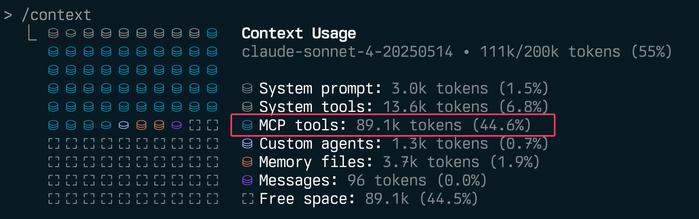

**TLDR**: If you're building MCP servers, let users disable individual tools via environment variables. It's simple to implement and your context window will thank you.



Agents often don't need _every_ tool a MCP server provides. Allowing individual tools to be disabled can not just vastly improve token usage, it aids with tool use reliability, the quality of the model's output and your security posture.

- **Optimises context use** by reducing token count when running many MCP servers
- **Reduces [context rot](https://research.trychroma.com/context-rot)** - we know that model performance grows increasingly unreliable as input length grows and that irrelevant information acts as distractors that degrade performance
- **Improves security posture** by reducing attack surface - disable risky operations in production while keeping read-only tools available
- **Enables finer-grained control** over tool access for organisational compliance

Want the AWS Terraform server but you don't use Terragrunt? Disable the Terragrunt tool (save 1.1k tokens). Want web search but not video and maps search? Disable the maps and video tools.

## The Problem is Real

MCP servers add invaluable capabilities to LLMs and agents, however - unchecked the impact of their many tools quickly becomes apparent.

The numbers are worse than you think:

| MCP Server            | Tool Name                      | Tokens               |
|-----------------------|--------------------------------|----------------------|
| **AWS Terraform**     |                                | **6.4k** (7 tools)   |
|                       | ExecuteTerragruntCommand       | 1.1k                 |
|                       | SearchAwsccProviderDocs        | 1.1k                 |
|                       | SearchAwsProviderDocs          | 905                  |
|                       | SearchUserProvidedModule       | 894                  |
|                       | RunCheckovScan                 | 806                  |
|                       | SearchSpecificAwsIaModules     | 849                  |
|                       | ExecuteTerraformCommand        | 743                  |
| **AWS Cost Explorer** |                                | **9.1k** (7 tools)   |
|                       | get_cost_and_usage             | 2.2k                 |
|                       | get_cost_comparison_drivers    | 1.9k                 |
|                       | get_cost_and_usage_comparisons | 1.5k                 |
|                       | get_cost_forecast              | 1.4k                 |
|                       | get_dimension_values           | 910                  |
|                       | get_tag_values                 | 699                  |
|                       | get_today_date                 | 469                  |
| **Playwright**        |                                | **9.7k**  (21 tools) |
|                       | browser_take_screenshot        | 631                  |
|                       | browser_fill_form              | 593                  |
|                       | browser_type                   | 545                  |
|                       | browser_click                  | 516                  |
|                       | browser_select_option          | 501                  |
|                       | _...plus 16 more tools_        | _390-469_            |
| **Markdownify**       | pptx-to-markdown               | **4.0k** (10 tools)  |
|                       |                                | 406                  |
|                       | bing-search-to-markdown        | 405                  |
|                       | audio-to-markdown              | 404                  |
|                       | docx-to-markdown               | 403                  |
|                       | image-to-markdown              | 402                  |
|                       | _...plus 5 more tools_         | _394-400_            |
| **ShadCN UI**         | get_directory_structure        | **3.0k** (7 tools)   |
|                       |                                | 478                  |
|                       | get_component_demo             | 427                  |
|                       | get_component                  | 422                  |
|                       | get_component_metadata         | 422                  |
|                       | list_blocks                    | 405                  |
|                       | _...plus 2 more tools_         | _376-467_            |

**That's over 32k tokens _just for tool descriptions & annotations_ - before you've written a line of code.**

Individual tools range from lightweight (387 tokens for basic memory operations) to massive (2.7k tokens for AWS's documentation generator). The AWS Cost Explorer's `get_cost_and_usage` tool alone burns 2.2k tokens describing parameters you might never use.

Fortunately, implementing selective tool disabling is straightforward and the benefits are immediate.

## Implementation Advice

Start simple. The conditional registration approach requires minimal code and covers most use cases. If you need runtime flexibility later, you can always refactor to a registry pattern.

- **Parse once**: Process environment variables at startup, not per-request
- **Normalise input**: Handle whitespace, case variations, and naming conventions (`underscore_tool` vs `hyphen-tool`)
- **Use map lookups**: `O(1)` performance with `map[string]bool` over slice iteration
- **Case insensitivity**: Match both `ToolName` and `toolname`
- **Whitespace**: `" tool1 , tool2 "` should be equivalent to `"tool1,tool2"`
- **Empty strings**: `DISABLED_TOOLS=",tool1,,tool2,"` should work
- **Non-existent tools**: Disabling `"non-existent_tool"` shouldn't break anything
- **Fail gracefully**: Invalid tool names shouldn't crash your server

## Example Implementation Approaches

I've implemented tool disabling in both my [mcp-devtools server](https://github.com/sammcj/mcp-devtools) with a registry based approach,and recently raised a [PR to AWS's MCP servers](https://github.com/awslabs/mcp/pull/1178) with a simpler conditional utility. Both work well and take slightly different approaches.

### Simple Conditional Registration

In my [PR](https://github.com/awslabs/mcp/pull/1178) to AWS's MCP servers, I used straightforward conditional registration. Here's the pattern:

```python
from awslabs.common.config import tool_enabled

if tool_enabled('ExecuteTerraformCommand'):
    @mcp.tool(name='ExecuteTerraformCommand')
    async def execute_terraform_command(...):
        # existing implementation unchanged
```

The utility function parses a comma-separated environment variable:

```python
def disabled_tools() -> Set[str]:
    disabled_tools = os.environ.get('DISABLED_TOOLS', '')
    if not disabled_tools:
        return set()
    return {tool.strip() for tool in disabled_tools.split(',') if tool.strip()}

def tool_enabled(tool_name: str) -> bool:
    return tool_name not in disabled_tools()
```

Configuration is simple:

```json
{
  "env": {
    "DISABLED_TOOLS": "ExecuteTerraformCommand,RunCheckovScan"
  }
}
```

### Registry-Based Runtime Filtering

My [MCP DevTools](https://github.com/sammcj/mcp-devtools) server uses a more sophisticated approach with runtime filtering:

```go
// Tools register normally during init
func init() {
    registry.Register(&ThinkTool{})
}

// But filtering happens at retrieval
func GetTool(name string) (tools.Tool, bool) {
    if disabledFunctions[name] {
        return nil, false
    }
    return toolRegistry[name], true
}
```

This approach allows for more complex filtering logic and better separation of concerns. The trade-off is slightly more implementation complexity.

## Just Do It

This isn't revolutionary engineering. It's usually just a few lines of code, but the impact is substantial.

Having a pattern for selective tool disabling is something I now add to all MCP servers that I develop and recommend to others. The implementation effort is minimal, but the user value - and performance improvement - is significant.

If you're maintaining an MCP server, add this feature. Your users are already thinking about their token budgets and context quality - help them optimise both.
