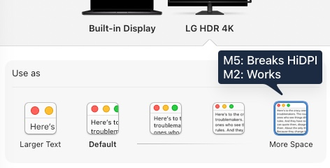

Starting with the M4 and including the new M5 generations of Apple Silicon, macOS no longer offers or allows full-resolution HiDPI 4k modes for external displays.

The maximum HiDPI mode available on a 3840x2160 panel is now just 3360x1890 - _M2/M3 machines did not have this limitation_.



With this regression Apple is leaving users to choose between:

- Full screen real estate at 4k (3840x2160) with blurry text due to HiDPI being disabled.

or

- Reduced screen real estate at 3.3k (3360x1890) with sharp text (HiDPI) but significantly less usable working space, and macOS's UI looking ridiculously oversized.

## A regression in the display controller architecture

The DCP (Display Coprocessor) reports identical capabilities on both M2 Max and M5 Max for the same display. The M5 Max hardware supports 8K (7680x4320) at 60Hz per Apple's own specs. _However_, the M4/M5 generation appears to have introduced a new per-sub-pipe framebuffer budget system (`IOMFBMaxSrcPixels`) that caps the single-stream scaler path (sub-pipe 0) at 6720 pixels wide - exactly the backing store width for 3360x1890 HiDPI. The M2 Max used a completely different architecture with a flat per-controller budget of 7680 pixels wide, which is why it worked.


## Environment and Test Setup

| Property          | M5 Max (affected)                           | M2 Max (working)                            |
| ----------------- | ------------------------------------------- | ------------------------------------------- |
| Chip              | Apple M5 Max                                | Apple M2 Max                                |
| Model ID          | Mac17,6                                     | Mac14,6                                     |
| GPU Cores         | 40                                          | 38                                          |
| macOS             | 26.4 (25E246)                               | 26.4 (25E246)                               |
| Display           | LG HDR 4K 32UN880                           | LG HDR 4K 32UN880                           |
| Native Resolution | 3840x2160                                   | 3840x2160                                   |
| Connection        | USB-C/Thunderbolt, HBR3 (8.1 Gbps), 4 lanes | USB-C/Thunderbolt, HBR3 (8.1 Gbps), 4 lanes |
| Max HiDPI Mode    | **3360x1890**                               | **3840x2160**                               |

Both machines report identical DCP parameters for the LG display:

```
MaxActivePixelRate  = 497,664,000
MaxTotalPixelRate   = 537,600,000
MaxW                = 3840
MaxH                = 2160
MaxBpc              = 10
```

## Diagnosis and Troubleshooting

### Display Override Plist (scale-resolutions)

**What**: Wrote a display override plist to `/Library/Displays/Contents/Resources/Overrides/DisplayVendorID-1e6d/DisplayProductID-7750` containing scale-resolutions entries for 7680x4320 HiDPI.

**Result**: No effect on M5 Max. The identical plist produces 3840x2160 HiDPI on M2 Max. WindowServer on M5 Max refuses to enumerate the mode regardless of plist content.

The override plist that works on M2 Max:

```xml
<dict>
    <key>default-resolution</key>
    <data>AA8AAIhwAAAAPA==</data>  <!-- 3840x2160@60 -->
    <key>DisplayProductID</key>
    <integer>30544</integer>
    <key>DisplayVendorID</key>
    <integer>7789</integer>
    <key>scale-resolutions</key>
    <array>
        <data>AAAeAAAAEOAAAAAJACAAAA==</data>  <!-- 7680x4320 HiDPI -->
        <data>AAAeAAAAEOA=</data>               <!-- 7680x4320 -->
        <data>AAAPAAAACHA=</data>               <!-- 3840x2160 -->
    </array>
</dict>
```

### EDID Patching (Software Override)

**What**: Wrote a patched EDID into the override plist's `IODisplayEDID` key with:

- Preferred timing doubled to 4095x4095 (12-bit EDID field maximum)
- Pixel clock set to maximum (655.35 MHz)
- Range limits boosted to 2550 MHz max pixel clock, 255 kHz max H-freq, 255 Hz max V-freq

**Result**: No effect with these values. However, waydabber (incredibly helpful BetterDisplay developer) [has confirmed](https://github.com/waydabber/BetterDisplay/discussions/4215) that software EDID overrides _can_ work on M4 - he got an 8K framebuffer on a 4K TV by adding a valid 8K timing and defining it as the native resolution. The catch: even with a correct override, a 4K panel can't actually accept an 8K signal, so this confirms the mechanism (scaled modes derive from the system's idea of native resolution) without providing a practical fix.

### EDID Hardware Flash - VIC 199 (8K) and DisplayID Extension

**What**: Created a patched EDID with VIC 199 (7680x4320@60Hz) added to the CEA Video Data Block, keeping the preferred detailed timing at 3840x2160. Successfully flashed to the LG monitor's EEPROM via BetterDisplay.

**Result**: The DCP read VIC 199 from the hardware EDID and updated its reported capabilities: `MaxW` changed from 3840 to 7680, `MaxH` from 2160 to 4320, and `MaxActivePixelRate` to 1,990,656,000. The DCP also allocated 2 pipes (`PipeIDs=(0,2)`, `MaxPipes=2`) as it would for a real 8K display. However, the sub-pipe 0 framebuffer budget (`MaxSrcRectWidthForPipe`) remained at 6720, and no 3840x2160 HiDPI mode appeared.

A further attempt added a DisplayID Type I Detailed Timing for 7680x4320@30Hz marked as preferred and native. This **did** generate a 3840x2160 scale=2.0 mode in the CG mode list. However, when selected, macOS attempted to output 7680x4320 on the wire (since the EDID declared it as a supported output mode), which the LG could not display. A DisplayID Display Parameters block (declaring 7680x4320 as native pixel format without creating an output timing) did not generate any new modes.

### EDID Flash to Monitor EEPROM (Range Limits Only)

**What**: Created a patched EDID binary with boosted range limits only (keeping preferred timing at native 3840x2160 to avoid breaking display output), attempted to flash to the LG monitor's EEPROM via BetterDisplay's "Upload EDID" feature.

**Result**: The range-limits-only flash did not change any DCP parameters. The DCP derives `MaxActivePixelRate` from the preferred timing's pixel clock, not from the range limits. A subsequent flash with VIC 199 added to the Video Data Block was successful (see "EDID Hardware Flash" section above).

### IOKit Registry Override (DisplayHints)

**What**: Attempted to modify the DCP's `DisplayHints` dictionary and `ConnectionMapping` array directly in the IOKit registry using `IORegistryEntrySetCFProperty`, targeting higher MaxW, MaxH, and MaxActivePixelRate values.

**Result**: The DCP driver explicitly rejects userspace property writes with `kIOReturnUnsupported` (kern_return=-536870201). These properties are owned by the kernel-level `AppleDisplayCrossbar` driver and cannot be modified from userspace.

### Display Re-probe

**What**: Used `IOServiceRequestProbe` to trigger the DCP to re-read display information after writing override plists.

**Result**: No effect on mode enumeration. The DCP re-reads from the physical display, not from software overrides.

### WindowServer Cache Clearing

**What**: Deleted `~/Library/Preferences/ByHost/com.apple.windowserver.displays.*.plist` and attempted to restart WindowServer. Also performed a full reboot.

**Result**: `killall WindowServer` on macOS 26 does not actually restart WindowServer (no display flicker, no session interruption). Full reboot with the override plist in place still did not produce the 3840x2160 HiDPI mode. The cache was not the issue.

### Reducing Connected Display Count

**What**: Disconnected the third display (U13ZA) to test whether the DCP's bandwidth budget across display pipes was the constraint.

**Result**: No effect. With only 2 displays (LG + built-in), the mode list remained identical. The limitation is not related to the number of connected displays.

### HDMI vs USB-C/Thunderbolt

**What**: Considered switching from USB-C/DisplayPort to HDMI.

**Result**: Not attempted; HDMI 2.0 has less bandwidth (14.4 Gbps vs 25.92 Gbps on DP 1.4 HBR3), so would be the same or worse.

### SkyLight Private API (SLConfigureDisplayWithDisplayMode)

**What**: Used `SLConfigureDisplayWithDisplayMode` from the private SkyLight framework to attempt to directly apply a 3840x2160 HiDPI mode (7680x4320 pixel backing, scale=2.0) to the LG display. The mode was sourced from both the CG mode list and from other displays.

**Result**: Returns error code 1000 when the mode is not in the display's own mode list. The SkyLight display configuration API validates modes against the same DCP-derived mode list as WindowServer. There is no private API path to bypass the mode list validation.

## Where the limit is applied

The DCP reports identical capability parameters on both machines - `MaxActivePixelRate`, `MaxW`, `MaxH`, `MaxTotalPixelRate` all match. These come from the display's EDID, so that's expected.

The difference shows up in WindowServer's mode list. On M2 Max, `CGSGetNumberOfDisplayModes` includes 3840x2160 at scale=2.0. On M5 Max, with the same DCP parameters and the same override plists, that mode doesn't exist.

### IOMFBMaxSrcPixels - the per-sub-pipe framebuffer budget

The `IOMFBMaxSrcPixels` property on the `IOMobileFramebufferShim` IOKit service exposes framebuffer size budgets. The M2 Max and M5 Max use fundamentally different structures here, which is the root cause of the regression.

**M2 Max** uses a flat per-controller budget:

```
# Each external display controller (all identical):
"IOMFBMaxSrcPixels" = {
    "MaxSrcRectWidth" = 7680,
    "MaxSrcRectTotal" = 33177600,
    ...
}
```

Every external display controller gets a flat `MaxSrcRectWidth` of **7680** and `MaxSrcRectTotal` of **33,177,600** (exactly 7680 x 4320). The LG is assigned to `PipeIDs=(1)`. With a 7680-pixel budget, 3840x2160 HiDPI (7680x4320 backing store) fits comfortably.

**M5 Max** restructured to per-sub-pipe budgets within each controller:

```
# Each external display controller (all identical):
"IOMFBMaxSrcPixels" = {
    "MaxSrcRectHeightForPipe" = (4608, 4608, 4608, 4608),
    "MaxSrcRectWidthForPipe"  = (6720, 7680, 7680, 7680),
    "MaxSrcBufferHeight"      = 16384,
    "MaxSrcBufferWidth"       = 16384,
    "IOMFBCompressionSupport" = 1
}
```

The 4 values in `MaxSrcRectWidthForPipe` are **sub-pipes within each display controller**, not separate display outputs. A single-stream 4K display only uses sub-pipe 0. Sub-pipes 1-3 are for multi-pipe configurations (8K displays use 2 sub-pipes simultaneously, which is why an 8K EDID causes the DCP to assign `PipeIDs=(0,2)` with `MaxPipes=2`).

| Sub-pipe | MaxSrcRectWidth | What it's for                                        |
| -------- | --------------- | ---------------------------------------------------- |
| 0        | **6720**        | Single-stream output (used by all standard displays) |
| 1        | 7680            | Multi-pipe mode only (e.g. 8K displays)              |
| 2        | 7680            | Multi-pipe mode only                                 |
| 3        | 7680            | Multi-pipe mode only                                 |

Sub-pipe 0's budget of 6720 pixels lines up exactly with the observed cap: 3360x1890 HiDPI needs a 6720x3780 backing store. For 3840x2160 HiDPI, the backing store would need to be 7680 pixels wide. Sub-pipes 1-3 have this budget, but they're only accessible in multi-pipe mode for displays that genuinely output above 4K.

| Property                   | M2 Max                   | M5 Max                                              |
| -------------------------- | ------------------------ | --------------------------------------------------- |
| Budget structure           | Flat per controller      | Per sub-pipe array                                  |
| External controller budget | `MaxSrcRectWidth` = 7680 | `MaxSrcRectWidthForPipe` = (6720, 7680, 7680, 7680) |
| Single-stream max width    | **7680**                 | **6720**                                            |
| `MaxSrcRectTotal`          | 33,177,600 (7680x4320)   | Not present                                         |
| LG pipe assignment         | `PipeIDs=(1)`            | `PipeIDs=(0)`                                       |
| 3840x2160 HiDPI            | Yes                      | No                                                  |

This property is set by the kernel-level `IOMobileFramebufferShim` driver and can't be modified from userspace.

### The budget is fixed at boot

Testing confirmed that `MaxSrcRectWidthForPipe` is set when the driver loads and does not change at runtime, regardless of what you do:

| Test                                               | Pipe 0 MaxSrcRectWidth | Changed? |
| -------------------------------------------------- | ---------------------- | -------- |
| LG on USB-C port 1                                 | 6720                   | No       |
| LG on USB-C port 2                                 | 6720                   | No       |
| LG on USB-C port 3                                 | 6720                   | No       |
| LG on HDMI                                         | 6720                   | No       |
| U13ZA disconnected (2 displays total)              | 6720                   | No       |
| Clamshell mode (LG only, lid closed)               | 6720                   | No       |
| EDID with VIC 199 (8K) flashed to monitor          | 6720                   | No       |
| EDID with 4095x4095 preferred DTD                  | 6720                   | No       |
| Software override plist with 8K default-resolution | 6720                   | No       |
| BetterDisplay native resolution set to 7680x4320   | 6720                   | No       |

It's possible the driver reads EDID content during early boot to determine these allocations (as waydabber's analysis suggests), but that hasn't been confirmed with a cold boot test using a modified EDID yet.

### What's going on

BetterDisplay developer waydabber ([discussion #4215](https://github.com/waydabber/BetterDisplay/discussions/4215)) describes the change:

> "Generally 3840x2160 HiDPI is not available with any M4 generation Mac on non-8K displays due to the new dynamic nature of how the system allocates resources. There might be exceptions maybe - when the system concludes that no other displays could be attached and there are resources left still for a higher resolution framebuffer. But normally the system allocates as low framebuffer size as possible, anticipating further displays to be connected and saving room for those."

The `IOMFBMaxSrcPixels` data fits this description. The M5 Max supports up to 4 external displays, and the GPU driver pre-allocates framebuffer budgets across all pipes at boot to cover the chip's maximum supported display configuration. Pipe 0 gets a reduced budget of 6720 to leave room for displays that _could_ be plugged in. Even in clamshell mode with only the LG connected, the budget stays at 6720 - the driver doesn't care how many displays are actually present.

Putting it together:

- The DCP reports identical capabilities on M2 Max and M5 Max (same `MaxW`, `MaxH`, `MaxActivePixelRate`)
- The M2 Max uses a flat per-controller framebuffer budget (`MaxSrcRectWidth=7680`), giving every external display enough backing store width for 3840x2160 HiDPI
- The M5 Max restructured to per-sub-pipe budgets (`MaxSrcRectWidthForPipe=(6720, 7680, 7680, 7680)`), where the single-stream sub-pipe (the only one a 4K display can use) is capped at 6720
- This caps the backing store width and therefore caps HiDPI at 3360x1890 on M5 Max
- Disconnecting other displays, switching ports, or closing the laptop lid doesn't change the sub-pipe budgets
- Adding VIC 199 (8K) to the EDID changes DCP-reported MaxW/MaxH but doesn't affect the sub-pipe budget
- Adding a DisplayID 7680x4320 timing creates a 3840x2160 scale=2.0 mode, but macOS tries to output 8K on the wire (treating it as a real output mode rather than a scaling mode), which the 4K panel can't display

The scaled resolution modes on M4/M5 are derived from whatever the system believes is the display's native resolution. On M2/M3, the system would generate HiDPI modes up to 2.0x the native resolution (so 3840x2160 native got you a 7680x4320 backing store). On M4/M5, the single-stream sub-pipe budget caps this at around 1.75x. Whether this is a hardware constraint in the new scaler architecture or a conservative firmware allocation policy is unclear without Apple's documentation - but the architectural change from M2's flat budget to M5's sub-pipe budget is the direct cause of the regression.

---

## What could fix this

This needs a change from Apple in the `IOMobileFramebufferShim` driver's sub-pipe budget allocation. Specifically, sub-pipe 0's `MaxSrcRectWidthForPipe` needs to be 7680 instead of 6720 when a 3840x2160 display is connected. A few ways they could approach it:

1. Raise sub-pipe 0's budget to 7680 for external display controllers (matching the M2 Max's flat allocation)
2. Dynamically reallocate sub-pipe budgets based on actually connected displays and their capabilities
3. Expose a user override for sub-pipe framebuffer budgets (system preference or `nvram` variable)

The M2 Max's flat per-controller budget of 7680 proves the display controller hardware can handle it. The M5 Max's multi-pipe sub-pipes (1-3) also have 7680, but these are only used for 8K multi-stream output. I've filed Apple Feedback FB22365722.

A 5K or 8K panel may not hit the exact same limit since its EDID native resolution is high enough that 1.75x scaling still provides a usable backing store.

## Appendix: Diagnostic Commands and Output

Commands to reproduce this on any Mac. All except #3 work without special permissions. Command #6 is the most useful single diagnostic for this issue.

### Diagnostic commands

```bash
# 1. DCP rate limits and native caps per display
ioreg -l -w0 | grep -o '"MaxActivePixelRate"=[0-9]*\|"MaxW"=[0-9]*\|"MaxH"=[0-9]*' \
  | paste - - - | sort -u

# 2. System profiler display summary
system_profiler SPDisplaysDataType

# 3. All HiDPI modes for a display (requires Screen Recording permission)
#    Use BetterDisplay, SwitchResX, or any tool that calls
#    CGSGetNumberOfDisplayModes / CGSGetDisplayModeDescriptionOfLength.
#    Example output format shown below.

# 4. Display connection details and DisplayHints
ioreg -l -w0 | grep -B5 -A2 'MaxActivePixelRate' | grep -v EventLog

# 5. ConnectionMapping (per-pipe allocation)
ioreg -l -w0 | grep "ConnectionMapping"

# 6. Per-pipe framebuffer budgets (the key constraint on M4/M5)
ioreg -l -w0 | grep "IOMFBMaxSrcPixels"
```

### M2 Max (Mac14,6) - Working

Display: LG HDR 4K 32UN880 (3840x2160) via USB-C/Thunderbolt, macOS 26.4.

> Note: Commands 2, 4, 5 were captured without the LG connected. The mode list (command 3) was captured with the LG connected in a separate session.

**Command 1 - DCP rate limits:**

```
"MaxW"=3840     "MaxActivePixelRate"=497664000  "MaxH"=2160
"MaxW"=3840     "MaxActivePixelRate"=552950718  "MaxH"=2400
```

**Command 2 - System profiler (LG not connected at capture time):**

```
Graphics/Displays:

    Apple M2 Max:

      Chipset Model: Apple M2 Max
      Type: GPU
      Bus: Built-In
      Total Number of Cores: 38
      Vendor: Apple (0x106b)
      Metal Support: Metal 4
      Displays:
        Color LCD:
          Display Type: Built-in Liquid Retina XDR Display
          Resolution: 3456 x 2234 Retina
          Main Display: Yes
          Mirror: Off
          Online: Yes
          Automatically Adjust Brightness: No
          Connection Type: Internal
```

**Command 3 - HiDPI modes (LG connected, top 5):**

```
mode: {resolution=3840x2160, scale = 2.0, freq = 60, bits/pixel = 16}
mode: {resolution=3840x2160, scale = 2.0, freq = 30, bits/pixel = 16}
mode: {resolution=3360x1890, scale = 2.0, freq = 60, bits/pixel = 16}
mode: {resolution=3360x1890, scale = 2.0, freq = 30, bits/pixel = 16}
mode: {resolution=3200x1800, scale = 2.0, freq = 60, bits/pixel = 16}
```

Note: **3840x2160 at scale = 2.0 is present** as the highest available HiDPI mode.

**Command 4 - Display connection details (LG not connected at capture time):**

```
DisplayHints = {}
```

When LG is connected, reports identical values to M5 Max:

```
"DisplayHints" = {
    "MaxBpc"=10,
    "EDID UUID"="1E6D5077-0000-0000-0520-0104B5462878",
    "MaxTotalPixelRate"=537600000,
    "MaxW"=3840,
    "MaxActivePixelRate"=497664000,
    "Tiled"=No,
    "ProductName"="LG HDR 4K",
    "MaxH"=2160
}
```

**Command 5 - ConnectionMapping (LG not connected at capture time):**

```
"ConnectionMapping" = ()
```

### M5 Max (Mac17,6) - Affected

Display: LG HDR 4K 32UN880 (3840x2160) via USB-C/Thunderbolt, macOS 26.4.

**Command 1 - DCP rate limits:**

```
"MaxW"=3840     "MaxActivePixelRate"=497664000  "MaxH"=2160
"MaxW"=3840     "MaxActivePixelRate"=552950718  "MaxH"=2400
```

Identical to M2 Max.

**Command 2 - System profiler:**

```
Graphics/Displays:

    Apple M5 Max:

      Chipset Model: Apple M5 Max
      Type: GPU
      Bus: Built-In
      Total Number of Cores: 40
      Vendor: Apple (0x106b)
      Metal Support: Metal 4
      Displays:
        LG HDR 4K:
          Resolution: 6720 x 3780
          UI Looks like: 3360 x 1890 @ 60.00Hz
          Main Display: Yes
          Mirror: Off
          Online: Yes
          Rotation: Supported
        Color LCD:
          Display Type: Built-in Liquid Retina XDR Display
          Resolution: 3456 x 2234 Retina
          Mirror: Off
          Online: Yes
          Automatically Adjust Brightness: Yes
          Connection Type: Internal
        U13ZA:
          Resolution: 3840 x 2400 (WQUXGA)
          UI Looks like: 1920 x 1200 @ 60.00Hz
          Mirror: Off
          Online: Yes
          Rotation: Supported
```

Note: The LG's backing store is 6720x3780 (3360x1890 HiDPI). This is 1.75x the native resolution, not the 2.0x (7680x4320) needed for 3840x2160 HiDPI.

**Command 3 - HiDPI modes (top 5):**

```
mode: {resolution=3360x1890, scale = 2.0, freq = 60, bits/pixel = 16}
mode: {resolution=3360x1890, scale = 2.0, freq = 30, bits/pixel = 16}
mode: {resolution=3200x1800, scale = 2.0, freq = 60, bits/pixel = 16}
mode: {resolution=3200x1800, scale = 2.0, freq = 30, bits/pixel = 16}
mode: {resolution=3008x1692, scale = 2.0, freq = 60, bits/pixel = 16}
```

Note: **3840x2160 at scale = 2.0 is absent.** Maximum HiDPI is 3360x1890.

**Command 4 - Display connection details:**

```
"DisplayHints" = {
    "MaxBpc"=10,
    "EDID UUID"="1E6D5077-0000-0000-0520-0104B5462878",
    "MaxTotalPixelRate"=537600000,
    "MaxW"=3840,
    "MaxActivePixelRate"=497664000,
    "Tiled"=No,
    "ProductName"="LG HDR 4K",
    "MaxH"=2160
}
```

Identical to M2 Max.

**Command 5 - ConnectionMapping:**

```
"ConnectionMapping" = (
    {
        "MaxW"=3840,
        "MaxTotalPixelRate"=537600000,
        "MaxActivePixelRate"=497664000,
        "ProductName"="LG HDR 4K",
        "Address"="0.2.0",
        "PipeIDs"=(0),
        "MaxPipes"=1,
        "MaxH"=2160
    },
    {
        "MaxW"=3840,
        "MaxTotalPixelRate"=594000000,
        "MaxActivePixelRate"=552950718,
        "ProductName"="U13ZA",
        "Address"="0.0.1",
        "PipeIDs"=(1),
        "MaxPipes"=1,
        "MaxH"=2400
    }
)
```

**Command 6 - IOMFBMaxSrcPixels (per-pipe framebuffer budgets):**

```
"IOMFBMaxSrcPixels" = {
    "MaxSrcRectHeightForPipe" = (4608, 4608, 4608, 4608),
    "MaxSrcRectWidthForPipe"  = (6720, 7680, 7680, 7680),
    "MaxSrcBufferHeight"      = 16384,
    "MaxSrcBufferWidth"       = 16384,
    "IOMFBCompressionSupport" = 1
}
```

Sub-pipe 0 (the single-stream path all standard displays use) has a `MaxSrcRectWidthForPipe` of 6720, which is exactly the backing store width for 3360x1890 HiDPI. Sub-pipes 1-3 have 7680 but are only used for multi-pipe 8K configurations.

### Key observation

DCP-reported capabilities are identical between M2 Max and M5 Max for the same display. The difference is in the display controller architecture: the M2 Max uses a flat per-controller budget (`MaxSrcRectWidth=7680`), while the M5 Max uses per-sub-pipe budgets (`MaxSrcRectWidthForPipe=(6720, 7680, 7680, 7680)`). The single-stream sub-pipe (the only one a 4K display uses) gets a 6720-wide budget on M5 Max, capping HiDPI at 3360x1890 before WindowServer ever builds its mode list.

## References

- [BetterDisplay Discussion #4215](https://github.com/waydabber/BetterDisplay/discussions/4215) - waydabber's description of the M4-generation limitation
- [MacRumors discussion](https://forums.macrumors.com/threads/5k2k-at-120hz-with-mac-mini-m4.2441289/page-29)
- [Apple Discussions](https://discussions.apple.com/thread/256265624?sortBy=oldest_first&page=1)
- [Apple M5 Max specifications](https://www.apple.com/macbook-pro/specs/) - claims 8K (7680x4320) at 60Hz over Thunderbolt
- Apple Feedback FB22365722
