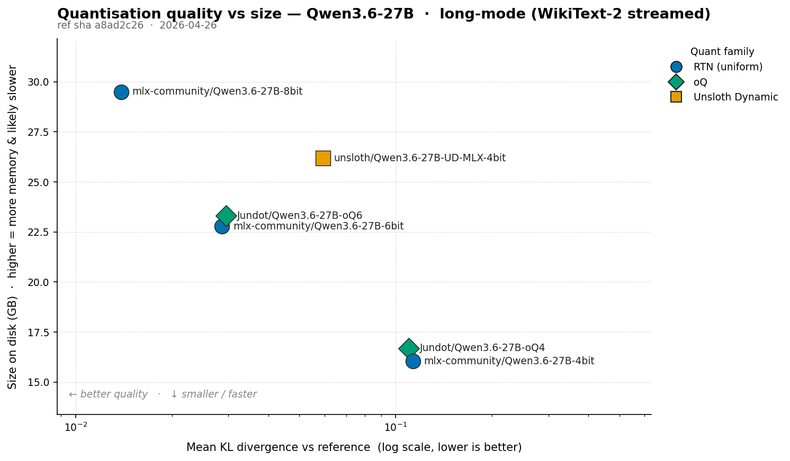
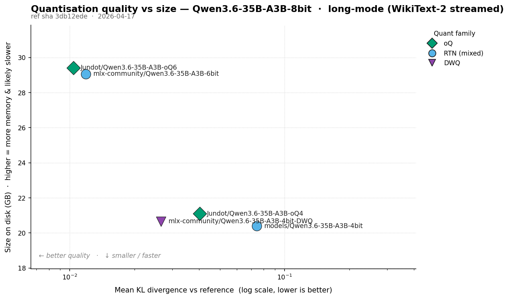

KL divergence against a known-good reference answers **"how much did this quant change the model's behaviour?"** rather than "how good is this model overall?".

## What KLD measures

KL divergence measures how much one probability distribution disagrees with another. At each token position, both the reference and the quantised model emit a distribution over the full vocabulary (~248k tokens for Qwen-class models). The reference might say _"~80% likely `the`, ~5% likely `a`, ..."_; the quant says something slightly different. KLD compares the two per position and averages.

Read it as "information lost when you use the quant in place of the reference". Zero means identical predictions; bigger means more divergent.

Why this beats perplexity for ranking quants: perplexity mixes the model's intrinsic uncertainty with quant damage. KLD against a fixed reference isolates the damage.

Rough scale (in nats, on Qwen-class instruct models):

| Mean KLD         | Reads as                                                                                                         |
| ---------------- | ---------------------------------------------------------------------------------------------------------------- |
| `< 1e-4`         | Distributions essentially identical                                                                              |
| `1e-3` to `5e-3` | Very close; typical of well-made 6-bit                                                                           |
| `1e-2` to `5e-2` | Measurably larger drift; typical 4-bit territory. Whether it's perceptible under sampling isn't well-established |
| `> 1e-1`         | Substantial divergence; sampled outputs likely to differ obviously                                               |

KLD is a distance metric, not a perceptual one. Treat the bands above as ranking aids, not quality verdicts.

Two caveats:

- **Prefill only.** KLD is measured at prompt positions. It doesn't track how sampled outputs drift over a long generation, where per-token divergences compound. Lower KLD tracks subjective quality but doesn't guarantee it.
- **Direction matters.** I compute `KL(reference ‖ quant)`, weighting divergence by the _reference's_ probabilities. Disagreements where the reference is confident count more than ones in the long tail. That's the right direction for "how well does the quant imitate the reference".

## Evaluation modes

mlx-kld has two evaluation modes:

- **Short mode**: ~50 short prompts. Quick (1-2 minutes for six quants), but the small token budget makes results noisy and swing-prone on unlucky positions.
- **Long mode**: streams WikiText-2's raw test split in 32 chunks of `n_ctx=2048` tokens (65,536 per comparison), scoring only the second half of each chunk (matching `llama.cpp`'s perplexity convention). Slower (5-10 minutes for six quants), but produces stable rankings and catches quants that degrade past their training context boundary.

Results below are long-mode only. Short-mode rankings broadly agreed but with wider noise on close pairs. The two means aren't directly comparable; the scale table above is approximate for long-mode.

## Qwen 3.6 27B results

Reference: `Qwen/Qwen3.6-27B` at bf16 (55.56 GB), measured against six MLX quantisations: RTN uniform (4/6/8-bit), Unsloth Dynamic mixed-precision 4-bit, and oQ data-driven mixed-precision (4-bit and 6-bit). 65,536 tokens per comparison from WikiText-2. Hardware: Apple M5 Max, 128 GB.



### Headline numbers

KL divergence vs the bf16 reference, ordered by mean KLD (lower = closer to bf16):

{}
| Model                             | Size     | Eff. bpw | Mean KLD      | Mean KLD / bpw | Median KLD    | P95 KLD       | P99 KLD       | Max KLD        |
| --------------------------------- | -------- | -------- | ------------- | -------------- | ------------- | ------------- | ------------- | -------------- |
| `mlx-community/Qwen3.6-27B-8bit`  | 29.50 GB | 9.69     | 0.01388       | 0.00143        | 0.00063       | 0.00454       | 0.02963       | 21.20596       |
| `mlx-community/Qwen3.6-27B-6bit`  | 22.78 GB | 7.48     | **0.02869** ★ | **0.00383** ★  | 0.00201       | 0.01562       | **0.10848** ★ | 26.31875       |
| `Jundot/Qwen3.6-27B-oQ6`          | 23.30 GB | 7.65     | 0.02956       | 0.00386        | **0.00194** ★ | **0.01511** ★ | 0.11315       | **25.44921** ★ |
| `unsloth/Qwen3.6-27B-UD-MLX-4bit` | 26.19 GB | 8.60     | 0.05922       | 0.00688        | 0.00733       | 0.08340       | 0.53137       | 26.38841       |
| `Jundot/Qwen3.6-27B-oQ4`          | 16.69 GB | 5.48     | 0.11004       | 0.02008        | 0.02009       | 0.16473       | 0.95891       | 27.10723       |
| `mlx-community/Qwen3.6-27B-4bit`  | 16.05 GB | 5.27     | 0.11324       | 0.02147        | 0.02180       | 0.18127       | 1.13275       | 26.91660       |
{}

★ = best on that metric, excluding the 8-bit reference. Mean KLD / bpw is a quality-per-bit ratio (lower is better).

### Per-tensor configs

The interesting differences between mixed-precision quants are in _which_ tensors got the extra bits:

{}
| Model                             | Quant family            | Base bits | Overrides                          | Tensors elevated                                                                                |
| --------------------------------- | ----------------------- | --------- | ---------------------------------- | ----------------------------------------------------------------------------------------------- |
| `mlx-community/Qwen3.6-27B-8bit`  | RTN affine (uniform)    | 8/gs64    | none                               | (uniform 8-bit)                                                                                 |
| `mlx-community/Qwen3.6-27B-6bit`  | RTN affine (uniform)    | 6/gs64    | none                               | (uniform 6-bit)                                                                                 |
| `mlx-community/Qwen3.6-27B-4bit`  | RTN affine (uniform)    | 4/gs64    | none                               | (uniform 4-bit)                                                                                 |
| `unsloth/Qwen3.6-27B-UD-MLX-4bit` | Unsloth Dynamic (mixed) | 4/gs64    | 258 (4-bit×189, 5-bit×3, 8-bit×66) | embed_tokens×1, lm_head×1, self_attn×64, mlp×192. 8-bit boosts on every ~4th attention layer    |
| `Jundot/Qwen3.6-27B-oQ4`          | oQ (data-driven mixed)  | 4/gs64    | 110 (5-bit×108, 6-bit×2)           | linear_attn(SSM)×73, mlp×32, self_attn×5. **Entire +1 bpw budget spent on SSM and MLP tensors** |
| `Jundot/Qwen3.6-27B-oQ6`          | oQ (data-driven mixed)  | 6/gs64    | 30 (8-bit×30)                      | embed_tokens×1, self_attn×10, linear_attn(SSM)×13, mlp×6                                        |
{}

### What stands out

**8-bit tracks bf16 most closely.** Mean KLD ~0.014, ~2x lower than 6-bit and ~8x lower than 4-bit. Short mode had 8-bit at ~1.6e-3, which is the metric being too generous on a small token budget: short prompts only score early-context positions where 8-bit's predictions are mostly trivial. In practice 8-bit is a drop-in for bf16; the only real cost is the bit width itself.

**At 6 bpw, RTN and oQ6 are effectively tied.** RTN edges oQ6 on mean (0.02869 vs 0.02956) and P99; oQ6 wins on median, P95 and Max. Short mode had oQ6 winning by ~14% on mean; long mode collapses that to a ~3% gap the other way. Call it a draw and prefer the simpler recipe. Both sit in the band where any quality drop should be imperceptible.

**At 4-bit, oQ4 beats RTN-4bit by ~3%** (0.110 vs 0.113). The SSM/MLP protection helps, but nowhere near the ~16% short mode showed. Both sit in the "noticeable degradation" band; choose by file size.

**`unsloth/Qwen3.6-27B-UD-MLX-4bit` is the bad deal here.** Effective 8.6 bpw (more memory than RTN-6bit) and mean KLD 0.059, ~2x worse than 6-bit. The "every 4th attention layer to 8-bit" heuristic doesn't transfer to Qwen 3.6; you pay 6-bit memory for distinctly worse than 6-bit quality. Unsloth describes their MLX algorithm as _"still evolving"_, and their GGUF quants are strong, so this'll likely improve. Skip it for now.

**UD and oQ allocate bits very differently.** UD spreads bits across repeating layer positions (attention every 4th layer, all MLP at base, plus embedding). oQ4 spends its budget on 73 SSM tensors flagged fragile by data-driven sensitivity, plus 32 MLP tensors, leaving `lm_head` at 4-bit. oQ6 spreads a smaller 30-tensor budget across embed, attention, SSM and MLP.

## Qwen 3.6 35B-A3B results

The MoE variant. `Qwen3.6-35B-A3B` activates ~3B of its 35B parameters per token, so prefill is much faster than the dense 27B.

Reference is `mlx-community/Qwen3.6-35B-A3B-8bit` (37.72 GB), not bf16. The 27B result showed 8-bit vs bf16 sits well below the 6-bit numbers, so this ranks lower-bit quants fine without loading 70+ GB of bf16 MoE weights. Absolute KLD here understates divergence from bf16 by the 8-bit-vs-bf16 gap. Five MLX quantisations, 65,536 tokens per comparison.



### Headline numbers

{}
| Model                                               | Size     | Eff. bpw | Mean KLD      | Mean KLD / bpw | Median KLD    | P95 KLD       | P99 KLD       | Max KLD       |
| --------------------------------------------------- | -------- | -------- | ------------- | -------------- | ------------- | ------------- | ------------- | ------------- |
| `Jundot/Qwen3.6-35B-A3B-oQ6`                        | 29.41 GB | 6.89     | **0.01039** ★ | **0.00151** ★  | **0.00396** ★ | **0.03398** ★ | **0.10955** ★ | **3.09347** ★ |
| `mlx-community/Qwen3.6-35B-A3B-6bit`                | 29.06 GB | 6.81     | 0.01189       | 0.00174        | 0.00503       | 0.03732       | 0.11440       | 6.95977       |
| `mlx-community/Qwen3.6-35B-A3B-4bit-DWQ`            | 20.66 GB | 4.84     | 0.02663       | 0.00550        | 0.01082       | 0.08504       | 0.28286       | 3.89949       |
| `Jundot/Qwen3.6-35B-A3B-oQ4`                        | 21.10 GB | 4.95     | 0.04024       | 0.00813        | 0.01621       | 0.13556       | 0.42157       | 6.84052       |
| `mlx-community/Qwen3.6-35B-A3B-4bit` (RTN baseline) | 20.40 GB | 4.78     | 0.07418       | 0.01551        | 0.03924       | 0.23813       | 0.62739       | 11.49803      |
{}

### Quant architecture

The MoE has tensor categories the dense model doesn't: `router` (the gating network picking which experts each token hits) and `shared_expert` (an expert that runs on every token). Per-tensor budgets vary widely:

{}
| Model                                               | Quant family       | Base bits | Overrides                            | Tensors elevated                                                                                     |
| --------------------------------------------------- | ------------------ | --------- | ------------------------------------ | ---------------------------------------------------------------------------------------------------- |
| `Jundot/Qwen3.6-35B-A3B-oQ6`                        | oQ                 | 6/gs64    | 228 (6-bit×30, 8-bit×198)            | embed_tokens×1, linear_attn(SSM)×50, **shared_expert×160**, self_attn×16, lm_head×1                  |
| `mlx-community/Qwen3.6-35B-A3B-6bit`                | RTN affine (mixed) | 6/gs64    | 80 (8-bit×80)                        | **router×40, shared_expert×40**                                                                      |
| `mlx-community/Qwen3.6-35B-A3B-4bit-DWQ`            | DWQ                | 8/gs64    | 512 (4-bit×240, 8-bit×272)           | embed_tokens×1, linear_attn(SSM)×150, router×40, mlp×120, shared_expert×160, self_attn×40, lm_head×1 |
| `Jundot/Qwen3.6-35B-A3B-oQ4`                        | oQ                 | 4/gs64    | 306 (5-bit×113, 6-bit×14, 8-bit×179) | embed_tokens×1, linear_attn(SSM)×125, shared_expert×160, self_attn×19, lm_head×1                     |
| `mlx-community/Qwen3.6-35B-A3B-4bit` (RTN baseline) | RTN affine (mixed) | 4/gs64    | 80 (8-bit×80)                        | router×40, shared_expert×40                                                                          |
{}

DWQ's config has an 8-bit base with 4-bit downcasts on most tensors, the inverse of the usual "4-bit base + 8-bit elevations" pattern. Effective bpw still lands at 4.84, so the "4-bit" name matches the on-disk reality. Unsloth Dynamic on the dense 27B doesn't (8.60 bpw despite the "4-bit" name).

### What stands out

**MoE 6-bit is closer to 8-bit than dense 27B's was.** Mean KLD ~0.011 vs the 8-bit reference, against dense 27B's ~0.029 vs bf16. Different references, but the 6-to-8 step buys less on the MoE: both 6-bit recipes already lift routers and shared experts to 8-bit, so the remaining damage is in tensors that fire less often.

**The plain RTN 4-bit is the worst, but no longer unusable.** `mlx-community/Qwen3.6-35B-A3B-4bit` (RTN with only router and shared_expert at 8-bit) sits at mean KLD 0.074, ~3x worse than DWQ-4bit. P99 is 0.63: bad, but not the 1.97 short mode showed. Coherent but noticeably degraded. If you need 4-bit, DWQ is the pick.

**At 4-bit, DWQ beats oQ4 by ~34% on mean** (0.027 vs 0.040). DWQ protects more: 512 overrides covering embed, lm_head, all 150 SSM tensors, all 40 routers, every shared_expert, plus 40 attention and 120 MLP. oQ4 protects 125 SSM tensors and all 160 shared_experts but leaves the routers at 4-bit. On MoE, the router is sensitive enough that the bits oQ4 saves there cost more than they save.

**At 6-bit, oQ6 wins by ~13% on mean** (0.0104 vs 0.0119) and on every other percentile. oQ6 lifts all 160 shared_experts and 50 SSM tensors to 8-bit; RTN-6bit lifts 40 routers + 40 shared_experts. Protecting the SSM tensors on top is worth ~13%.

**Quant rankings don't generalise between dense and MoE.** Dense 27B: oQ4 beats RTN-4bit by ~3%. MoE: oQ4 beats the RTN baseline by ~46% but loses to DWQ by ~34%, because DWQ protects the routers and oQ4 doesn't. Pick a quant for the actual model, not "the same family at the same bit width".

**MoE prefill is much faster than the dense 27B's at similar size,** because only ~3B parameters fire per token.

## What I'd actually run

Anything in the 5.8-7 bpw band from a well-made quant should be indistinguishable from bf16 in actual output. Choose on memory and speed, not quality. Two things drive quality at a given bit width: the _recipe_ (which tensors got more bits) and the implementation (group size, calibration data).

For Qwen 3.6 27B (dense) on a 64-128 GB Mac:

- **`mlx-community/Qwen3.6-27B-6bit`** (22.78 GB) is my default. Practical sweet spot, well within the band where any quality drop should be imperceptible.
- **`Jundot/Qwen3.6-27B-oQ6`** (23.30 GB) if your workload is sensitive to large excursions (lowest Max and median KLD). Otherwise equivalent to RTN-6bit.
- **`mlx-community/Qwen3.6-27B-8bit`** (29.50 GB) if you have the memory and want the closest match. Doesn't buy anything you'd notice over a good 6-bit.
- **`mlx-community/Qwen3.6-27B-4bit`** or **`Jundot/Qwen3.6-27B-oQ4`** (16-17 GB) if memory is tight. Within 3% of each other on mean KLD; pick whichever's already cached. This is where the recipe starts to matter and divergence is more likely to surface in outputs.
- **Skip `unsloth/Qwen3.6-27B-UD-MLX-4bit`.** Effective 8.6 bpw (more memory than RTN-6bit) and ~2x worse mean KLD.

For Qwen 3.6 35B-A3B (MoE):

- **`Jundot/Qwen3.6-35B-A3B-oQ6`** (29.41 GB) is the quality winner. ~13% better mean KLD than RTN-6bit and best on every percentile, with similar speed.
- **`mlx-community/Qwen3.6-35B-A3B-6bit`** (29.06 GB) if you prefer the simpler recipe; quality gap to oQ6 is real on the metric but you're unlikely to feel it.
- **`mlx-community/Qwen3.6-35B-A3B-4bit-DWQ`** (20.66 GB) is the right 4-bit choice. ~34% better mean KLD than oQ4 at similar speed.
- **Skip `Jundot/Qwen3.6-35B-A3B-oQ4`**. DWQ dominates it on every metric at the same effective bit width.
- **Don't use plain `mlx-community/Qwen3.6-35B-A3B-4bit`.** Mean KLD 3x worse than DWQ; divergence starts to surface in outputs at this level. DWQ is the only 4-bit worth running on this model.

---

## Measuring KLD with [mlx-kld](https://github.com/sammcj/mlx-kld)

[mlx-kld](https://github.com/sammcj/mlx-kld) is what I've been using for this on MLX. It's my fork / rewrite of `TipKnuckle/mlx-kld`.

### How the tool works

Two stages, with the expensive bit cached:

1. Load the reference, run a forward pass on each prompt, store the log-softmax outputs as a sparse top-K cache (~500-1000x smaller than dense), unload.
2. For each comparison model: load, run the same forward passes using the cached reference token IDs verbatim, compute per-token KL, unload before the next.

Only one model is in memory at a time. Forward passes use `--chunk-tokens 2048` with `mlx-lm`'s shared KV cache; bit-equivalent to an un-chunked pass. Reference token IDs are authoritative: the comparison model is fed exactly the tokens the reference saw, never re-tokenised.

Sparse top-K stores only the K most-likely log-probs per position, plus a _tail-mass scalar_ (the total probability of every other token combined). K=256 default keeps 256 explicit log-probs out of ~248k vocab entries. Lumping the tail into one bin introduces a ~3-5% rank-preserving underestimate. Compression on real Qwen output is ~420x at K=256 (210 MB dense, 0.5 MB sparse for ~300 tokens).

#### Running it

```bash
# Stage 1: cache the reference once. --short --long runs both modes and stores
# both in the cache; you can also run them separately and merge later. Pointing
# --compare at the reference doubles as a self-comparison sanity check (KL must be 0).
mlx-kld \
  --reference Qwen/Qwen3.6-27B \
  --compare  Qwen/Qwen3.6-27B \
  --short --long \
  --top-k-cache 256 \
  --save-reference qwen27b_bf16_ref

# Stage 2: rank as many quants as you like against the cached reference.
mlx-kld \
  --load-reference qwen27b_bf16_ref \
  --short --long \
  --compare \
    mlx-community/Qwen3.6-27B-4bit \
    mlx-community/Qwen3.6-27B-6bit \
    mlx-community/Qwen3.6-27B-8bit \
    unsloth/Qwen3.6-27B-UD-MLX-4bit \
    Jundot/Qwen3.6-27B-oQ4 \
    Jundot/Qwen3.6-27B-oQ6 \
  --top-k 20 --chunk-tokens 2048 --json-summary-only \
  --chart results/qwen3.6-quality.png \
  --output results/qwen3.6
```

Each run reports KLD stats (mean, median, std, P95, P99, max), model metadata (size, effective bpw, quant family, group size, per-tensor override count and bit distribution), and weights versioning (SHA-256 of the safetensors index plus mtime of the newest weight file, so you can tell whether two runs hit the same bytes-on-disk).

## Sanity checks and approximation error

- **Self-comparison must be zero.** Pointing `--compare` at the reference produces KL = 0. If not, the tokenisation or cache load path is broken. Mine was, briefly: cached references were re-tokenising on the comparison side, silently invalidating the comparison when chat-template settings differed across invocations. Use the cached reference token IDs verbatim.
- **Sparse top-K is rank-preserving but biased low.** I built dense and K=64/128/256/512/1024 caches over a 10-prompt subset, measured against the same 4-bit comparison model:

  | Cache              | Cache size | Mean KLD on 4-bit | Rel. error vs dense |
  | ------------------ | ---------- | ----------------- | ------------------- |
  | dense (full vocab) | 210.0 MB   | 0.018870          | (reference)         |
  | K=64               | 0.1 MB     | 0.017619          | -6.63%              |
  | K=128              | 0.2 MB     | 0.017871          | -5.30%              |
  | **K=256**          | **0.5 MB** | **0.018107**      | **-4.05%**          |
  | K=512              | 0.9 MB     | 0.018286          | -3.10%              |
  | K=1024             | 1.8 MB     | 0.018435          | -2.31%              |

  Every K produces a small *negative* bias: lumping the tail into one bin under-counts disagreement from low-mass tail tokens. ~4% at K=256, rank-preserving across all six comparison models. K=512 buys ~1% more accuracy at 2x the storage.

## Caveats

What this measurement doesn't tell you:

- **Generation drift.** Prefill KLD is per-position next-token disagreement. It doesn't track how sampled outputs diverge over a long generation, where per-token errors compound. A generation mode sampling N tokens at fixed prefill positions and measuring exact-match length plus trajectory KLD would close the gap; on the list.
- **Confidence intervals.** Means above are point estimates. 65k tokens makes the close pairs much more stable than short mode but still point estimates. A paired bootstrap on per-position differences would give 95% CIs.
- **No category breakdown.** WikiText-2 is mostly Wikipedia prose, so long mode says less about code, JSON, math or non-English than short mode. A quant that holds up on prose but falls apart on code would look fine here. Tagging chunks by category, or running long mode against more diverse corpora, would fix this.

---

Tool, prompts, and reproduction commands in [the repo](https://github.com/sammcj/mlx-kld). If you're building a quant of something interesting and want to know whether the bit allocation paid off, this is what I'd reach for.
