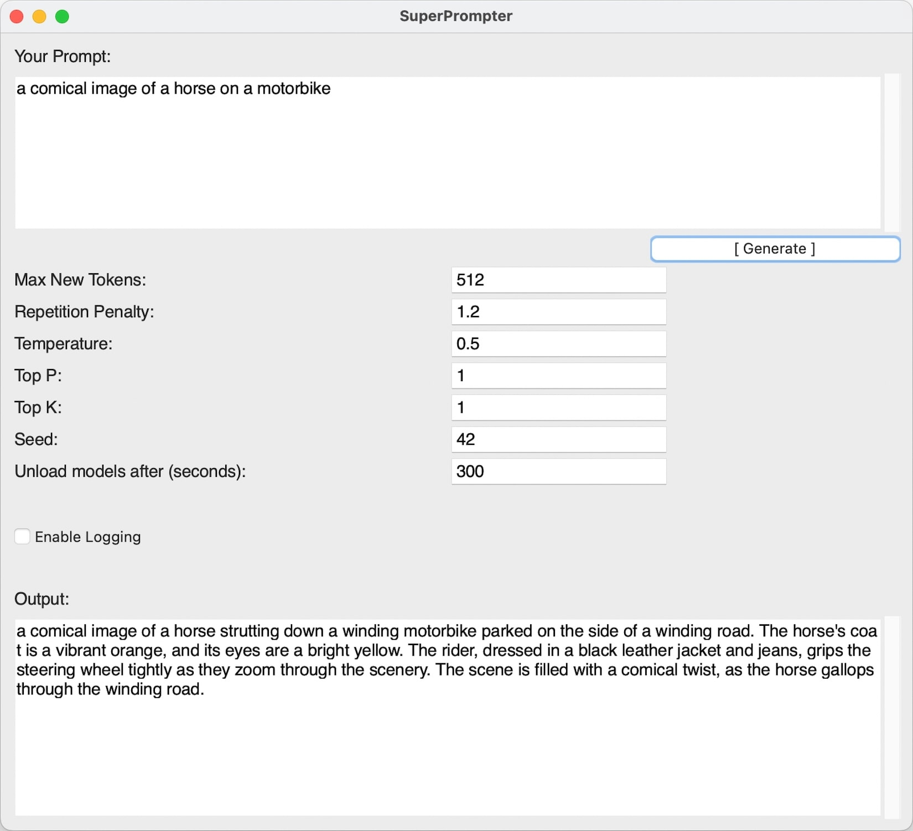

[SuperPrompter](https://github.com/sammcj/superprompter) is a Python-based application that utilises the [SuperPrompt-v1](https://huggingface.co/roborovski/superprompt-v1) model to generate optimised text prompts for AI/LLM image generation (for use with Stable Diffusion etc...) from user prompts.



See [Brian Fitzgerald's Blog](https://brianfitzgerald.xyz/prompt-augmentation/) for a detailed explanation of the SuperPrompt-v1 model and its capabilities / limitations.

<!-- more -->

## Features

- Utilises the [SuperPrompt-v1](https://huggingface.co/roborovski/superprompt-v1) model for text generation.
- A basic (aka ugly) graphical user interface built with tkinter.
- Customisable generation parameters (max new tokens, repetition penalty, temperature, top p, top k, seed).
- Optional logging of input parameters and generated outputs.
- Bundling options to include or exclude pre-downloaded model files.
- Unloads the models when the application is idle to free up memory.

## Prebuilt Binaries

Check [releases](https://github.com/sammcj/superprompter/releases) page to see if there are any prebuilt binaries available for your platform.

## Building

### Prerequisites

- Python 3.x
- Required Python packages (listed in `requirements.txt`)
- python-tk (`brew install python-tk`)

### Installation

1. Clone the repository:

   ```shell
   git clone https://github.com/yourusername/SuperPrompter.git
   ```

2. Navigate to the project directory:

   ```shell
   cd SuperPrompter
   ```

3. Create a virtual environment (optional but recommended):

   ```shell
   make venv
   ```

4. Install the required packages:

   ```shell
   make install
   ```

### Usage

Run the application:

```shell
make run
```

- On first run, it will download the [SuperPrompt-v1](https://huggingface.co/roborovski/superprompt-v1) model files.
  - Subsequent runs will use the downloaded model files.
- Once the model is loaded, the main application window will appear.
  - Enter your prompt in the "Your Prompt" text area.
- Adjust the generation parameters (max new tokens, repetition penalty, temperature, top p, top k, seed) as desired.
- Click the "Generate" button or press Enter to generate text based on the provided prompt and parameters.
- The generated output will be displayed in the "Output" text area.
- Optionally, enable logging by checking the "Enable Logging" checkbox.
  - When enabled, the input parameters and generated outputs will be saved to a log file named `~/.superprompter/superprompter_log.txt` in the user's home directory.

### Bundling

SuperPrompter can be bundled into a standalone executable using PyInstaller.
The bundling process is automated with a `Makefile` and a `bundle.py` script.

To bundle the application:

1. Install deps

   ```shell
   make venv
   make install
   ```

2. Check it runs

   ```shell
   make run
   ```

3. Run the bundling command

   ```shell
   make bundle
   ```

   This command will download the SuperPrompt-v1 model files and bundle the application with the model files included.
   Alternatively, if you want to bundle the application without including the model files (they will be downloaded at runtime), run:

   ```shell
   make bundleWithOutModels
   ```

4. The bundled executable will be available in the `dist` directory.

## Contributing

Contributions are welcome! If you find any issues or have suggestions for improvements, please open an issue or submit a pull request.

## License

I have open sourced the codebase under the MIT License and it is freely available for download on GitHub.
