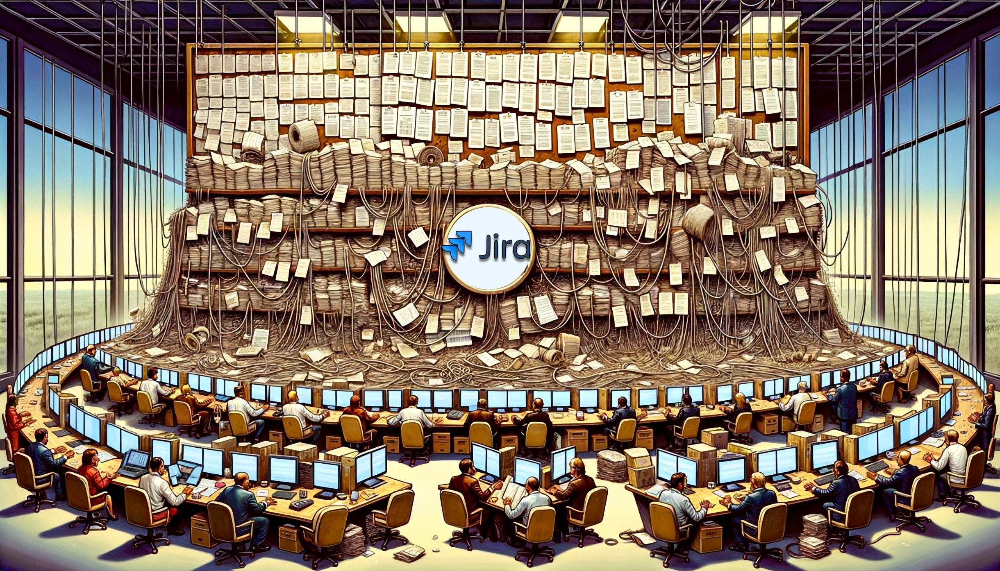

# The Enterprise "Agile" Software Development Manifesto

We are pretending to uncover better ways of developing software by talking about it and making others believe we're doing it. Through this facade, we have come to value:

## Processes and tools over individuals and interactions

We believe in the almighty power of bureaucracy and red tape. Who needs skilled individuals when you have a convoluted process that nobody understands? Interactions are overrated; just follow the process blindly, and everything will magically work out. We'll even hire an army of Agile coaches to ensure that everyone is following the process, regardless of whether it makes sense or not.

<!-- more -->

## Comprehensive documentation over working software

We love documentation so much that we prioritize it over actual working software. Why bother with functioning code when you can have a 500-page requirements document that nobody reads? We believe that the more documentation we have, the more agile we are. Plus, our Agile coaches will make sure that every single document is templated and filled out correctly, even if it means spending more time on paperwork than on actual development.

## Contract negotiation over customer collaboration

Collaboration is for the weak. We prefer to engage in lengthy contract negotiations, ensuring that every single detail is spelled out, even if it means delaying the project by months. Our customers should be kept at arm's length and only contacted when absolutely necessary. And if they dare to suggest a change, we'll make sure to put them through our rigorous change management process, which involves at least five different approval levels and a dozen forms to fill out.

## Following a plan over responding to change

Plans are meant to be followed religiously, no matter how outdated or irrelevant they become. Change is the enemy of "Agile" in enterprises. We'd rather stick to a plan that doesn't work than adapt to new information or changing circumstances. And if anyone suggests deviating from the plan, our change management process will ensure that it takes at least three months to get approval, by which time the opportunity will have long passed.

That is, while there is value in the items on the left, we pretend to value the items on the right more, but in reality, we don't care about either.

Signed by:

- The CIO who attended a two-hour "Agile" workshop once and now believes they are an expert
- The project manager who thinks "Agile" is just a buzzword and a way to micromanage the team
- The developer who's tired of attending daily stand-up meetings that last an hour and being constantly interrupted by Agile coaches
- The stakeholder who doesn't understand why nothing gets delivered despite all the "Agile" ceremonies and the army of Agile coaches
- The Agile coach who's making a fortune by enforcing meaningless processes and templates, while stifling any actual agility
- The change management team who ensures that any attempt to be truly agile is bogged down in bureaucracy and red tape

/s
