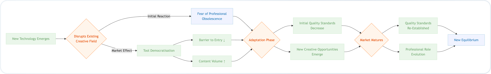

## Abstract

This paper examines the historical pattern of technological disruption and democratisation across various creative fields and applies these insights to the current AI revolution. We explore how each technological innovation—from photography to digital music production—initially triggered fears of human obsolescence but ultimately restructured rather than eliminated professional domains. The paper argues that the true challenge of AI lies not in the technology itself, but in our economic systems' ability to properly value human contributions in an AI-augmented landscape. By analysing the recurring "democratisation paradox," wherein new technologies simultaneously lower barriers to creation while elevating appreciation for skilled work, we can better understand and navigate the current transition toward AI-assisted creativity and work.

Every technological revolution has triggered waves of anxiety about the obsolescence of human skills and professions. The current fears that AI will replace artists, eliminate writing jobs, render illustrators obsolete, and devalue creative work follow a well-established historical pattern that's worth examining critically.

## The Democratisation Paradox

When photography emerged in the 19th century, painters predicted the death of portraiture. When home cameras became accessible, professional photographers feared obsolescence. When smartphones put cameras in everyone's pockets, the same concerns resurfaced . Yet professional photography hasn't vanished—it's evolved. What actually occurred was a democratisation of image creation, while simultaneously elevating the appreciation for truly skilled work .

The written word followed a similar trajectory. Writing began as the domain of elites and scholars before the printing press dramatically altered the landscape . As literacy spread, journalism rose, then blogs emerged, and self-publishing platforms demolished traditional gatekeepers . Now we're witnessing an influx of low/no-effort AI-generated books appearing on Amazon. Despite this, professional authors continue to publish their work, and readers still distinguish and value quality writing regardless of its production channel .

Mathematics faced its existential crisis with the calculator. Critics warned that mechanical computation would cripple mathematical understanding . The opposite occurred—calculators made mathematics more approachable and freed human minds to tackle more complex problems. Complex, manual arithmetic skills may have diminished, but mathematical innovation accelerated as computational tools handled the grunt work .

Digital music production technologies sparked similar anxieties. When samplers, MIDI, and production software emerged, traditionalists decried the "death of musicianship" . Instead, these tools lowered barriers to creation and spawned entirely new genres . Even with today's deluge of AI-generated music on streaming platforms, human musicians continue creating, though the economics of fair compensation remains problematic .

## The Creative Landscape is Forever in Transition

Some observers have coined the term "AI slop" to describe hastily produced, minimally curated content generated with AI tools but little human refinement. This includes auto-generated YouTube videos with robotic narration, cheaply produced books flooding Amazon, or generic stock-style images created through basic prompts. It should be noted that the term is sometimes overused to disparage anything that might have been created with AI assistance, regardless of quality or craftsmanship. After all - much like CGI in films—when it's good, you don't notice it's there .

This phenomenon mirrors the early days of every democratised medium: when blogs first appeared, when self-publishing began, when amateur photography flooded social media. The signal-to-noise ratio initially decreases before quality standards emerge and the market matures . It's worth noting that such transitions are not new but rather a recurring pattern in technological evolution.

What history demonstrates repeatedly is that technological advancements don't typically eliminate fields—they restructure them. The true impact is often a dismantling of exclusive gatekeeping mechanisms that previously restricted access to knowledge and creative tools. This creates opportunities for those previously locked out of creative industries while also challenging established professionals to differentiate their work. When anyone can create, the volume of poor-quality content increases, but so does the potential for innovation from previously excluded voices.

## Beyond Technology: Capitalism & Systemic Economics

The more pressing concern isn't whether AI will replace human creativity—it's whether our economic systems will properly value human contributions in an AI-augmented landscape. AI itself is neither good nor evil—it is simply technology. The real risk lies in our societal structures and economic systems that are centred around capitalist ideologies focused on profit maximisation.

Humans are capable of both extraordinary creation—moon landings, symphonies, medical breakthroughs—and deeply destructive behaviours. This duality is mirrored in AI outputs, as systems absorb both the brilliance and flaws present in their training data, aligned with the values of the powerful companies that build and control them . Meanwhile, humans remain caught in a competitive mindset focused on scarcity of money, power, and resources, with the overwhelming majority dedicating five out of seven days of their lives working for someone else rather than themselves.

As we transition from traditional capitalism toward technofeudalism, power increasingly concentrates in the hands of tech giants who control the digital infrastructure upon which society depends . Unlike conventional corporations merely pursuing shareholder value, these new feudal lords—companies like Google, Amazon, the so-called "Open"AI and Meta—wield unprecedented influence over access to digital spaces, data, and online commerce . This power dynamic has intensified with the development of advanced AI, as the most powerful models in the world are now built and controlled by these same corporate entities, further cementing their position as the overlords of our digital existence.

This technofeudal control directly impacts creative economies. Many artists, writers, and musicians have legitimate fears about being undercut by AI-generated alternatives that cost a fraction to produce—alternatives often created using models owned by these same tech giants. Streaming services profiting from both human and AI-generated content maintain compensation models designed to maximise their own profits rather than fairly value human creativity. Meanwhile, traditional companies driven primarily to deliver year-on-year profits to shareholders will likely continue trying to do more with less, leveraging these AI tools at the expense of human creators.

### Impact on the Workforce

In the short term over the 1 to 2 years that follow, we're likely to witness significant job displacement, particularly within large enterprise organisations . These corporations are prime targets for AI-driven efficiency measures, especially in areas where work is standardised despite perceptions of uniqueness.

A perfect example is enterprise software development, where organisations often maintain vast teams building functionally similar systems to their competitors—each believing their implementation to be special or distinctive when, in reality, most are simply widget factories operating in parallel. This systemic inefficiency has persisted primarily because large organisations traditionally move slowly, creating a market equilibrium where inefficiency is tolerated. However, AI threatens to shatter this balance by dramatically accelerating automation capabilities while simultaneously reducing technical barriers to implementation, allowing new players to quickly gain a foothold .

Consider also call centre staff, content moderators, and entry-level developers at large corporations. These roles don't always create substantial unique value when focused on repetitive tasks, and corporations are unlikely to invest in re-skilling these workers at their own cost when AI alternatives become viable.

In the medium term - perhaps the next 3 to 5 years or so, companies that cut headcount earlier may return to hiring, but with roles significantly refocused . Rather than simply rebuilding widget factories, positions will increasingly centre on 'driving' AI capabilities, requiring deeper engineering and architectural understanding to enable organisations to target new and competing revenue streams. This shift represents not just a change in job descriptions but a fundamental reimagining of how human expertise complements rather than competes with automated systems.

Historically, many large enterprises have enjoyed a form of institutional immunity—deemed 'too big to fail' due to their substantial capital reserves, the collective slow pace of industry movement, and often lenient regulatory oversight. Yet AI's unprecedented ability to accelerate development threatens to alter this dynamic, Allowing smaller organisations or potentially even individuals to outmanoeuvre larger competitors encumbered by legacy systems and drowning in bureaucracy. This shift in competitive advantage may reshape industry landscapes faster than many established players can adapt.

Evolution is not mandatory, but neither is survival.

## Moving Forward: Balancing Progress and Humanity

The democratisation of creative tools through AI represents the latest chapter in humanity's complex relationship with technology. As we've seen throughout history, the initial disruption eventually gives way to a new equilibrium where human creativity adapts rather than disappears. The true challenge lies not in whether AI will replace us, but in how we choose to structure our economic and social systems around these new capabilities.

Rather than fearing AI itself, we would be wiser to focus our collective energy on building economic models that distribute the benefits of technological advancement more equitably. After all, the most valuable aspect of creativity has never been the tools themselves, but the uniquely human perspective, experience, and purpose that breathes life into them.


Andrejevic, M. (2013). *Infoglut: How Too Much Information Is Changing the Way We Think and Know*. New York: Routledge.

Autor, D. H. (2015). Why Are There Still So Many Jobs? The History and Future of Workplace Automation. *Journal of Economic Perspectives, 29*(3), 3-30.

Baron, N. S. (2015). *Words Onscreen: The Fate of Reading in a Digital World*. Oxford, UK: Oxford University Press.

Batchen, G. (2001). *Each Wild Idea: Writing, Photography, History*. Cambridge, MA: MIT Press.

Benjamin, W. (1969). *The Work of Art in the Age of Mechanical Reproduction*. (H. Zohn, Trans.). New York: Schocken Books. (Original work published 1936).

Brynjolfsson, E., & McAfee, A. (2014). *The Second Machine Age: Work, Progress, and Prosperity in a Time of Brilliant Technologies*. New York: W. W. Norton & Company.

Crawford, K. (2021). *Atlas of AI: Power, Politics, and the Planetary Costs of Artificial Intelligence*. New Haven, CT: Yale University Press.

Eisenstein, E. L. (1980). *The Printing Press as an Agent of Change*. Cambridge, UK: Cambridge University Press.

Floridi, L. (2014). *The Fourth Revolution: How the Infosphere is Reshaping Human Reality*. Oxford, UK: Oxford University Press.

Frey, C. B., & Osborne, M. A. (2017). The future of employment: How susceptible are jobs to computerisation? *Technological Forecasting and Social Change, 114*, 254-280.

Hand, M. (2012). *Ubiquitous Photography*. Cambridge, UK: Polity Press.

Kaput, J. J. (1992). Technology and Mathematics Education. In D. A. Grouws (Ed.), *Handbook of Research on Mathematics Teaching and Learning* (pp. 515-556). New York: Macmillan.

Kidwell, P. A., Ackerberg-Hastings, A., & Roberts, D. L. (2008). *Tools of American Mathematics Teaching, 1800-2000*. Baltimore, MD: Johns Hopkins University Press.

Ong, W. J. (1982). *Orality and Literacy: The Technologizing of the Word*. London: Methuen.

Prior, N. (2018). *Popular Music, Digital Technology and Society*. London: SAGE Publications.

Taylor, T. D. (2001). *Strange Sounds: Music, Technology and Culture*. New York: Routledge.

Théberge, P. (1997). *Any Sound You Can Imagine: Making Music/Consuming Technology*. Middletown, CT: Wesleyan University Press.

Varoufakis, Y. (2021, June 28). Techno-Feudalism Is Taking Over. *Project Syndicate*. Retrieved from https://www.project-syndicate.org/commentary/techno-feudalism-replacing-market-capitalism-by-yanis-varoufakis-2021-06

Zuboff, S. (2019). *The Age of Surveillance Capitalism: The Fight for a Human Future at the New Frontier of Power*. London: Profile Books.

