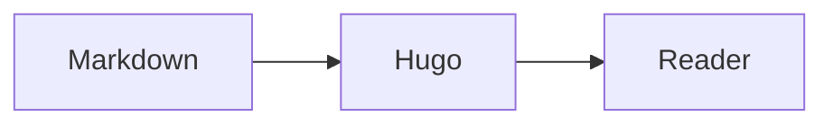

Posts are plain markdown. This page shows each rendered feature once, so it doubles as a test fixture.

## Code

Fenced code gets Chroma highlighting and a copy button. Long inline code such as `deskbar.window.manager.restoreLayoutFromSharedLinkWithoutReflow()` and bare links such as <https://example.com/a/very/long/path/that/would/otherwise/push/the/post/wider/than/a/phone/screen> wrap rather than widen the post.

```go
func greet(name string) string {
	return "G'day, " + name
}
```

## Diagrams



## Maths

Inline maths such as \\(e^{i\pi} + 1 = 0\\) renders with MathJax, which loads only on pages that need it.

## Footnotes and definitions

A claim that needs a source.[^1]

Chroma
: The syntax highlighter Hugo uses.

Goldmark
: The markdown renderer.

## Tables

| Window  | Snaps | Tabs |
| ------- | ----- | ---- |
| Reader  | Right | One  |
| Tracker | Left  | Many |

> Quotes keep a quiet left rule and the body font.

## Callouts

GitHub-style alerts render through the hugo-admonitions module, restyled to follow the theme.

> [!TIP]
> Snap a window by dragging its tab to a screen edge.

> [!WARNING] Unsaved state
> Closing a window drops its scroll position.

[^1]: The footnote, with a link back to where it was cited.
