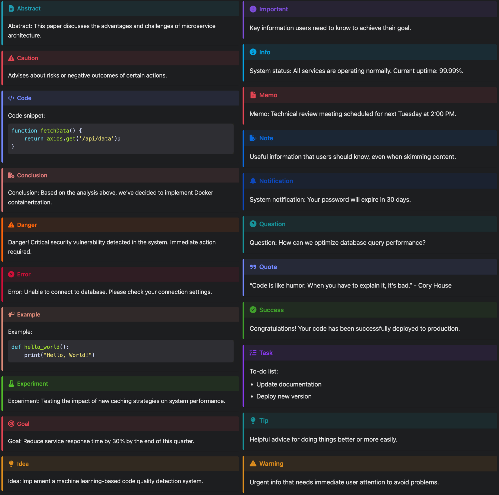
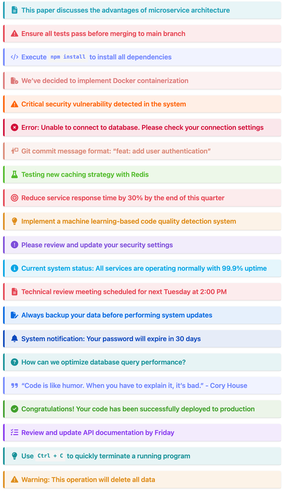
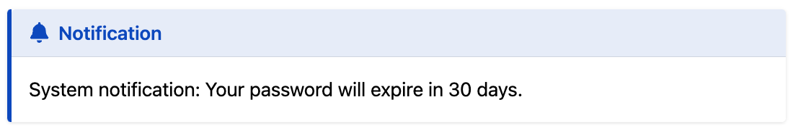
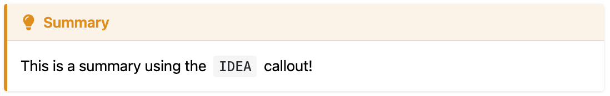
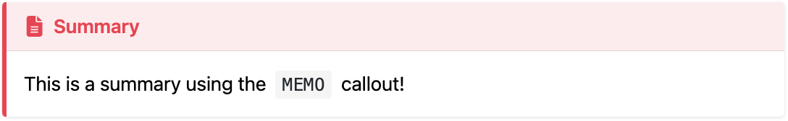
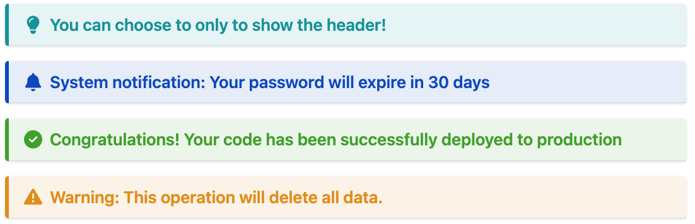

# Hugo-admonitions

A lightweight Hugo module that adds beautiful and customizable admonition blocks to your content.

Inspiration from [mdbook-admonish](https://tommilligan.github.io/mdbook-admonish/).

## Table of Contents

- [Features ✨](#features-)
- [Overview of all admonitions](#overview-of-all-admonitions)
  - [Light Mode](#light-mode)
  - [Dark Mode](#dark-mode)
  - [Header Only Mode](#header-only-mode)
- [Installation](#installation)
  - [Hugo Module](#hugo-module)
  - [Git Clone](#git-clone)
- [Usage](#usage)
- [Customization](#customization)
- [Contributing](#contributing)
- [License](#license)

## Features ✨

- Various beautiful and simple callout available 🎨
- Blockquote style 💬
  - Portable Markdown style (GitHub, Obsidian, Typora, etc.) 📝

  - ```md
    > [!WARNING]
    > Warning: This operation will delete all data.
    ```

- Dark mode support 🌙
- Header Only Mode 📑
- Multi-language support 🌐
  - English
  - Chinese
  - French
  - German
  - Swahili
  - [Localization PRs are always welcome!](https://github.com/KKKZOZ/hugo-admonitions/pulls)

## Overview of all admonitions

### Light Mode


### Dark Mode



### Header Only Mode

<div align="center">
  
</div>

## Installation

> [!IMPORTANT]
> This modules requires Hugo `v0.140.0` or later.

### Hugo Module

1. Install the [Go programming language](https://go.dev/doc/install).

2. Initialize your own hugo module:

    ```shell
    hugo mod init YOUR_OWN_GIT_REPOSITORY
    ```

3. Add `hugo-admonitions` in your site's configuration file:

    With `hugo.yaml`:

    ```yaml
    module:
      imports:
        - path: github.com/KKKZOZ/hugo-admonitions
        - path: my-theme
    ```

    With `hugo.toml`:

    ```toml
    [module]
      [[module.imports]]
        path = "github.com/KKKZOZ/hugo-admonitions"
      [[module.imports]]
        path = "my-theme"
    ```

4. Finally update by running:

    ```shell
    hugo mod get -u
    ```

### Git Clone

1. Inside the folder of your Hugo site, run:

    ```bash
    git clone git@github.com:KKKZOZ/hugo-admonitions.git themes/hugo-admonitions --depth=1
    ```

2. Add `hugo-admonitions` as the left-most element of the theme list variable in your site's or theme's configuration file `hugo.yaml` or `hugo.toml`.

    With `hugo.yaml`:

    ```yaml
    theme: ["hugo-admonitions", "my-theme"]
    ```

    With `hugo.toml`:

    ```toml
    theme = ["hugo-admonitions", "my-theme"]
    ```

## Usage

See [demo.md](docs/content/demo.md) for examples.

Use the blockquote in this way:

```markdown
> [!NOTIFY]
> System notification: Your password will expire in 30 days.
```



<details>
<summary>Available Callouts List</summary>

- `[!ABSTRACT]`
- `[!CAUTION]`
- `[!CODE]`
- `[!CONCLUSION]`
- `[!DANGER]`
- `[!ERROR]`
- `[!EXAMPLE]`
- `[!EXPERIMENT]`
- `[!GOAL]`
- `[!IDEA]`
- `[!IMPORTANT]`
- `[!INFO]`
- `[!MEMO]`
- `[!NOTE]`
- `[!NOTIFY]`
- `[!QUESTION]`
- `[!QUOTE]`
- `[!SUCCESS]`
- `[!TASK]`
- `[!TIP]`
- `[!WARNING]`

</details>

<br/>

> [!NOTE]
> Unsupported callout types will default to `[!NOTE]`

Or you can customize the title by using any of them:

```markdown
> [!IDEA] Summary
> This is a summary using the `IDEA` callout!
```



```markdown
> [!MEMO] Summary
> This is a summary using the `MEMO` callout!
```



Use the Header Only mode by including a title only:

```markdown
> [!TIP] You can choose to only to show the header!

> [!NOTIFY] System notification: Your password will expire in 30 days

> [!SUCCESS] Congratulations! Your code has been successfully deployed to production

> [!WARNING] Warning: This operation will delete all data. 
```



## Customization

Please follow the instructions below to override the default styles.

1. Create a new Sass file.

    Run these commands from the root of your project:

    ```shell
    mkdir -p assets/sass/vendors
    touch assets/sass/vendors/_admonitions.scss
    ```

    The resulting directory structure will look like this:

    ```text
    your-hugo-project/
    └── assets/
        └── sass/
            └── vendors/
                └── _admonitions.scss
    ```

2. Copy the contents of the [source file] into the file you created.
3. Update the styles as needed.

[source file]: https://github.com/KKKZOZ/hugo-admonitions/blob/main/assets/sass/vendors/_admonitions.scss

## Contributing

Contributions are welcome! Please feel free to submit a [Pull Request](https://github.com/KKKZOZ/hugo-admonitions/pulls).

## License

This project is licensed under the MIT License - see the [LICENSE](LICENSE) file for details
